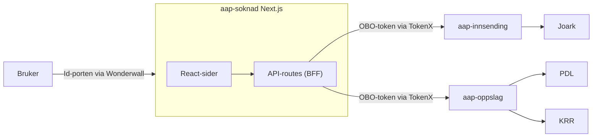

# Teknisk beskrivelse
[Github](https://github.com/navikt/aap-soknad)

Løsningen bygger på [NAIS](https://nais.io) som er kjøreplattform for Google Cloud.

| Del av løsning | Teknologi beskrivelse                                                 |
|----------------|-----------------------------------------------------------------------|
| Klient         | Next.js, Typescript                                                   |
| Baksystem      | Ktor og Kotlin                                                        |
| Infrastruktur  | Postgres-database for forretningslogikk og Redis for mellomlagring    |
| Kafka          | Hendelsesbasert kommunikasjon mellom systemer i NAV og feilhåndtering |
| Redis          | Mellomlagring av søknad og vedlegg                                    |

### Tekniske tjenester

Tekniske tjenester er integrasjoner mellom systemer/tjenester.

#### Tjenester som konsumeres av [aap-oppslag](https://github.com/navikt/aap-oppslag)

- **Innlogging** via [Id-porten](https://eid.difi.no/en/id-porten)
- **PDL** - Persondatatjeneste for NAV og Skatt
- **KRR** - Kontakt og reservasjonsregisteret

#### Tjenester som konsumeres av [aap-innsending](https://github.com/navikt/aap-innsending)

- **Arkivtjeneste** for opprettelse av ingående dokumenter i NAVS dokumentarkiv.
- **Microfrontend for min side** for [pålogget bruker på nav.no](https://nav.no)

Systemene tilbyr ingen eksterne tjenester, kun interne i dialog med hverandre.

#### Tjenester som konsumeres av [postmottak-backend](https://github.com/navikt/postmottak-backend)

- **Dokarkiv** - For oppslag i NAVS dokumentarkiv: brukes for å oppdatere informasjon tilknyttet saksbehandling og fordeling.
- **aap-tilgang** - Tjeneste for å sjekke NAV-ansatts tilgang til AAP-saker.

### Databasemodell i aap-innsending

Som figuren viser er modellen delt i 3:

- Håndtering av søknadslogikk og påkrevde vedlegg som er sendt inn eller mangler
- Håndtering av mellomlagring av søknad.
- håndterer beskjeder som skal sendes til bruker på min side.

## aap-soknad - arkitektur

[aap-soknad](https://github.com/navikt/aap-soknad) er en Next.js-applikasjon (BFF - backend for frontend) som både
serverer søknadsdialogen (React) til bruker og eksponerer egne API-routes (`pages/api/**`) som proxyer videre til
baksystemene. Det finnes ingen egen frittstående backend-tjeneste for søknaden - all serverlogikk kjører i Next.js'
API-routes i samme applikasjon/pod som frontendet.

### Autentisering

- Innlogging skjer med [ID-porten](https://eid.difi.no/en/id-porten) (nivå Level4) via en
  [Wonderwall](https://github.com/nais/wonderwall)-sidecar som NAIS setter opp automatisk (`idporten.sidecar.autoLogin: true`
  i `.nais/nais.yaml`), slik at hele appen krever innlogging.
- Hver API-route er beskyttet med `beskyttetApi`, som validerer `Authorization`-headeren (ID-porten-token) med
  [`@navikt/oasis`](https://github.com/navikt/oasis) før forespørselen slippes videre til handleren.
- For kall videre til `aap-innsending` og `aap-oppslag` byttes brukerens ID-porten-token om til et
  on-behalf-of-token via TokenX (`requestOboToken` i `simpleTokenXProxy`), slik at baksystemene kan stole på at kallet
  er gjort på vegne av innlogget bruker.

### Sider og steg

Applikasjonen har tre "vanlige" sider (`pages/index.tsx`, det dynamiske `pages/[step].tsx` og `pages/kvittering.tsx`),
alle beskyttet av `beskyttetSide` (server-side sjekk av ID-porten-token, tilsvarende `beskyttetApi` for API-routes):

- **`/` (`index.tsx`)** - veiledningsside. Initialiserer en ny `SoknadContextState` med en fast stegliste
  (`defaultStepList`) og navigerer bruker til første steg.
- **`/[step]`** - selve søknadsveiviseren. Ett Next.js-route rendrer alle stegene avhengig av `?step=`-parameter, se
  under.
- **`/kvittering`** - kvitteringsside etter innsending.
- **`/vedlegg/[uuid]`** - egen side som viser et enkeltvedlegg (PDF) hentet fra mellomlagringen via
  `/api/vedlegginnsending/les`, brukt for forhåndsvisning av opplastede filer i oppsummeringssteget.

Stegene (definert som enum `StepNames` i `pages/index.tsx`, rendret av komponenter i `components/pageComponents/standard`)
er i rekkefølge: **Startdato → Medlemskap → Yrkesskade → Fastlege/behandlere → Barnetillegg → Student →
Andre utbetalinger → Vedlegg → Oppsummering**. Hvert steg er en selvstendig komponent/skjema (validert med `yup`),
og `Steg0`/`Veiledning` håndterer introduksjonssiden. Navigasjon og fremdrift styres av `StepWizardContext`
(aktivt steg, ferdigstilte steg), mens selve søknadsdataene ligger i `SoknadContext` (reducer med actions som
`setSoknadStateFraProps`, `addBarnIfMissing`, `deleteVedlegg` osv.).

### Søknadsflyt og mellomlagring

Underveis i utfyllingen:

- `POST /api/mellomlagring/lagre` (proxy til `aap-innsending` sitt `/mellomlagring/søknad/v2`) lagrer et øyeblikksbilde
  av søknaden - trigges debounced (`useDebounceLagreSoknad`) ved endringer, slik at bruker kan fortsette senere uten å
  miste utfylte data.
- `GET /api/mellomlagring/les` / `DELETE /api/mellomlagring/slett` henter og rydder mellomlagret søknad.
- Vedlegg lastes opp via `/api/vedlegginnsending/*`, som proxyer til `aap-innsending` sitt `/mellomlagring/fil`
  (antivirus, PDF-konvertering og -validering skjer der, se [Innsending](../04_Innsending/teknisk.md)).
- Ved fullføring valideres søknaden på nytt server-side (samme yup-skjemaer som klienten bruker), en PDF-kvittering
  av svarene genereres (`mapSøknadToPdf`), og `/api/innsending/soknadinnsending` sender søknad + kvittering + vedlegg
  til `aap-innsending` sitt `/innsending`-endepunkt, som arkiverer i Joark og varsler Min side.
- `/api/oppslag/{barn,fastlege,krr}` og `/api/oppslagapi/person` henter hhv. barn, fastlege, kontakt-/reservasjonsinfo
  og persondata fra [aap-oppslag](https://github.com/navikt/aap-oppslag) for forhåndsutfylling av steg som
  barnetillegg og behandlere.

### Internasjonalisering og sporing

- Tekster er oversatt til bokmål og nynorsk (`translations/nb.json`, `translations/nn.json`) og rendres med
  `react-intl`; `translations/links.json` holder eksterne lenker brukt i tekstene.
- Brukerhandlinger (skjema startet/fullført, steg startet/fullført) sendes til Umami via
  `lib/utils/umami`/`@navikt/analytics-types`, og frontend-feil/ytelse spores med Grafana Faro
  (`@grafana/faro-web-sdk`).

### Testing

- **Enhets-/komponenttester**: Vitest (`vitest.config.mts`, `vitestSetup.tsx`), bl.a. `StepWizard.test.tsx`.
- **Ende-til-ende-tester**: Playwright (`playwright.config.ts`, testene i `tests/`) - dekker lykkelig sti
  (`happypath.spec.ts`), stier med feil (`unhappypath.spec.ts`) og mer komplekse navigasjonsmønstre
  (`complexnavigation.spec.ts`), kjørt mot et mocket miljø (`isMock()`/`isFunctionalTest()`-flagg som kobler ut
  reelle kall til aap-innsending/aap-oppslag og bruker en fil-basert mellomlagringscache i `mock/`).

### Miljø og drift

- Kjører på NAIS i GCP med 2-4 replikaer, bak Wonderwall/ID-porten-sidecar (se over).
- `/api/internal/isAlive`, `/api/internal/isReady` og `/api/internal/prometheus` brukes til helsesjekker/metrikker.
- Utgående nettverkstilgang er begrenset til `innsending`, `oppslag` og `nav-dekoratoren` (accessPolicy i
  `.nais/nais.yaml`); dekoratøren (topp-/bunntekst på nav.no) hentes fra `dekoratoren.dev.nav.no`/prod-varianten som
  ekstern host.
- Det finnes egne mock-miljøer (`.nais/dev-mock.yaml`, `dev-mock.env`) hvor kall til baksystemene mockes lokalt, samt
  en historisk dev-mock-konfigurasjon (`historisk-dev-mock.yaml`) for eldre versjoner av søknaden.
