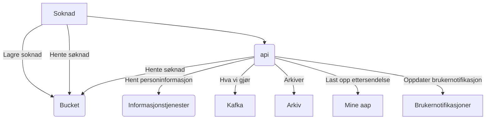

# Teknisk beskrivelse
[Github](https://github.com/navikt/mine-aap)

## Ettersendelse og Mine AAP

Peke tilbake på overordnet oversikt

```mermaid
    graph TD
    A[Soknad] -->|Lagre soknad| B(Bucket)
    A -->|Hente søknad| B
    A --> C(api)
C -->|Hente søknad| B
C -->|Hent personinformasjon| D(Informasjonstjenester)
C -->|Hva vi gjør| E[Kafka]
C -->|Arkiver| F[Arkiv]
C -->|Last opp ettersendelse| G[Mine aap]
C -->|Oppdater brukernotifikasjon| H[Brukernotifikasjoner]
```
