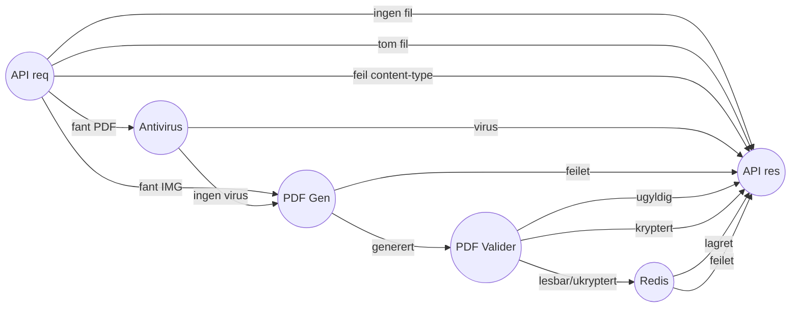

# Funksjonell beskrivelse
Brukeren skal kunne sende inn søknad om AAP digitalt.   
Dette innebærer at brukeren skal kunne fylle ut søknadsskjema, legge ved dokumentasjon og sende inn søknaden.

For å gjøre dette, må det funksjonelt støttes:
- Hente inn informasjon fra registrene i NAV 
- Lagre søknad for innbygger

Det er bygget 2 komponenter for dette:
- Oppslag, som slår opp relevant informasjon fra registrene i NAV
- Innsending, som tar imot utfylt søknad og lagrer denne i NAV

## Oppslag

Oppslag er en komponent som henter informasjon fra registrene i NAV. 
- Oppslag henter navnet til brukeren for å vise det på påloggede sider på nav.no
- Oppslag henter informasjon om brukeren fra registrene i NAV som brukes i søknaden.
  - Personopplysninger om innbygger og dens barn
  - Digital kontaktinformasjon
  - Om bruker har registrert fastlege
- Oppslag henter informasjon som bruker kan se på Mine AAP
  - Dokumenter tilknyttet bruker på tema AAP
  - Brev som NAV har sendt til bruker.
  - Dokumenter sendt inn av andre på vegne av innbygger, som er knyttet til søknad om AAP.

## Innsending

En innsending kan være enten en søknad eller en ettersendelse

### Motta innsending

- søknad har JSON råformat
- søknad kan sendes med og uten vedlegg
- ettersendelse har ikke JSON råformat
- ettersendelse kan bestå av flere vedlegg
- innsendinger lagres i PosgreSQL

### Mellomlagre innsending

- Søknad mellomlagres før den faktisk sendes inn.
- Vedlegg mellomlagres før de faktisk sendes inn.
- Mellomlagring skjer i Redis.
- Når det er sendt inn, slettes dataene fra Redis.

### Arkivere innsending
- mottatte innsendinger arkiveres i Joark
- ved arkivering slettes dataene fra Postgres og Redis
- ved arkivering lagres metadata om hva som ble arkivert i Joark

## Komponentdiagram

[Mural](https://app.mural.co/t/navdesign3580/m/navdesign3580/1686128879741/be8d640e3e037731badc3a78c09db5c1c14a8e7f?sender=sturlehelland7470) 
