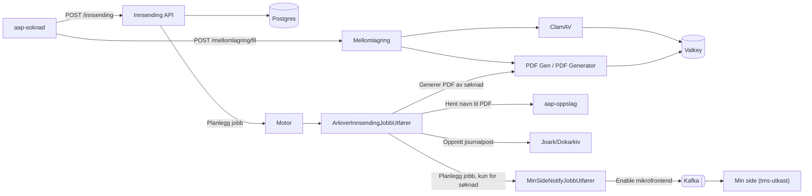
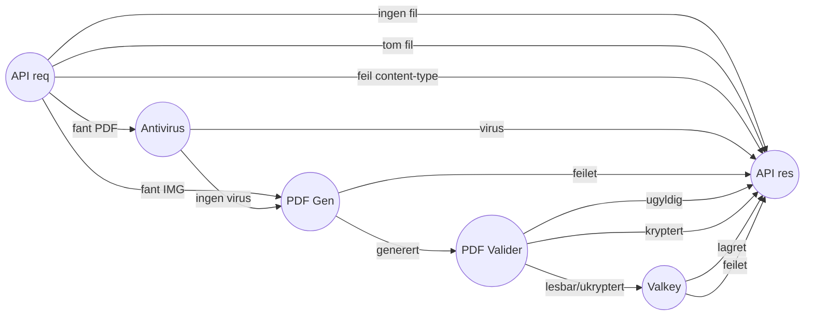

# Teknisk beskrivelse
[Github](https://github.com/navikt/aap-innsending) | [Grafana](https://grafana.nav.cloud.nais.io/d/TSvq-GvIk/innsending?orgId=1)

`aap-innsending` er baksystemet som tar imot innsendinger fra bruker på nav.no - søknader, ettersendinger til en søknad
og løskoblede vedlegg (ustrukturerte filer uten tilknyttet skjema) - mellomlagrer vedlegg før innsending, og arkiverer
den ferdige innsendingen i Joark/Dokarkiv. Appen konsumeres av
[aap-soknad](https://github.com/navikt/aap-soknad) (frontend/BFF for søknadsdialogen), samt av `innsyn`,
`paw-patrol`, `aap-min-side-microfrontend` og `tms-utkast` (min side).

|Del av løsning|Teknologi beskrivelse                                                                                               |
|--------------|--------------------------------------------------------------------------------------------------------------------|
|Database      |Postgres (Google Cloud SQL) for innsendinger/vedlegg og for jobbmotorens jobbtabeller                               |
|Mellomlagring |Valkey (Redis-kompatibel) for mellomlagring av vedlegg og påbegynt søknad før innsending                            |
|Jobbmotor     |[Motor](../../teknisk/felles_komponenter.md#motor) fra felleskomponenter kjører arkivering og varsling asynkront    |
|Kafka         |Produserer melding på topic for Min side-mikrofrontend når en søknad er sendt inn                                   |
|Auth          |TokenX for innlogget bruker (inngående kall), Azure AD/Entra ID for jobbmotor-API og utgående maskin-til-maskin-kall|

## Overordnet arkitektur

## Mottak og lagring

Appen eksponerer to grupper endepunkter (i `innsendingRoute` og `mellomlagerRoute`), begge bak TokenX-autentisering
(`personident` hentes fra `pid`-claim i JWT-token):

- **`/mellomlagring/søknad`** - lagrer/henter/sletter en påbegynt (ikke innsendt) søknad som rå bytes i Valkey med
  1 døgns TTL. Har også et `/finnes`-endepunkt som `tms-utkast` bruker for å vise "du har en påbegynt søknad" på Min side.
- **`/mellomlagring/fil`** - tar imot ett og ett vedlegg (multipart) og mellomlagrer det i Valkey. Flyten er:
    1. Les fil fra multipart-request (maks størrelse styrt av `MAX_FILE_SIZE`, håndhevet i selve lesingen av streamen).
    2. Sjekk faktisk filtype med Apache Tika og avvis hvis den ikke stemmer med oppgitt `Content-Type`
       (kun JPEG/PNG/PDF er støttet).
    3. Virussjekk av filen mot ClamAV.
    4. Bilder konverteres til PDF (via PDF Gen, eller PDF Generator hvis Unleash-featuren
       `InnsendingNyBildekonvertering` er på).
    5. Den resulterende PDF-en sjekkes for kryptering/gyldighet med Apache PDFBox.
    6. Filen lagres i Valkey under en nøkkel (`personident:UUID`) og nøkkelen returneres til klient, som senere
       refererer til den ved innsending.
- **`/innsending`** (`POST`, evt. `POST /innsending/{ref}` for ettersendelse på en eksisterende søknad) - mottar selve
  innsendingen (JSON-søknad og/eller referanser til mellomlagrede vedlegg):
    1. Avviser duplikate innsendinger (hash av request lagres kortvarig i Valkey).
    2. Ved ettersendelse: sjekker at oppgitt referanse faktisk tilhører innlogget bruker.
    3. Henter opp de mellomlagrede vedleggene fra Valkey via oppgitte fil-id-er; avviser (`412`) hvis noen mangler
       eller total størrelse overskrider grensen.
    4. Validerer søknaden strukturelt mot kontrakten `no.nav.aap.behandlingsflyt.kontrakt...Søknad` (kun logging, feiler ikke innsendingen).
    5. Lagrer innsendingen og tilhørende filer i Postgres (tabellene `innsending_ny` og `fil_ny`), og planlegger en
       jobb `ArkiverInnsendingJobbUtfører` for videre asynkron behandling - i samme databasetransaksjon.
    6. Rydder mellomlagrede vedlegg/søknad fra Valkey og returnerer en referanse-id (`innsendingId`) til klient.
- **`/innsending/søknader`** og **`/innsending/{ref}/ettersendinger`** - brukes av bl.a. innsyn/soknad for å vise
  brukerens innsendte søknader og ettersendinger med journalpost-id og mottatt dato.

## Asynkron arkivering (jobbmotor)

Appen bruker [Motor](../../teknisk/felles_komponenter.md#motor)-komponenten fra felleskomponenter til å kjøre bakgrunnsjobber
mot Postgres (tabellene `jobb`/`jobb_historikk`, med tilhørende arkivtabeller). Motoren startes med 2 kammer og har
to jobbtyper registrert:

| Jobb                          | Trigger                                          | Ansvar                                                                 |
|-------------------------------|---------------------------------------------------|-------------------------------------------------------------------------|
| `ArkiverInnsendingJobbUtfører` | Planlegges ved mottak av innsending (`POST /innsending`) | Genererer PDF, arkiverer i Joark, markerer innsendingen ferdig          |
| `MinSideNotifyJobbUtfører`     | Planlegges av `ArkiverInnsendingJobbUtfører`, kun for type SOKNAD | Varsler Min side (Kafka) om at søknaden er sendt inn                    |

`ArkiverInnsendingJobbUtfører` gjør, avhengig av innsendingstype:

- **Søknad**: Slår opp brukerens navn i [aap-oppslag](https://github.com/navikt/aap-oppslag), genererer PDF av
  søknaden (PDF Gen, eller PDF Generator dersom Unleash-featuren `InnsendingNySoknadPdf` er på), og bygger en
  journalpost med søknaden som originalt JSON-dokument + generert PDF, pluss ev. vedlegg.
- **Ettersendelse**: Bygger en journalpost kun av vedleggene (ingen JSON/PDF-hoveddokument).

Journalposten opprettes i Joark via `JoarkClient` (`POST /rest/journalpostapi/v1/journalpost` mot Dokarkiv, autentisert
med Azure AD M2M-token). Etter vellykket arkivering markeres innsendingen som ferdig i Postgres
(`journalpost_id` settes, og selve søknads-/vedleggsdataene (`soknad`, `data`, filenes `data`) nulles ut - de trengs
ikke lenger siden dokumentene nå ligger i Joark).

`MinSideNotifyJobbUtfører` sender deretter en melding via `MinSideKafkaProducer` på Kafka-topicet
`min-side.aapen-microfrontend-v1`, som slår på mikrofrontenden for AAP-søknad på Min side for brukeren
(`no.nav.tms.microfrontend`-biblioteket brukes til å bygge meldingen).

Jobbmotorens administrasjons-API (`motorApi`) eksponeres også, men bak Azure AD-autentisering og (i prod) krav om
medlemskap i NAIS-teamgruppa for AAP.

## Datamodell

Postgres-databasen (`innsending`) inneholder i hovedsak:

- **`innsending_ny`** - én rad per innsending (søknad eller ettersendelse): `personident`, rå `soknad`-json,
  `data` (kvittering brukt i PDF-generering), `ekstern_referanse` (UUID brukt eksternt), `type`
  (`SOKNAD`/`ETTERSENDING`), `forrige_innsending_id` (kobling til søknaden en ettersendelse hører til) og
  `journalpost_id` (satt når arkivert).
- **`fil_ny`** - vedlegg tilhørende en innsending (`tittel`, `data` som bytes), fremmednøkkel til `innsending_ny`.
- **`jobb`/`jobb_historikk`** (+ arkivtabeller) - jobbmotorens egne tabeller for kø og kjørehistorikk.

Eldre tabeller (`innsending`, `fil`, `logg`, `soknad_ettersending`) er migrert bort til `innsending_ny`/`fil_ny`
(se `db/migration/V1_2`-`V1_3`), men finnes fortsatt i skjemaet.

## Integrasjoner

| Tjeneste                                                | Retning  | Bruk                                                                     |
|----------------------------------------------------------|----------|-----------------------------------------------------------------------------|
| [aap-soknad](https://github.com/navikt/aap-soknad)       | Inngående | Sender inn søknad, ettersendelse og vedlegg (TokenX)                        |
| innsyn, paw-patrol, aap-min-side-microfrontend, tms-utkast | Inngående | Leser status på innsendte søknader / sjekker påbegynt søknad (TokenX)     |
| [aap-oppslag](https://github.com/navikt/aap-oppslag)      | Utgående | Slå opp brukerens navn til bruk i generert PDF (Azure AD)                   |
| PDF Gen / PDF Generator                                    | Utgående | Generere PDF av søknad/ettersendelse og konvertere bilder til PDF          |
| ClamAV                                                    | Utgående | Antivirus-skanning av opplastede vedlegg                                    |
| Dokarkiv (Joark)                                          | Utgående | Opprette journalposter for søknader og ettersendelser (Azure AD, ekstern FSS-vert) |
| Kafka (`min-side.aapen-microfrontend-v1`)                 | Utgående | Varsle Min side om innsendt søknad                                         |
| Unleash                                                   | Utgående | Feature-toggling av PDF-generator og bildekonvertering                     |

## Miljø og drift

- Kjører på NAIS i GCP, med `min: 2, max: 4` replikaer og autoskalering på CPU.
- Postgres: `POSTGRES_16`, høy tilgjengelighet og PITR, med `pgaudit` for revisjonslogging.
- Valkey-instans `mellomlager` med lese/skrivetilgang.
- Utgående nettverkstilgang er begrenset via NAIS accessPolicy til `pdfgenerator`, `pdfgen`, `oppslag`, `clamav`
  (i namespace `nais-system`) og eksternt vertsnavn `dokarkiv.<miljø>-fss-pub.nais.io`.
- `/actuator/live` og `/actuator/ready` (sjekker at Valkey svarer) brukes som helsesjekker, `/actuator/metrics`
  eksponerer Prometheus-metrikker.
