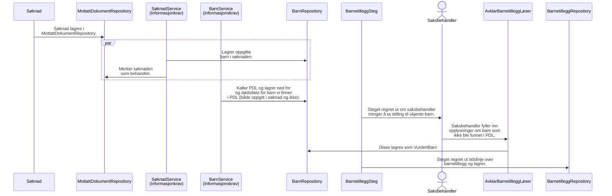

# Barnetillegg informasjonsflyt

Eksempel på hvordan informasjon flyter fra søknad, register til saksbehandlerløsningen.

Den strukturerte dataen i søknaden lagres i tabellen `mottatt_dokument`. Når søknaden mottas, leses den strukturerte dataen og lagres i relevante repositories. I dette tilfellet leses informasjon om oppgitte barn, og lagres i `BarnRepository`.

Før barnetilleggsteget kjøres, kjøres `BarnService`, som henter ned barn fra PDL. Her hentes også ned informasjon om barn som ble oppgitt i søknaden _hvis_ de oppga fødselsnummer.

Barnetilleggsteget trenger å finne ut av hvor mange og hvor lenge søker har rett til barnetillegg. Hvis PDL har informasjon om barn, kan dette avgjøres automatisk. Hvis ikke, må saksbehandler ta stilling til "manuelle barn".

Når alle barn er tatt høyde for, lagres en tidslinje over barnetillegg (faktisk en tidslinje med av `Set<BarnIdentifikator>`) i `BarnetilleggRepository`.

Denne informasjonen brukes deretter for å regne ut tilkjent ytelse senere.
