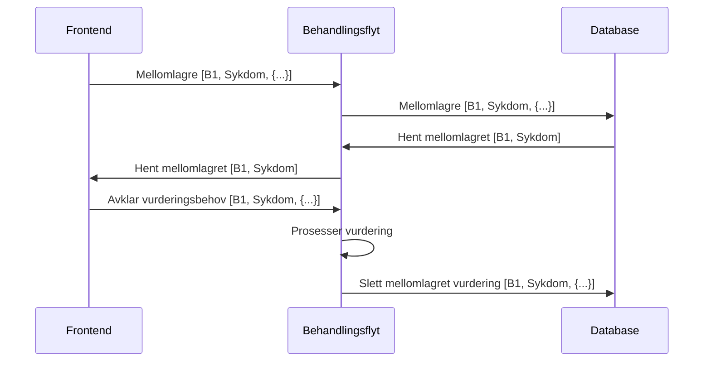

# Mellomlagring

Behandlingsflyt støtter mellomlagring av vurderinger på behandlingsnivå.

Felles api for alle vurderinger som lagrer ned en rad per avklaringsbehovkode og behandling.
Innholdet for mellomlagringen er en generisk JSON-blob som sendes inn fra frontend og parses av frontend ved bruk.
Det tas vare på hvem som har mellomlagret innholdet og når dette ble utført.
Dersom det kommer en ny mellomlagret verdi for samme avklaringsbehov så oversikrives den gamle verdien - den tas ikke
vare på.

### Opprydding

Når avklaringsbehov løses vil mellomlagrede verdier for dette avklaringsbehovet slettes fra databasen. Dersom det, mot
formodning, finnes mellomlagrede verdier når en behandling iverksettes vil disse bli slettet når behandlingen
iverksettes.

### Risiko

Dersom frontend endrer sine parametre vil det kunne være mellomlagrede data som ikke lar seg "mappe" til fornuftige
valg. For beskrivelsesfelter vil dette sjelden/aldri være et problem, men mindre avklaringsbehovet skrives fullstendig
om.

### Flyt

