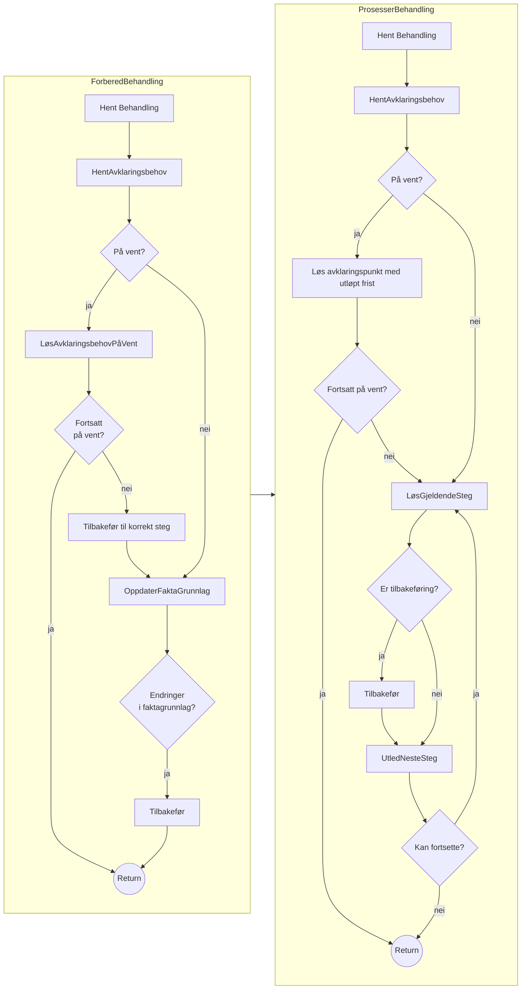
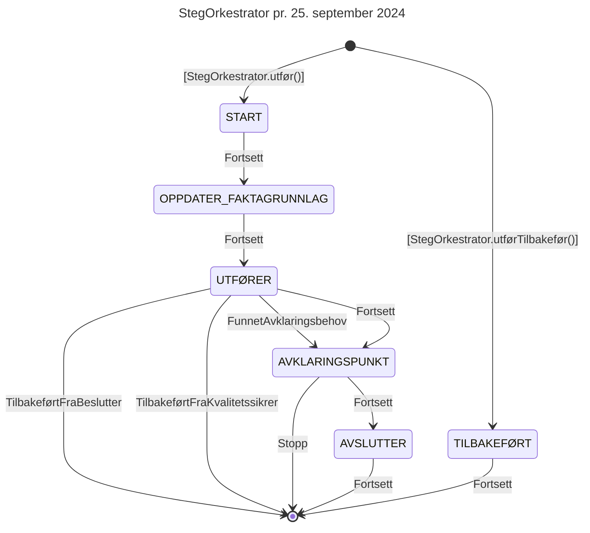

# Teknisk beskrivelse

Swagger-dokumentasjon: https://aap-behandlingsflyt.intern.dev.nav.no/swagger-ui/index.html

Grafana-dashboard: https://grafana.nav.cloud.nais.io/d/fdti727n7u6m8c/behandlingsflyt?orgId=1

## Kjøre lokalt

I IntelliJ, finn klassen `TestApp`, og kjør den derfra. Appen vil da kjøre på `localhost:8080`. Alternativt, for å unngå å starte IntelliJ:

```
cd app && TEST_APP=RUN ../gradlew test --tests TestApp --info
```


Swagger-dokumentasjon blir tilgjengelig på http://localhost:8080/swagger-ui/index.html.
For å gjøre autentiserte kall trengs JWT-token fra "fake Azure AD" (startet i `Fakes`-klassen). "Fake AD" kjører på `localhost:8081`, og du kan få token ved å kjøre

```
curl -s -XPOST http://localhost:8081/token  | jq -r '.access_token' | pbcopy
```

Nå kan API-kall gjøres i Swagger UI ved å trykke på "Authorize"-knappen og lime inn token. For å gjøre API-kall i Swagger i dev må _on behalf of_-token genereres i Ida (men det har jeg aldri fått til).

## Integrasjoner utad med interne apper

### Oppgavestyring

### Statistikk

Avgir statistikk på behandling underveis (ved behandlingsstopp) og avsluttet behandling for statistikkformål. Se mer på [statistikk-siden](/funksjonalitet/Statistikk/funksjonell).

### Tilgangsstyring

Inneholder logikk for å avgjøre om saksbehandlere har rett til forskjellige operasjoner på forskjellige saker/behandlinger. Se mer på [tilgangsstyringssiden](/funksjonalitet/Tilgangsstyring/funksjonell).

## Integrasjoner med eksterne team

### Persondataløsningen (PDL)

PDL-dokumentasjon: https://pdl-docs.ansatt.nav.no/ekstern/index.html

### Sak- og arkiv-fasade (SAF)

SAF (sak- og arkiv-fasade) tilbyr søk mot fagarkivet (Joark/dokarkiv) og sørger for korrekt tilgangsstyring av arkivdataene. Dokumentasjon [på Confluence](https://confluence.adeo.no/display/BOA/saf).

### Yrkesskade-saker

App-repo: https://github.com/navikt/yrkesskade/tree/main/apps/saker

Swagger-doc: https://yrkesskade-saker.intern.dev.nav.no/swagger-ui/index.html

### Institusjonsoppholdsregisteret

Github: https://github.com/navikt/institusjon

Noens eksempel kall- og respons [på Confluence](https://confluence.adeo.no/x/yY59HQ).

### Pensjon Popp: Inntekt

Github: https://github.com/navikt/popp/tree/main?tab=readme-ov-file

Swagger: https://pensjon-popp-q2.dev.intern.nav.no/popp/swagger-ui/index.html


### PESYS (pensjon-pen)

Per i dag (19-07-24) ser det ikke ut til at integrasjonen er fullført.

Jeg har ikke klart å finne noe Swagger-dok.

### MEDL

Github: https://github.com/navikt/medlemskap-medl

Swagger-dok: https://medlemskap-medl-api.dev.intern.nav.no/swagger-ui/index.html#/

## Tidslinjer/segmenter (TODO)

## Flytdiagram FlytOrkestrator



## State-machine for StegOrkestrator

