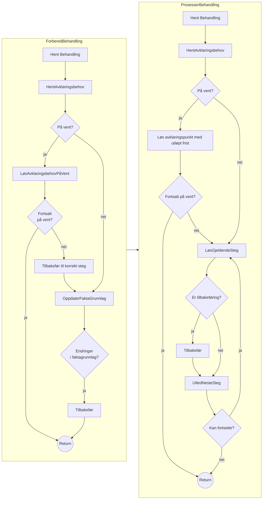
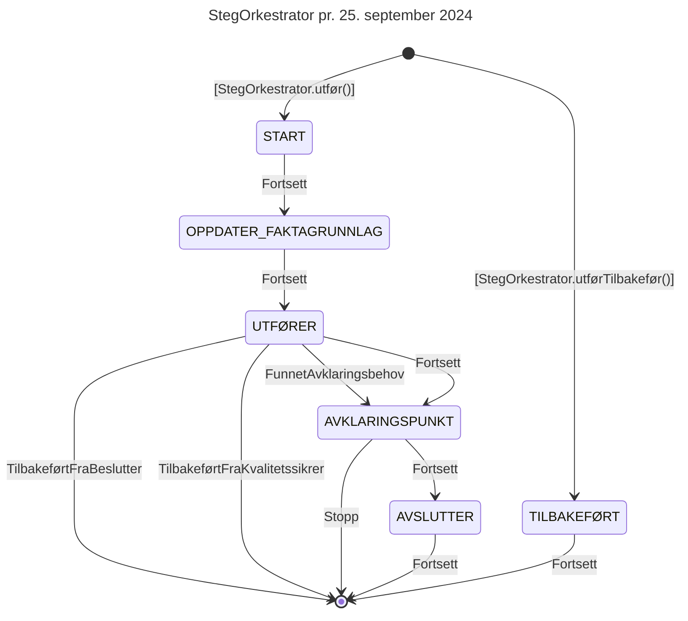
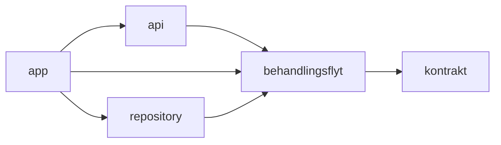

# Teknisk beskrivelse

[Github](https://github.com/navikt/aap-behandlingsflyt) | [Swagger](https://aap-behandlingsflyt.intern.dev.nav.no/swagger-ui/index.html) | [Grafana](https://grafana.nav.cloud.nais.io/d/fdti727n7u6m8c/behandlingsflyt?orgId=1)

Behandlingsflyt er den delen av Kelvin som eier saken og driver saksbehandlingen. Den er en generisk motor for sammenstilling av fakta og løsing av behov.

## Motoren

[Motoren](../../teknisk/felles_komponenter.md#motor) er en felles-komponent for tasks/jobbhåndtering som står sentralt
i løsningen. Når behandlingsflyt starter opp, legges diverse jobber til i motoren. Noen er periodiske, andre legges til
fortløpende, f.eks. ved at behandlingsflyt enten mottar eller sender ut en hendelse, eller at saksbehandler klikker seg
inn på en behandling.

Den mest sentrale jobben er `flyt.prosesserBehandling`, som starter opp flytorkestratoren.

## FlytOrkestrator

Flytorkestratoren har ansvar for å drive flyten til en gitt behandling. En behandling består av flere steg som utføres i
rekkefølge. Typen behandling avgjør hvilke steg som skal kjøres.

Jobben `flyt.prosesserBehandling` sparker i gang henholdsvis forbered- og prosesser behandling.
FlytOrkestratoren kjører i en transaksjon. Savepoints settes underveis i flyten
(se [StegOrkestrator](#stegorkestrator)), men en behandling kan også kjøres atomært, f.eks. meldekortbehandlingen.

### Forbered behandling

Har ansvar for å sette behandlingen i en oppdatert tilstand i form av å innhente opplysninger for stegene man allerede
har prosessert og vurdere om man er nødt til å behandle steget på nytt hvis det er oppdaterte opplysninger.

Dersom behandlingen er på vent, blir ventebehovet forsøkt løst ved å kalle relevante evaluatorer. Et eksempel er `FristUtløptVentebehovEvaluerer`, som løser behovet dersom fristen er utløpt. Automatiske løsninger for spesifikke
ventebehov kan lages ved å implementere `SpesifikkVentebehovEvaluerer`. Hvis behovet blir løst, tas behandlingen av vent, og flyten blir dratt tilbake til det steget som behandlingen var i da den ble satt på vent. 

### Prosesser behandling

Har ansvar for å drive prosessen fremover, stoppe opp ved behov for besluttningsstøtte av et menneske og sørge for at at
stegene traverseres i den definerte rekkefølgen i flyten. Flytene defineres i typen behandlingen.
[StegOrkestratoren](#stegorkestrator) kalles for det gjeldende steget.

### Diagrammer

## StegOrkestrator

Håndterer den definerte prosessen i et gitt steg, flytter behandlingen gjennom de forskjellige fasene internt i et
steg.

| Fase                   | Beskrivelse                                                                                                                                   | Savepoint |
|------------------------|-----------------------------------------------------------------------------------------------------------------------------------------------|:---------:|
| START                  | Teknisk markør for at flyten har flyttet seg til et gitt steg                                                                                 |     ✅     |
| OPPDATER_FAKTAGRUNNLAG | Oppdaterer faktagrunnlag                                                                                                                      |     ✅     |
| UTFØRER                | Utfører forrettningslogikken i steget ved å kalle på stegets utfør-metode                                                                     |           |
| AVKLARINGSPUNKT        | Vurderer om maskinen har bedt om besluttningstøtte fra et menneske og stopper prosessen hvis det er et punkt som krever stopp i dette steget. |           |
| AVSLUTTER              | Teknisk markør for avslutting av steget                                                                                                       |           |

### State-machine for StegOrkestrator

## Informasjonskrav / Oppdater faktagrunnlag

Steg kan ha informasjonskrav. Et informasjonskrav har ansvar for å hente inn relevant informasjon og oppdatere
faktagrunnlaget. Dette skjer både i flytorkestratoren og i stegorkestratoren. I flytorkestratoren hentes
informasjonskrav for alle foregående steg, slik at behandlingen kan dras tilbake til riktig steg dersom faktagrunnlaget
har endret seg. I stegorkestratoren hentes informasjonskrav for det gjeldende steget.
Et steg kan ha flere informasjonskrav, men disse må være uavhengige av hverandre. Det vil si at faktagrunnlaget som er
oppdatert i ett informasjonskrav ikke kan brukes i oppdater-metoden til et annet.

Informasjonskravene oppdateres asynkront.

## Avklaringsbehov

Behandlingsflyt prøver å fullføre en behandling på egenhånd. Dersom et steg ikke kan fullføres automatisk, opprettes et
avklaringsbehov som stopper opp behandlingen. Steget vil ikke fullføres før behovet er blitt løst. Hvordan et
avklaringsbehov løses, avhenger av behovets <i>definisjon</i>. Den finner man i enum-klassen `Definisjon`.

Merk: `Avklaringsbehov` i koden er et spesifikt avklaringsbehov som er opprettet når flyten stopper opp. Den peker på en
definisjon, men har også flere egenskaper som f.eks. hvilket steg det ble opprettet i, når det ble opprettet og hvem som
opprettet det. Avklaringsbehovhistorikken brukes videre
i [oppgavehåndtering](docs/funksjonalitet/07_Oppgave/teknisk.md).

### Definisjon

| Egenskap        | Beskrivelse                                                                                                                                         | Eksempel: `AVKLAR_STUDENT`     |
|-----------------|-----------------------------------------------------------------------------------------------------------------------------------------------------|--------------------------------|
| kode            | fire-sifret ekstern referanse                                                                                                                       | `5001`                         |
| type            | Hvordan behovet trigges                                                                                                                             | `MANUELT_PÅKREVD`              |
| løsesISteg      | Hvilket steg behovet løses i. Flere behov kan løses i samme steg, men et behov kan kun løses i ett steg. Flere steg kan opprette det samme behovet. | `StegType.AVKLAR_STUDENT`      |
| løsesAv         | Liste over roller som kan løse behovet. Brukes bl.a. til oppgavehåndtering og tilgangskontroll                                                      | `Rolle.SAKSBEHANDLER_NASJONAL` |
| kreverToTrinn   | Hvorvidt beslutter skal ta stilling til løsningen av behovet                                                                                        | `true`                         |
| kvalitetssikres | Hvorvidt kvalitetssikrer skal ta stilling til løsningen av behovet                                                                                  | `false`                        |
| defaultFrist    | Kun relevant for avklaringsbehov av type `VENTEPUNKT`                                                                                               | `null`                         |

:::info

Definisjon skal ikke endres - dette kan brekke gamle og åpne behandlinger. Eventuelle endringer gjøres ved å
opprette en ny definisjon med unik kode, og deprekere den gamle.

:::

## Tidslinjer/segmenter (TODO)

## Modulinndeling

### app

Ansvarlig for å lese inn konfigurasjon og starte opp applikasjonen ved å opprette
objekter fra de andre modulene og tildele disse.

Avhengigheter til tredjeparts kode for å
håndtere dette blir isolert til denne modulen.

### api

Ansvarlig for å tilgjengeliggjøre løsningens funksjonalitet til frontend og andre tjenester i form av
HTTP-basert API.

Oversetter mellom publisert API og modell i modul `behandlingsflyt`. Gjør
kall til forretningslogikk i `behandlingsflyt` gjennom objekter som blir opprettet av modul `app`
og tildelt `api` ved oppstart av applikasjonen. Avhengigheter til tredjeparts-kode for
implementasjon av HTTP-basert API blir isolert til denne modulen.

### behandlingsflyt

Ansvarlig for all forretningslogikk i applikasjonen.

Har ikke avhengigheter til kode i andre moduler, bortsett fra `kontrakt`. Bruker ingen eller få veletablerte
tredjepartsbiblioteker. Gjør kall til kode i modul `repository` gjennom interfaces definert i modul `behandlingsflyt`
som implementeres av klasser i `repository`. Oppstartskoden i modul `app`
oppretter objektene og tildeler disse ved oppstart av applikasjonen.

### repository

Ansvarlig for kommunikasjon med database og andre løsningers
APIer.

Implementerer interfaces definert i modul `behandlingsflyt`. Oversetter mellom
data-/objektmodell i `behandlingsflyt` og grensesnitt i andre applikasjoner. Avhengigheter til
tredjeparts kode for kommunikasjon med databaser og APIer blir isolert til denne modulen.

### kontrakt

Ansvarlig for å definere kontrakter mellom applikasjonen og andre tjenester.

Klasser i denne modulen publiseres som bibliotek.

## Samspill med frontend
https://github.com/navikt/aap-saksbehandling

Det er behandlingsflyt som styrer tilstanden til behandlingen. Når saksbehandler åpner en behandling, hentes informasjon
om behandlingen. Dersom behandlingen ikke har vært prosessert nylig, kaller frontenden `/forbered`-endepunktet for å
trigge jobben `flyt.prosesserBehandling`. Denne jobben kjøres så asynkront, og frontenden poller `/flyt`-endepunktet som
gir status på jobben. Når jobben er ferdig, oppdateres frontend med behandlingstilstanden, og navigerer til
riktig steg.

Stegene i den aktive steggruppa henter så inn `grunnlag`, som er informasjon som er relevant å vise i hvert steg. Når
saksbehandler sender inn en løsning i `/løs-behov` trigges ny prosessering av behandlingen, og det polles igjen på
`/flyt`-endepunktet for å synkronisere frontend med backend.

## DB-diagram for samordning-tabeller

