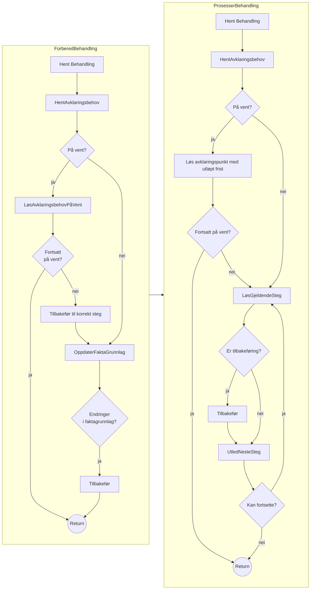
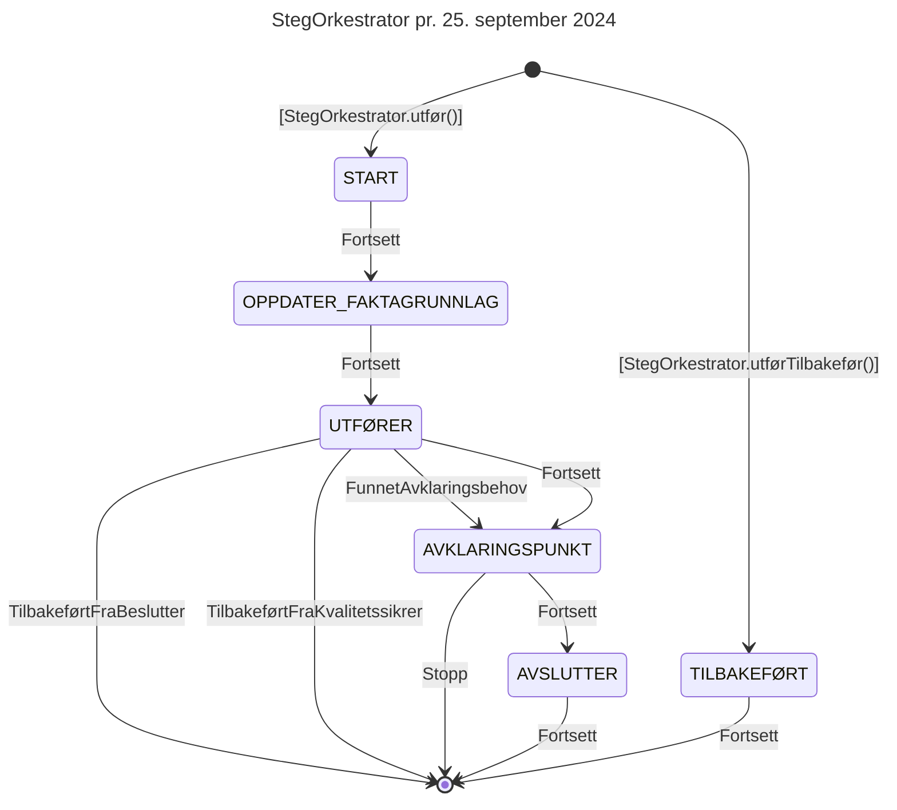

# Teknisk beskrivelse

Swagger-dokumentasjon: https://aap-behandlingsflyt.intern.dev.nav.no/swagger-ui/index.html

Grafana-dashboard: https://grafana.nav.cloud.nais.io/d/fdti727n7u6m8c/behandlingsflyt?orgId=1

Les også [readme](https://github.com/navikt/aap-behandlingsflyt)

## Tidslinjer/segmenter (TODO)

## FlytOrkestrator

Flytorkestratoren har ansvar for å drive flyten til en gitt behandling. Typen behandling styrer hvilke steg som skal
utføres.

Jobben `flyt.prosesserBehandling` sparker i gang henholdsvis forbered- og prosesser behandling.
FlytOrkestratoren kjører i en transaksjon. Savepoints settes underveis i flyten
(se [StegOrkestrator](#StegOrkestrator)), men kan også kjøres atomært, f.eks. meldekortbehandlingen.

### Forbered behandling

Har ansvar for å sette behandlingen i en oppdatert tilstand i form av å innhente opplysninger for stegene man allerede
har prosessert og vurdere om man er nødt til å behandle steget på nytt hvis det er oppdaterte opplysninger.

### Prosesser behandling

Har ansvar for å drive prosessen fremover, stoppe opp ved behov for besluttningsstøtte av et menneske og sørge for at at
stegene traverseres i den definerte rekkefølgen i flyten. Flytene defineres i typen behandlingen.

### Diagrammer

## StegOrkestrator

Håndterer den definerte prosessen i et gitt steg, flytter behandlingen gjennom de forskjellige fasene internt i et
steg. Et steg beveger seg gjennom flere faser som har forskjellig ansvar.

| Fase                   | Beskrivelse                                                                                                                                   | Savepoint |
|------------------------|-----------------------------------------------------------------------------------------------------------------------------------------------|:---------:|
| START                  | Teknisk markør for at flyten har flyttet seg til et gitt steg                                                                                 |     ✅     |
| OPPDATER_FAKTAGRUNNLAG | Oppdaterer faktagrunnlag                                                                                                                      |     ✅     |
| UTFØRER                | Utfører forrettningslogikken i steget ved å kalle på stegets utfør-metode                                                                     |           |
| AVKLARINGSPUNKT        | Vurderer om maskinen har bedt om besluttningstøtte fra et menneske og stopper prosessen hvis det er et punkt som krever stopp i dette steget. |           |
| AVSLUTTER              | Teknisk markør for avslutting av steget                                                                                                       |           |

### State-machine for StegOrkestrator

## DB-diagram for samordning-tabeller

