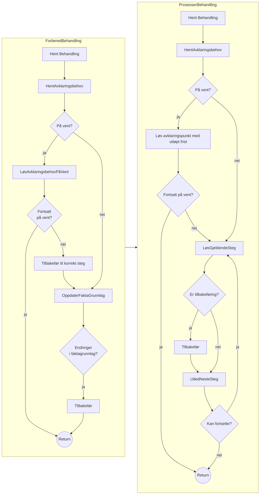
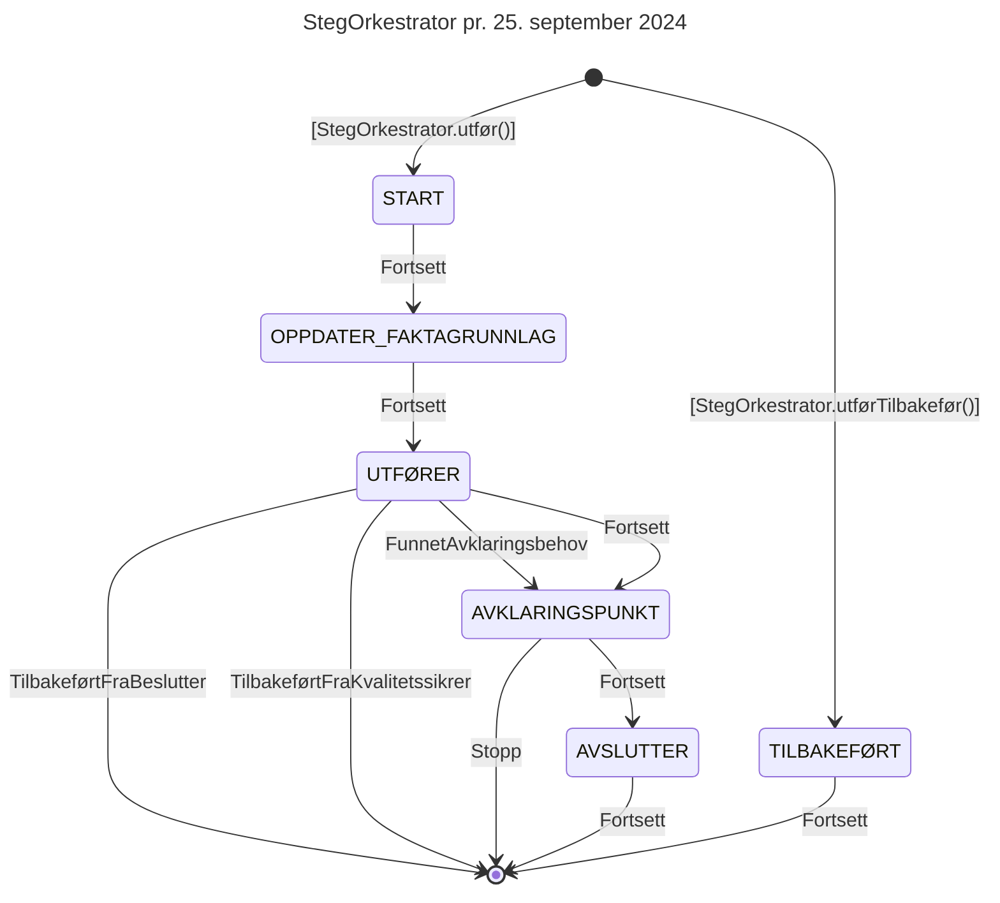

# Teknisk beskrivelse

Swagger-dokumentasjon: https://aap-behandlingsflyt.intern.dev.nav.no/swagger-ui/index.html

Grafana-dashboard: https://grafana.nav.cloud.nais.io/d/fdti727n7u6m8c/behandlingsflyt?orgId=1

## Kjøre lokalt

I IntelliJ, finn klassen `TestApp`, og kjør den derfra. Appen vil da kjøre på `localhost:8080`. Alternativt, for å unngå
å starte IntelliJ:

```
./gradlew runTestApp
```

i rotmappen.

Swagger-dokumentasjon blir tilgjengelig på http://localhost:8080/swagger-ui/index.html.
For å gjøre autentiserte kall trengs JWT-token fra "fake Azure AD" (startet i `Fakes`-klassen). "Fake AD" kjører
på `localhost:8081`, og du kan få token ved å kjøre

```
curl -s -XPOST http://localhost:8081/token  | jq -r '.access_token' | pbcopy
```

Nå kan API-kall gjøres i Swagger UI ved å trykke på "Authorize"-knappen og lime inn token. For å gjøre API-kall i
Swagger i dev må _on behalf of_-token genereres i Ida (men det har jeg aldri fått til).

## Tidslinjer/segmenter (TODO)

## Flytdiagram FlytOrkestrator



## State-machine for StegOrkestrator


