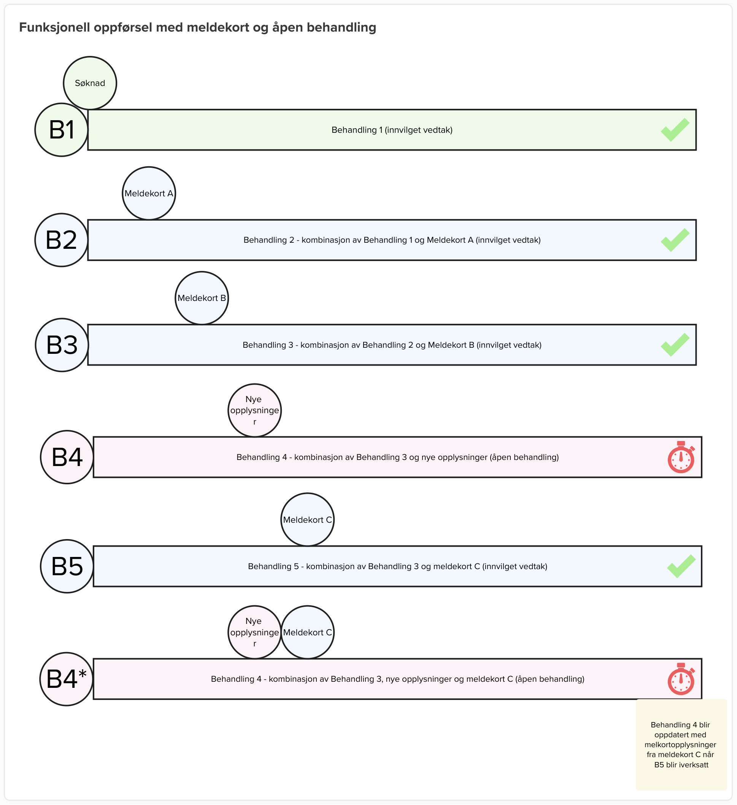

# Vedtak

## Overordnet

En behandling i Kelvin inneholder vilkår, registerdata og vurderinger. Enkelte vilkår utledes automatisk, mens andre utledes basert på vurderinger fra saksbehandler.

Det kan være ulike vilkårsresultater, satser og vurderinger for ulike perioder. Dette er grunnlaget for tidslinjene som eksisterer i Kelvin. 
En behandling oppretter tidslinjer fra sakens start til slutt med unikt innhold. Disse brukes til å beregne tilkjent ytelse for hver periode.
Tilkjent ytelse er perioder (tidslinjer) med informasjon om bl.a. arbeidede timer, dagsats, samordning, barnetillegg, effektiv dagsats og utbetalingsdato. 

Når en behandling godkjennes av beslutter er dette iverksatt - og blitt et iverksatt vedtak. Grunnlagsdataene fra dette vedtaket vil aldri endres og er komplett.

Første behandling på en sak i Kelvin kalles "Førstegangsbehandling", mens resterende behandlinger på saken kalles "revurdering".

Når det opprettes en revurdering i Kelvin gjøres dette med utgangspunkt i forrige iverksatte vedtak - samt eventuelle nye opplysninger som ligger til grunn (registre, innsendt dokumentasjon++).

Det kan i utgangspunktet kun eksistere én åpen behandling i Kelvin. Det vil si at dersom det kommer ny informasjon underveis i saksbehandlingen vil dette inkluderes i en eksisterende behandling, så lenge den ikke er iverksatt. 
Unntaket for denne regelen er dersom den nye opplysningen er meldekort - da opprettes det en egen behandling, kun for meldekort.

### Meldekort-behandling

En forutsetning for at innsendt meldekort skal prosesseres som en egen behandling i Kelvin er at det finnes et iverksatt vedtak med innvilgede perioder. Dersom meldekort sendes inn før det er iverksatt et vedtak vil meldekortopplysningene legges inn i førstegangsbehandlingen.

Når et meldekort sendes inn oppretter Kelvin en ny behandling med utgangspunkt i forrige iverksatte vedtak. Alle vilkår, vurderinger og opplysninger kopieres fra forrige vedtak og nye meldekortopplysninger legges til. 
Kelvin beregner ny tilkjent ytelse og iverksetter dette mot økonomi automatisk.
Den nye meldekortbehandlingen er nå "nyeste iverksatte vedtak" og inneholder alle opplysninger som ligger til grunn for hele saksperiode, på samme måte som andre revurderinger.
Ved opprettelse av en ny revurdering (vanlig eller nytt meldekort) så vil denne basere seg på forrige meldekortbehandling. 

NB: meldekort-behandlinger i Kelvin henter ikke oppdatert registerinformasjon underveis - den gjenbruker informasjon fra forrige iverksatte vedtak.

#### Meldekort og åpen behandling
Selv om det finnes en eksisterende åpen behandling (ikke iverksatt) vil meldekortet behandles i en separat behandling - kalt "meldekort-behandling".  
Denne behandlingen vil ta utgangspnukt i det sist iverksatte vedtaket (ikke endringer fra den åpne behandling), legge inn meldekortopplysningene og iverksette mot økonomi. 
Når meldekort-behandlingen er iverksatt vil opplysningene fra det nye meldekortet også effektueres på den åpne behandlingen slik at denne blir oppdatert med de nye opplysningene.

NB: Unntak dersom den eksisterende åpne behandlingen er en førstegangsbehandling - da vil meldekortet prosesseres sammen med førstegangsbehandlingen.

### Sjekk av registerinformasjon
Underveis i en behandling vil Kelvin sjekke registre for oppdatert informasjon og opprette avklaringsbehov dersom dette er nødvendig.

For meldekort-behandlinger vil ikke dette skje, men ... TODO (Må beskrives når det er implementert) 

### Flyter

- [Mural-flyt for meldekort](https://app.mural.co/t/navdesign3580/m/navdesign3580/1724828552945/96e5f250022558dcb6f26b83441fb313a7fee74f)
- [Mural-flyt for meldekort med en åpen behandling](https://app.mural.co/t/navdesign3580/m/navdesign3580/1743748972326/e77b8a16712c705667af38e95653b669a1cc5a71?wid=0-1745397476730)