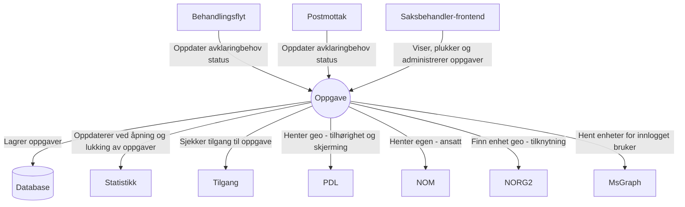
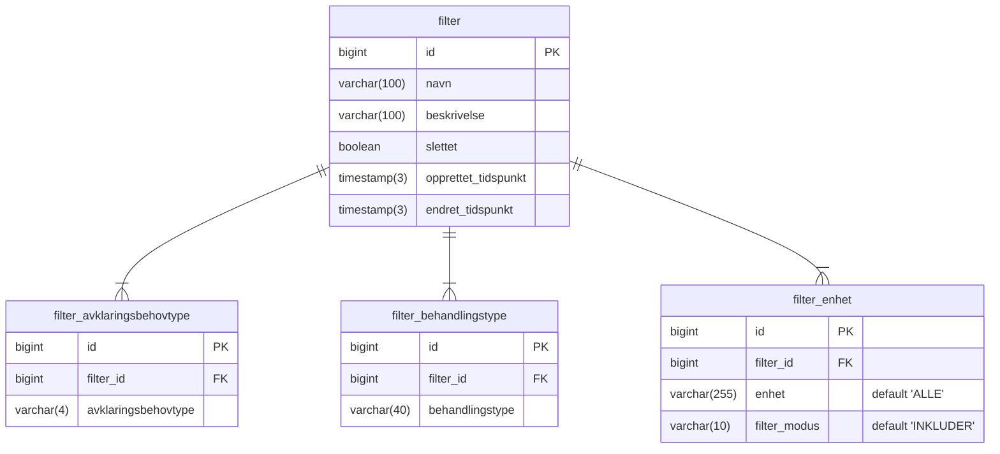

# Teknisk beskrivelse
[Github](https://github.com/navikt/aap-oppgave) | [Swagger](https://aap-oppgave.intern.dev.nav.no/swagger-ui/index.html)
### Kontekstdiagram

## Hvordan opprettes en oppgave?

Kelvin har to applikasjoner som tar i bruk oppgaveløsningen: [Postmottak](../12_Postmottak/teknisk.md)
og  [Behandlingsflyt](../06_Behandlingsflyt/teknisk.md).
Begge sender hendelser til oppgave når behandlingen stopper opp. Denne hendelsen inneholder informasjon om
avklaringsbehov med historikk. Oppgave verken oppretter eller løser avklaringsbehov, men har logikk for å avgjøre
hvorvidt en oppgave skal opprettes eller oppdateres gitt behandlingshistorikken.

## Hvordan er køer implementert?

Køer i Kelvins oppgaveløsning er implementert som et sett forhåndsdefinerte filtre på oppgaver. Disse filtrene er
lagret i databasen. På sikt skal det lages et grensesnitt for å opprette og vedlikeholde proprietære filtre.

Et filter kan filtrere oppgaver basert på avklaringsbehovkoder, behandlingstyper og enehter. Enhetsfilteret kan
inkludere eller ekskludere enheter. Eksempler på filtre er:

| Navn                         | Behandlingstyper                    | Avklaringsbehovkoder | Enheter                                                       |
|------------------------------|-------------------------------------|----------------------|---------------------------------------------------------------|
| Førstegangsbehandling kontor | Førstegangsbehandling               | 5003, 5004...        | INKLUDER ALLE, EKSKLUDER 4491, EKSKLUDER 4483, EKSKLUDER 4402 |
| NAY saksbehandler            | Førstegangsbehandling, Revurdrering | 5001, 5008...        | INKLUDER 4491                                                 |

