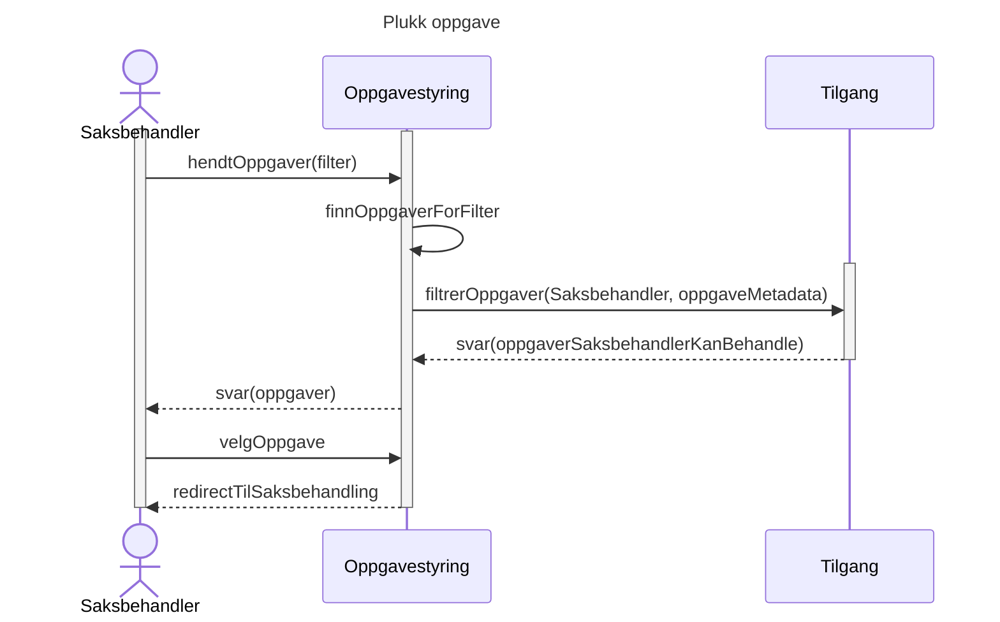
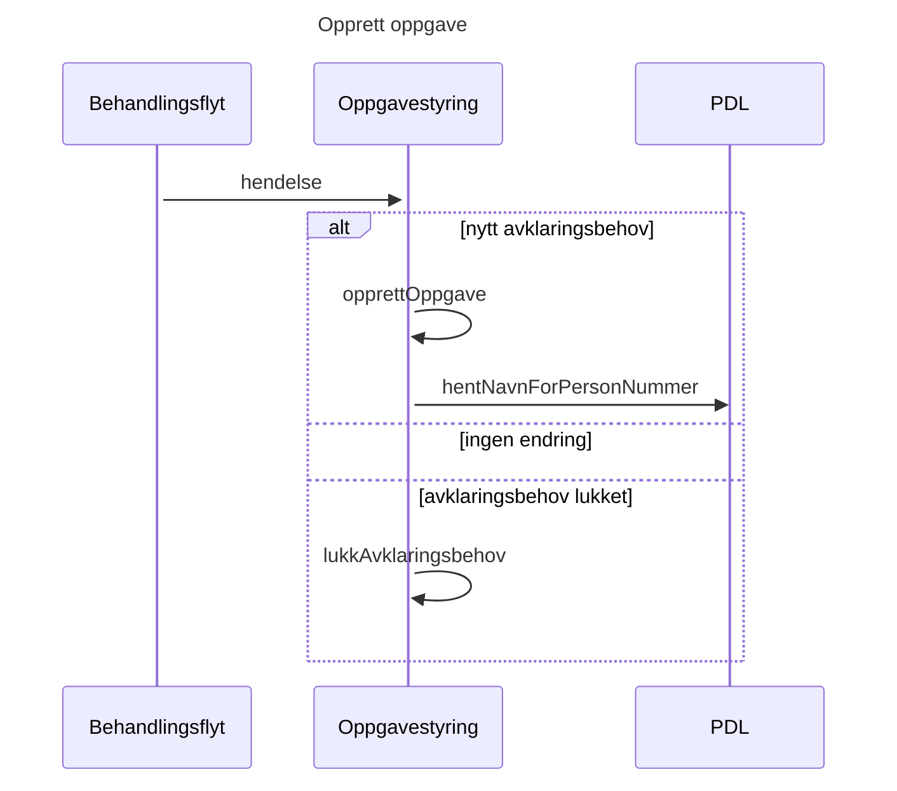
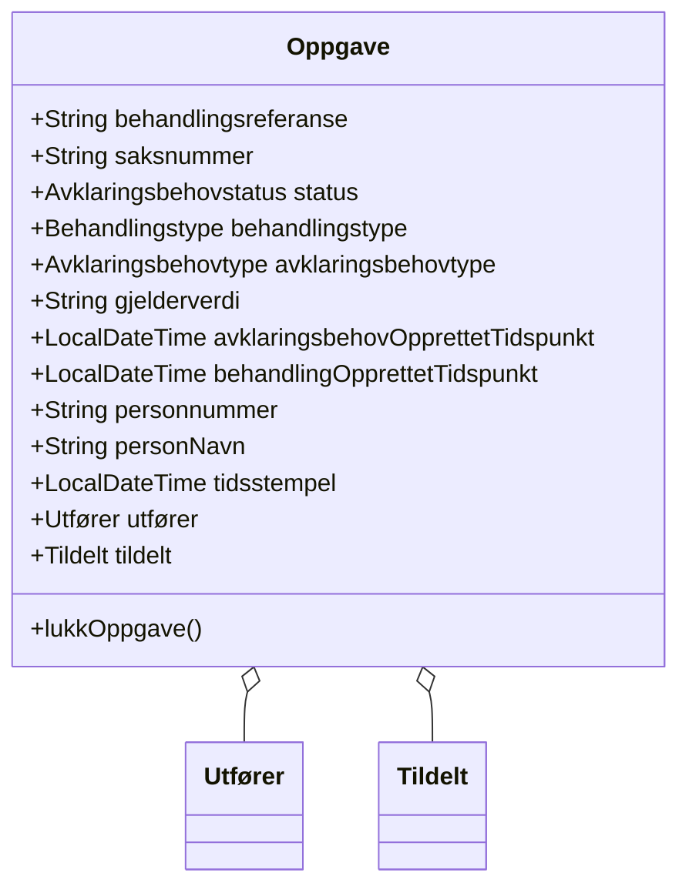
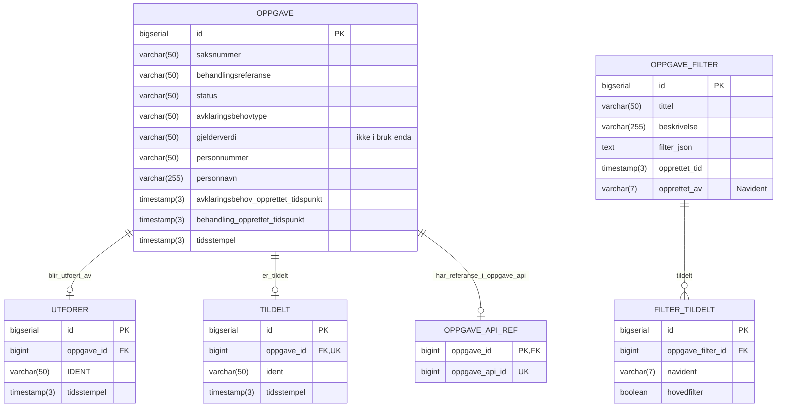

# Teknisk beskrivelse

Swagger-dokumentasjon: https://aap-oppgavestyring.intern.dev.nav.no/swagger-ui/index.html

## Informasjonsflyt

## Logisk datamodell

## Fysisk datamodell

`OPPGAVE_API_REF`-tabellen er ikke tatt i bruk, da det er usikkert om vi skal integrere mot Gosys
