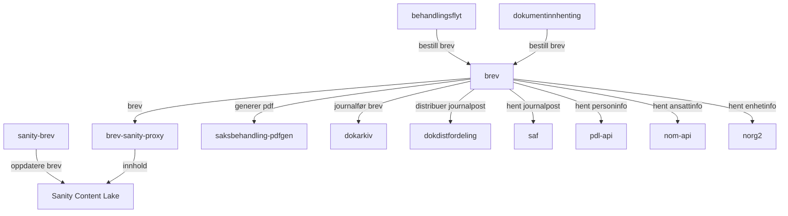
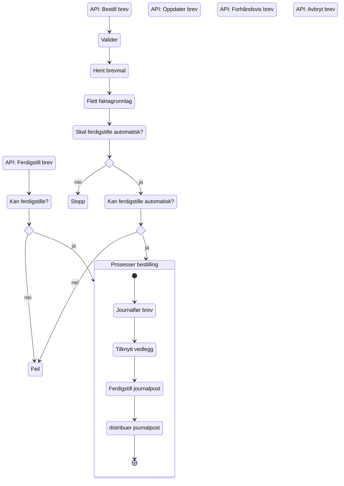

# Teknisk beskrivelse

## Flyt mellom applikasjoner

| Applikasjon                                                                                           | Formål                                                                                                            |
|-------------------------------------------------------------------------------------------------------|-------------------------------------------------------------------------------------------------------------------|
| [brev](https://github.com/navikt/aap-brev)                                                            | Håndterer bestilling, journalføring og distribusjon av brev                                                       |
| [behandlingsflyt](../06_Behandlingsflyt/teknisk.md)                                                   | Bestiller alle brev til bruker gjennom brev-applikasjonen                                                         |
| [dokumentinnhenting](../13_Dokumentinnhenting/teknisk.md)                                             | Genererer, journalfører og ekspederer brev til behandler gjennom brev-applikasjonen                               |
| [sanity-brev](https://github.com/navikt/aap-sanity-brev)                                              | Editering av brev for redaktører(Sanity studio). Definerer typer for schemas og queries.                          |
| [brev-sanity-proxy](https://github.com/navikt/aap-brev-sanity-proxy/)                                 | Henter og fletter innhold fra Sanity. Bruker typer fra aap-sanity-brev. Mapper til et felles format for aap-brev. |
| [saksbehandling-pdfgen](https://github.com/navikt/aap-saksbehandling-pdfgen/)                         | Genererer PDF                                                                                                     |
| [dokarkiv](https://confluence.adeo.no/spaces/BOA/pages/387098101/Arkivering+i+fagarkivet)             | Arkivering i fagarkivet                                                                                           |
| [dokdistfordeling](https://confluence.adeo.no/spaces/BOA/pages/329252897/Dokumentdistribusjon+domene) | Distribusjon av journalposter                                                                                     |
| [saf](https://confluence.adeo.no/display/BOA/saf)                                                     | Henter informasjon om journalposter for validering                                                                |
| [pdl-api](https://pdl-docs.ansatt.nav.no/ekstern/index.html)                                          | Henter navn og adressebeskyttelse                                                                                 |
| [nom-api](https://navikt.github.io/nom/)                                                              | Henter navn og org-tilknytning på en ansatt                                                                       |
| [norg2](https://navikt.github.io/norg2/)                                                                      | Henter enhetsnummer, -navn og -type                                                                               |
| [Sanity Content Lake](https://aap-brev.ansatt.dev.nav.no/studio/structure)                            | Holder på alle tekster som er definert og publisert i Sanity studio. Her kan redaktør redigere teskter.           |

## Flyt i brev

