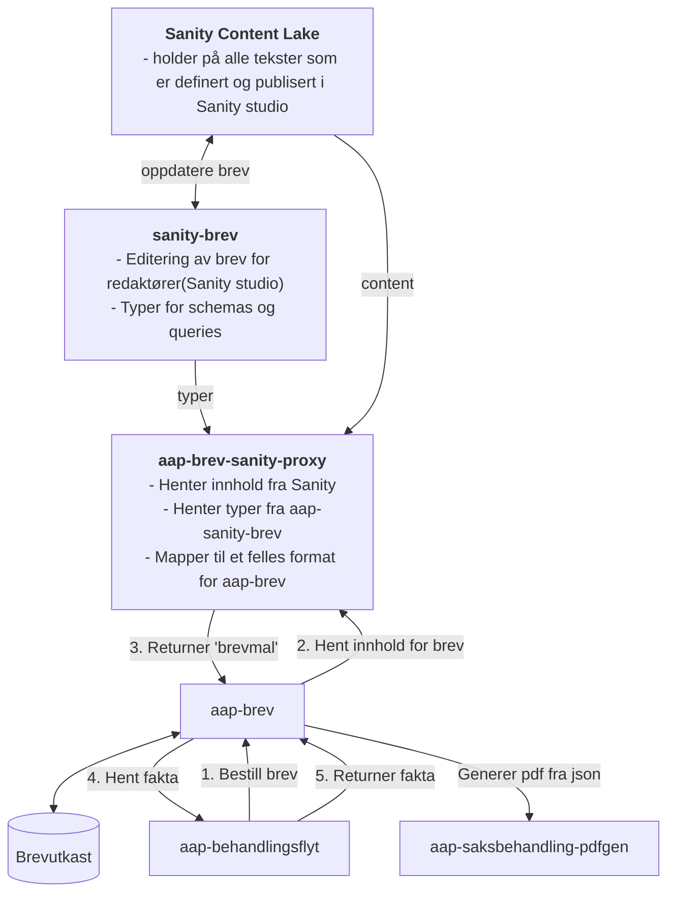

# Teknisk beskrivelse

## Tenkt dataflyt mellom applikasjoner

```mermaid
flowchart 
    sanity-content-lake["`**Sanity Content Lake**
    - holder på alle tekster som er definert og publisert i Sanity studio`"]
    aap-sanity-brev["`**sanity-brev**
    - Editering av brev for redaktører(Sanity studio)
    - Typer for schemas og queries`"] 
    aap-brev-sanity-proxy["`**aap-brev-sanity-proxy**
    - Henter innhold fra Sanity
    - Henter typer fra aap-sanity-brev
    - Mapper til et felles format for aap-brev`"]
    aap-sanity-brev -- typer --> aap-brev-sanity-proxy
    sanity-content-lake -- content --> aap-brev-sanity-proxy
    sanity-content-lake <-- oppdatere brev --> aap-sanity-brev
    aap-brev -- 2. Hent innhold for brev --> aap-brev-sanity-proxy
    aap-brev-sanity-proxy -- 3. Returner 'brevmal' --> aap-brev
    aap-brev <--> id1[(Brevutkast)]
    aap-behandlingsflyt -- 1. Bestill brev --> aap-brev
    aap-brev -- 4. Hent fakta -->  aap-behandlingsflyt 
    aap-behandlingsflyt -- 5. Returner fakta --> aap-brev
    aap-brev -- Generer pdf fra json --> aap-saksbehandling-pdfgen
```
