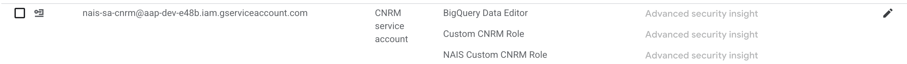

# Data i BigQuery

Oppskrift på replikering hvordan her: [her](../../innsikt/replikering_bigquery).

## Lage views i BigQuery

Det er en pågående jobb med å gå bort fra å skrive direkte til BigQuery, og heller dele [views](https://cloud.google.com/bigquery/docs/views) utledet fra tabeller som er replikert. Dette er mer stabilt med hensyn på feilhåndtering.

Views er definert via Kubernetes-manifester (som bruker Googles Config Connector), se [her](https://cloud.google.com/config-connector/docs/reference/resource-docs/bigquery/bigquerydataset).

Se [her](https://github.com/navikt/aap-statistikk/blob/main/.nais/bigquery/view_vilkarsresultat.yml) for definisjon av hvordan viewet `view-vilkarsresultat` er definert. Denne filen må refereres til i en Github Action ([se her](https://github.com/navikt/aap-statistikk/blob/main/.github/workflows/deploy_bigquery.yml)). Denne er igjen referert til i `release.yaml`-filen, slik:

```yaml
  deploy-bigquery-resources-dev:
    uses: ./.github/workflows/deploy_bigquery.yml
    secrets: inherit
    permissions:
      id-token: write
    with:
      cluster: dev-gcp
      project: aap-dev-e48b
```

### IAM-rolle for oppdatering av views

For at deploy skal fungere må Kubernetes-rollen til Nais (søk etter "CNRM service account" i Google Cloud Console) oppdateres til å ha rollen `BigQuery Data Editor`. Se bildet (screenshot fra dev):



:::info 

Hadde vi hatt tid, hadde alt dette vært automatisert med Terraform f.eks...

:::
