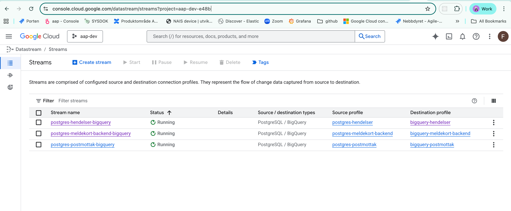
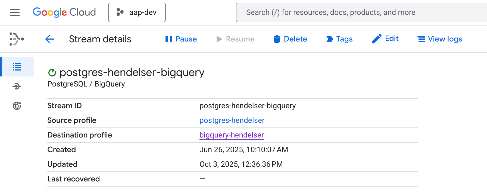
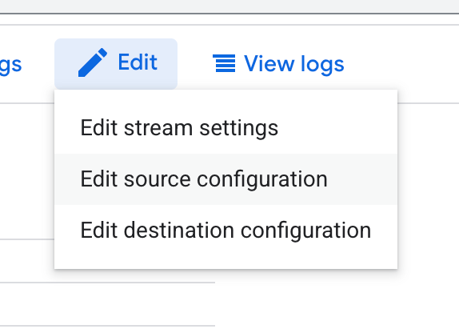
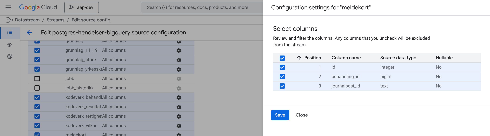
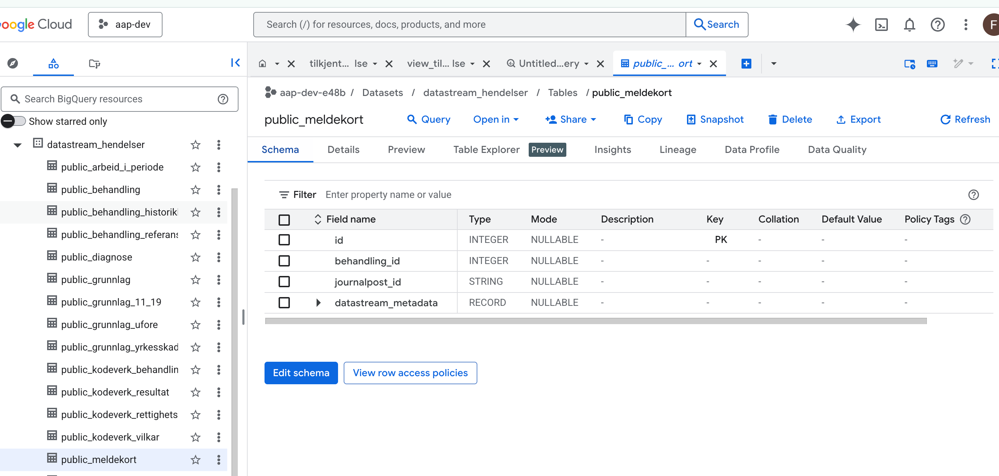
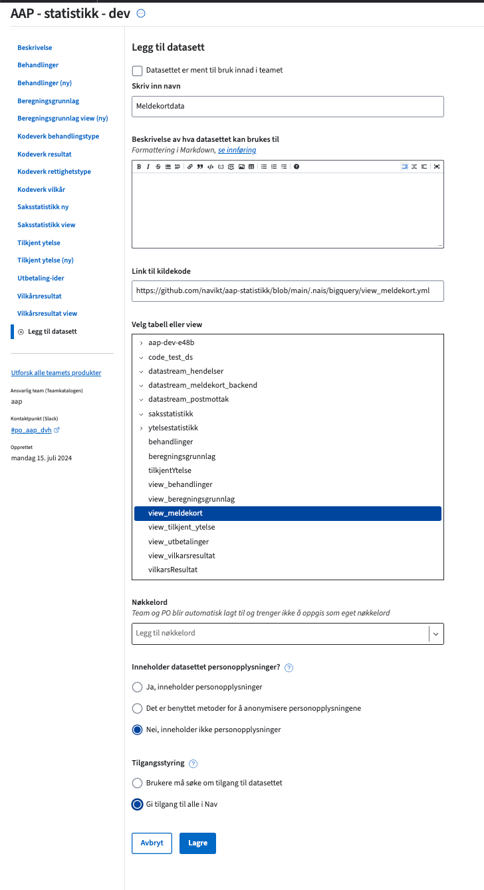
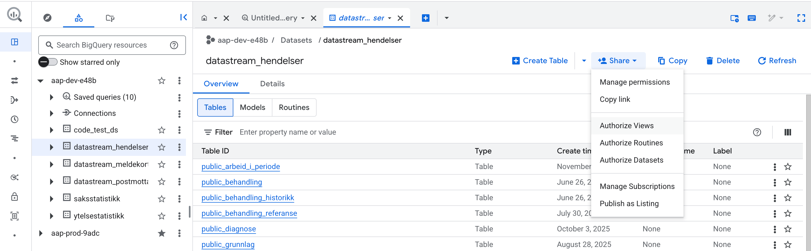
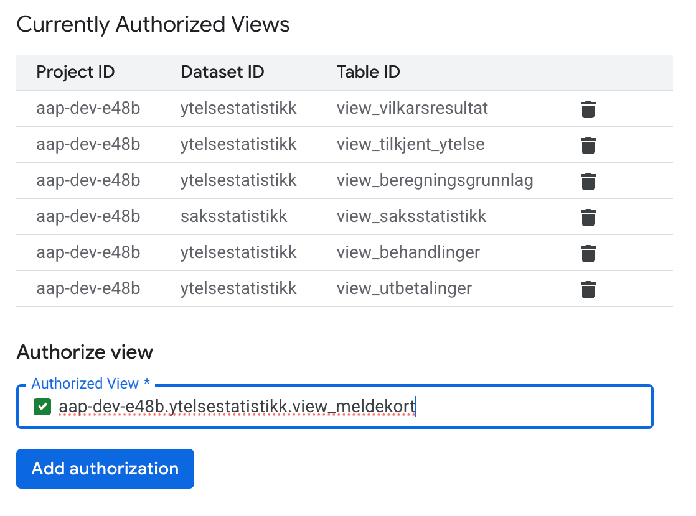

# Guide: hvordan dele ny tabell til datavarehus

:::info
Eksempelguide for å dele meldekortdata.
:::

Hvis det trengs å deles en ny tabell til datavarehuset, trengs følgende ting å gjøres:

 1. Pass på at tabellen er opprettet i statistikk-appen og blir populert av hendelser fra `behandlingsflyt`.
 2. Sett opp replikering av denne tabellen i Datastream (i dev og prod).
 3. Lag et view (eller endre på et eksisterende view) for å eksponere dataen.
 4. Eksponer tabellen eller viewet på Datamarkedsplassen.
 5. Oppdater dokumentasjon på Confluence.
 
Det kan være greit å gjøre endringene for ett miljø om gangen.
 
 ## Opprett tabellen i statistikk-appen

Vi skal dele tabellen som er definert slik:

```sql
CREATE TABLE meldekort
(
    id SERIAL PRIMARY KEY,
    behandling_id BIGINT NOT NULL REFERENCES behandling (id) ON DELETE CASCADE,
    journalpost_id TEXT NOT NULL UNIQUE
);

CREATE TABLE arbeid_i_periode (
    id SERIAL PRIMARY KEY,
    fra_dato date NOT NULL,
    til_dato date NOT NULL,
    timerArbeidet integer NOT NULL,
    meldekort_id INTEGER NOT NULL REFERENCES meldekort (id) ON DELETE CASCADE
);
```

Den blir populert i `HendelsesService` ved hver melding fra behandlingsflyt.

:::info
Replikering til BigQuery tåler ikke alle datatyper i Postgres. F.eks perioder/ranges. Flere detaljer [i dokumentasjonen](https://docs.cloud.google.com/datastream/docs/sources-postgresql).
:::

## Repliker tabellen via Datastream

Naviger til Datastream i GCP-konsollet.



Gå inn på `hendelser`-streamen, og klikk `Edit`



Klikk "Edit source configuration":



Velg hvilke(n) tabell som skal deles, og muligens hvilke kolonner (for tabeller med sensitiv data, vurder om alle kolonner trengs å deles):



Trykk "Save". Nå vil rader fra denne tabellen bli streamet til BigQuery (også gamle rader). Dette kan ta opp til 15 minutter med standardinnstillingene.

For å sjekke innholdet i den replikerte tabellen, naviger til BigQuery, og finn tabellen `datastream_hendelser.public_meldekort`.



## Lag view for å eksponere dataen

Lag en ny fil i `.nais/bigquery`-mappen i statistikk-kodebasen. Dette er et Kubernetes-manifest som bruker en GCP-modul i klusteret for å oppdatere GCP-ressurser.

F.eks slik:

```yaml
apiVersion: bigquery.cnrm.cloud.google.com/v1beta1
kind: BigQueryTable
metadata:
  name: view-meldekort
  namespace: aap
  labels:
    team: aap
  annotations:
    cnrm.cloud.google.com/management-conflict-prevention-policy: none
    cnrm.cloud.google.com/state-into-spec: absent
    cnrm.cloud.google.com/project-id: {{project}}
spec:
  resourceID: view_meldekort
  description: "View som viser meldekortdata."
  datasetRef:
    external: ytelsestatistikk
  view:
    useLegacySql: false
    query: >-
      SELECT * FROM `datastream_hendelser.public_meldekort`

```

Oppdater Github-workflow-filen `.github/workflows/deploy_bigquery.yml` til å anvende denne. Se https://github.com/navikt/aap-statistikk/blob/main/.nais/bigquery/view_meldekort.yml for endelig resultat.

Etter merge kan status på opprettelse av viewet ses med `kubectl` slik:

```bash
kubectl get bigquerytables/view-meldekort
```

Om det er feilmeldinger kan disse ses med:
```
kubectl describe bigquerytables/view-meldekort
```

## Eksponer tabellen på datamarkedsplassen

Logg inn på Datamarkedsplassen. I dev: https://data.ansatt.dev.nav.no/ og prod https://data.ansatt.dev.nav.no/.

Gå til "Mine produkter", og opprett et nytt datasett i et eksisterende produkt. I dev, det som heter "AAP - statistikk - dev". I prod er det ett for saksstatistikk, og ett for ytelsestatistikk.



Merk at det oppgis lenke til kildekode. I dev kan man gi tilgang til alle i Nav. I prod må man merke kolonner som personsensitive. I praksis er alle id-er på saker og behandlinger regnet som identifiserende.

Til slutt må man fikse at viewet kan hente data fra `datastream_hendelser`-datasettet. (jeg skulle ønske jeg visste om en måte å automatisere dette steget på)

I BigQuery, finn `datastream_hendelesr`-datasettet, og velg "Share" og deretter "Authorize views":



Fyll inn det nylig opprettede viewet:



## Oppdater dokumentasjon

Vi deler dokumentasjon på [Confluence](https://confluence.adeo.no/spaces/PAAP/pages/566090100/St%C3%B8nad+og+arbeidsmarkedsstatistikk).

## Gjenta for prod

Til slutt, gjenta stegene for prodmiljøet.

:::warning 
Alle endringer i eksisterende views bør kommuniseres på `#po_aap_dvh`-kanalen før de implementeres.
:::
