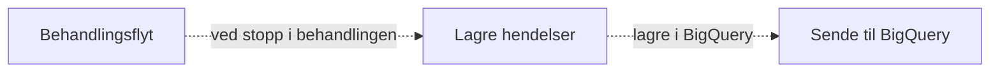

# Resending

Det er et [etterlevelseskrav](https://etterlevelse.ansatt.nav.no/krav/d3e815cc-02c4-486f-b3dc-c19b043adfb2) at dataprodukter skal ha resending-funksjonalitet.

## Påminnelse om arkitektur

For å forstå hvordan den er implementert, la oss minne oss på hvordan arkitekturen i statistikk-appen er satt opp:



Behandlingsflyt sender en payload med informasjon om avklaringsbehovhistorikk ved stopp i behandlingen (kall til `BehandlingHendelseServiceImpl`). Dette skjer typisk ganske mange ganger i en behandling (hver gang et avklaringsbehov må løses).

Statistikk-appen prøver å utlede forskjellige statuser og oversette til egen modell i en jobb som startes (`LagreStoppetHendelseJobb`). Dette lagres internt i statistikkappen i tabellen `behandling_historikk` og `behandling`.

Når denne jobben er fullført, trigges en jobb for å lagre til BigQuery (i praksis en egen tabell `saksstatistikk` som replikeres til BigQuery). Denne jobben leser fra behandling-tabellene, for å utlede rader tilpasset kravene til saksstatistikk (av typen `no.nav.aap.statistikk.saksstatistikk.BQBehandling`).

## Mekanisme for resending

Litt avhengig av hvor feilen lå / grunnen til at man trenger å resende, er det forskjellige data som må reproduseres.

Om feilen ligger i logikk _etter_ lagring i `behandling_historikk`-tabellen (eller om det kan fikses ved manuell skriving kun i statistikk-db), så trenger man kun en mekanisme for å resende data til BigQuery uten å involvere behandlingsflyt (kilden).

Dette gjøres av jobben `ResendSakstatistikkJobb`. Den fungerer ved at den henter alle hendelser som er lagret på en behandling, og regenererer en liste av nye hendelser av type `BQBehandling`. Disse blir så lagret i `saksstatistikk`-tabellen. Her er det et krav fra datavarehuset at ved resending må alle tidligere `endretTid`/`funksjonellTid`-tidsstempler være med, slik at de kan utlede resendt data (de spør etter `funksjonellTid` + sekvensnummer + teknisk tid for å utlede ny data). Derfor skjer noe "fletting" av tidligere sendte hendelser og potensielle nye hendelser i metoden [`flettBehandlingHendelser`](https://github.com/navikt/aap-statistikk/blob/e3969d433e8ec1a36b11ca1548c68c987db63b37/app/src/main/kotlin/no/nav/aap/statistikk/saksstatistikk/SaksStatistikkService.kt#L174), nettopp for å sørge at man bevarer tidligere `endretTid`-tidsstempler.

Om derimot man trenger å resende helt fra behandlingsflyt, så trenger man å trigge en jobb der (`ResendStatistikkJobbUtfører`). Denne sender avklaringsbehovhistorikk på nytt (av typen `no.nav.aap.behandlingsflyt.prosessering.statistikk.BehandlingFlytStoppetHendelseTilStatistikk`). Siden dette er kun én hendelse, må vi utlede historikken på nytt på et vis. Dette gjøres ved å utlede hva som har skjedd på en behandling ved å se på endringtidspunktene i avklaringsbehovhistorikken. Dette skjer i klassen `ReberegnHistorikk` i statistikk-appen.

Trunkert kode:
```kotlin
        val endringsTidspunkter = avklaringsbehov.flatMap {
            it.endringer.map { it.tidsstempel }
        }.sortedBy { it }

        val avklaringsbehovHistorikk = endringsTidspunkter.map { tidspunkt ->
            avklaringsbehov.påTidspunkt(tidspunkt)
        }.filterNot {
            // Fjerne "ugyldig" tilstand
            it.utledAnsvarligBeslutter() == null && it.sisteAvklaringsbehovStatus() == null
        }

        return avklaringsbehovHistorikk.fold(behandling) { acc, curr ->
            acc.leggTilHendelse(
                BehandlingHendelse(
                    // ... 
                    saksbehandler = curr.sistePersonPåBehandling()?.let(::Saksbehandler),
                    resultat = dto.avsluttetBehandling?.resultat.resultatTilDomene(),
                    versjon = dto.versjon.let(::Versjon),
                    status = curr.utledBehandlingStatus(),
                    // ...
                )
            )
        }
```

## Hvordan trigge resending

Per nå er mekanismen å manuelt sette inn en jobb i databasen. Man trenger behandling-id.

Eksempel i behandlingsflyt:

```sql
select id
from behandling
where referanse = '02e40369-ad98-4a09-948a-67d4808eacb6'; -- returnerer 10007

insert into jobb (type, sak_id, behandling_id, neste_kjoring, parameters, payload)
values ('flyt.statistikk.resend', null, null, '2023-01-01 00:00:00', null, '10007');
```

Tilsvarende SQL vil virke i statistikk (med jobbtype `statistikk.resendSakstatistikk`).

## Eksempler på når resending har skjedd

### Etterfylle prod-data ved hjelp av resending

(i midten av desember 2025)

Da det ble bestemt at dev-dataen var god nok for saksstatistikken, ble prod-tabellen `saksstatistikk` tømt, og hendelser ble sendt til statistikkappen på nytt ved å trigge dem i `behandlingsflyt`.

For alle avsluttede behandlinger ble denne spørringen kjørt:

```sql
insert into jobb (type, sak_id, behandling_id, neste_kjoring, parameters, payload)
select 'flyt.statistikk.resend', sak_id, null, '2023-01-01 00:00:00', null, id::text
from (select *
      from behandling
      where status = 'AVSLUTTET'
      order by id asc
      offset 3330 rows limit 500) as "b*";
```

(med varierende offset-verdi).

Dette resulterte i ca 5000 nye rader i `saksstatistikk`-tabellen.

Denne måten å resende på er altså samme som under overskriften [Hvordan trigge resending](#hvordan-trigge-resending).


### Riktig status på OVERSENDT_KA for klager

(ca 12 januar 2026)

Et annet tilfelle oppstod da vi fikk beskjed om at de trengte et status-felt for *før* klager blir sendt til andreinstans (Kabal). Se [denne Slack-tråden](https://nav-it.slack.com/archives/C07NKPFFELT/p1767878273931259).

Da måtte tidligere hendelser oppdateres (hvor "oppdateres" betyr å sette inn en ny rad med samme funksjonelle tid men høyere teknisk tid). Jeg måtte grave litt i databasen til `behandlingsflyt` for å finne de riktige tidspunktene. Til slutt fant jeg denne spørringen, som sier når `OPPRETTHOLDELSE`-steget ble kjørt.

```sql
select referanse, sh.opprettet_tid
from behandling b
         join steg_historikk sh on b.id = sh.behandling_id
where sh.steg = 'OPPRETTHOLDELSE'
  and sh.status = 'OPPDATER_FAKTAGRUNNLAG'
  and b.referanse in (
                      '206d8983-fd32-40a2-aac8-e89194d4c2f1',
                      '<mange andre uuid-er>',
                      '5f5d8a13-fe38-4244-afc2-902ef7577db9')
```

Dette er altså UUID-ene til klagebehandlingene.

Nå kan jeg copy-paste resultatet fra IntelliJ, lime inn, og bruke multicursor til raskt å lage en ny spørring:

```sql
insert into saksstatistikk (fagsystem_navn, behandling_uuid, saksnummer, relatert_behandling_uuid,
                            relatert_fagsystem, behandling_type, aktor_id, teknisk_tid,
                            registrert_tid, endret_tid, mottatt_tid, vedtak_tid,
                            ferdigbehandlet_tid, versjon, avsender, opprettet_av,
                            ansvarlig_beslutter, soknadsformat, saksbehandler, behandlingmetode,
                            behandling_status, behandling_aarsak, behandling_resultat,
                            resultat_begrunnelse, ansvarlig_enhet_kode, sak_ytelse)
select fagsystem_navn,
       behandling_uuid,
       saksnummer,
       relatert_behandling_uuid,
       relatert_fagsystem,
       behandling_type,
       aktor_id,
       now(),
       registrert_tid,
       ts,
       mottatt_tid,
       vedtak_tid,
       ferdigbehandlet_tid,
       versjon,
       avsender,
       opprettet_av,
       ansvarlig_beslutter,
       soknadsformat,
       saksbehandler,
       behandlingmetode,
       'OVERSENDT_KA',
       behandling_aarsak,
       behandling_resultat,
       resultat_begrunnelse,
       ansvarlig_enhet_kode,
       sak_ytelse
from (values ('bff56e25-2899-43db-8678-02203fe90b2b'::uuid, '2025-07-03 10:42:39.566'::timestamp),
              -- mange flere verdier
             ('8f445ebe-693b-406a-b303-c4da62e0e4bc'::uuid,
              '2026-01-08 11:51:02.312'::timestamp)) as data(uuid, ts)
         cross join lateral (
    select *
    from saksstatistikk
    where behandling_uuid = data.uuid
      and endret_tid < data.ts
    order by endret_tid desc
    limit 1)
returning id
```

Dette setter inn en ny rad i saksstatistikk-tabellen _etter_ siste hendelse som er før tidspunktene som er limt inn fra den forrige spørringen.

Etter ca 10-15 minutter er disse synlige i BigQuery.

### Resende relatert behandling UUID for klager

(20 januar 2026)

Steg en var å identifisere disse i behandlingsflyt. Dette ble gjort med spørringen

```sql
select kb.referanse, b.referanse
from paaklaget_behandling_grunnlag pg
         join paaklaget_behandling_vurdering pv on pg.vurdering_id = pv.id
         join behandling kb on pg.behandling_id = kb.id
         join behandling b on pv.paaklaget_behandling_id = b.id
where aktiv = true and kb.status = 'AVSLUTTET';
```

Resultatet ble kopiert inn i neste insert-spørring:

```sql
insert
into saksstatistikk (fagsystem_navn, behandling_uuid, saksnummer, relatert_behandling_uuid,
                     relatert_fagsystem, behandling_type, aktor_id, teknisk_tid,
                     registrert_tid, endret_tid, mottatt_tid, vedtak_tid,
                     ferdigbehandlet_tid, versjon, avsender, opprettet_av,
                     ansvarlig_beslutter, soknadsformat, saksbehandler, behandlingmetode,
                     behandling_status, behandling_aarsak, behandling_resultat,
                     resultat_begrunnelse, ansvarlig_enhet_kode, sak_ytelse)
select fagsystem_navn,
       behandling_uuid,
       saksnummer,
       relatert,
       'KELVIN',
       behandling_type,
       aktor_id,
       now(),
       registrert_tid,
       endret_tid,
       mottatt_tid,
       vedtak_tid,
       ferdigbehandlet_tid,
       versjon,
       avsender,
       opprettet_av,
       ansvarlig_beslutter,
       soknadsformat,
       saksbehandler,
       behandlingmetode,
       behandling_status,
       behandling_aarsak,
       behandling_resultat,
       resultat_begrunnelse,
       ansvarlig_enhet_kode,
       sak_ytelse
from (values ('bff56e25-2899-43db-8678-02203fe90b2b'::uuid,
              '5bd61cee-9677-44da-af1d-86177b7045d2'::uuid),
              --- FLERE UUID-PAR
             ('543526ff-c42b-42a7-bd50-d23aa08a67f0'::uuid,
              '805b1e33-84ee-4473-821e-16dcf02a0865'::uuid)) as data(uuid, relatert)
         cross join lateral (
    select *
    from saksstatistikk
    where behandling_uuid = data.uuid
      and behandling_status in ('AVSLUTTET', 'OVERSENDT_KA')
    order by endret_tid desc
    limit 1)
returning id;
```
