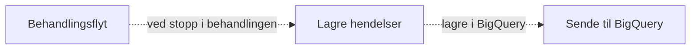

# Resending

Det er et [etterlevelseskrav](https://etterlevelse.ansatt.nav.no/krav/d3e815cc-02c4-486f-b3dc-c19b043adfb2) at dataprodukter skal ha resending-funksjonalitet.

## Påminnelse om arkitektur

For å forstå hvordan den er implementert, la oss minne oss på hvordan arkitekturen i statistikk-appen er satt opp:



Behandlingsflyt sender en payload med informasjon om avklaringsbehovhistorikk ved stopp i behandlingen (kall til `BehandlingHendelseServiceImpl`). Dette skjer typisk ganske mange ganger i en behandling (hver gang et avklaringsbehov må løses).

Statistikk-appen prøver å utlede forskjellige statuser og oversette til egen modell i en jobb som startes (`LagreStoppetHendelseJobb`). Dette lagres internt i statistikkappen i tabellen `behandling_historikk` og `behandling`.

Når denne jobben er fullført, trigges en jobb for å lagre til BigQuery (i praksis en egen tabell `saksstatistikk` som replikeres til BigQuery). Denne jobben leser fra behandling-tabellene, for å utlede rader tilpasset kravene til saksstatistikk (av typen `no.nav.aap.statistikk.saksstatistikk.BQBehandling`).

## Mekanisme for resending

Litt avhengig av hvor feilen lå / grunnen til at man trenger å resende, er det forskjellige data som må reproduseres.

Om feilen ligger i logikk _etter_ lagring i `behandling_historikk`-tabellen (eller om det kan fikses ved manuell skriving kun i statistikk-db), så trenger man kun en mekanisme for å resende data til BigQuery uten å involvere behandlingsflyt (kilden).

Dette gjøres av jobben `ResendSakstatistikkJobb`. Den fungerer ved at den henter alle hendelser som er lagret på en behandling, og regenererer en liste av nye hendelser av type `BQBehandling`. Disse blir så lagret i `saksstatistikk`-tabellen. Her er det et krav fra datavarehuset at ved resending må alle tidligere `endretTid`/`funksjonellTid`-tidsstempler være med, slik at de kan utlede resendt data (de spør etter `funksjonellTid` + sekvensnummer + teknisk tid for å utlede ny data). Derfor skjer noe "fletting" av tidligere sendte hendelser og potensielle nye hendelser i metoden [`flettBehandlingHendelser`](https://github.com/navikt/aap-statistikk/blob/e3969d433e8ec1a36b11ca1548c68c987db63b37/app/src/main/kotlin/no/nav/aap/statistikk/saksstatistikk/SaksStatistikkService.kt#L174), nettopp for å sørge at man bevarer tidligere `endretTid`-tidsstempler.

Om derimot man trenger å resende helt fra behandlingsflyt, så trenger man å trigge en jobb der (`ResendStatistikkJobbUtfører`). Denne sender avklaringsbehovhistorikk på nytt (av typen `no.nav.aap.behandlingsflyt.prosessering.statistikk.BehandlingFlytStoppetHendelseTilStatistikk`). Siden dette er kun én hendelse, må vi utlede historikken på nytt på et vis. Dette gjøres ved å utlede hva som har skjedd på en behandling ved å se på endringtidspunktene i avklaringsbehovhistorikken. Dette skjer i klassen `ReberegnHistorikk` i statistikk-appen.

Trunkert kode:
```kotlin
        val endringsTidspunkter = avklaringsbehov.flatMap {
            it.endringer.map { it.tidsstempel }
        }.sortedBy { it }

        val avklaringsbehovHistorikk = endringsTidspunkter.map { tidspunkt ->
            avklaringsbehov.påTidspunkt(tidspunkt)
        }.filterNot {
            // Fjerne "ugyldig" tilstand
            it.utledAnsvarligBeslutter() == null && it.sisteAvklaringsbehovStatus() == null
        }

        return avklaringsbehovHistorikk.fold(behandling) { acc, curr ->
            acc.leggTilHendelse(
                BehandlingHendelse(
                    // ... 
                    saksbehandler = curr.sistePersonPåBehandling()?.let(::Saksbehandler),
                    resultat = dto.avsluttetBehandling?.resultat.resultatTilDomene(),
                    versjon = dto.versjon.let(::Versjon),
                    status = curr.utledBehandlingStatus(),
                    // ...
                )
            )
        }
```

## Hvordan trigge resending

Per nå er mekanismen å manuelt sette inn en jobb i databasen. Man trenger behandling-id.

Eksempel i behandlingsflyt:

```sql
select id
from behandling
where referanse = '02e40369-ad98-4a09-948a-67d4808eacb6'; -- returnerer 10007

insert into jobb (type, sak_id, behandling_id, neste_kjoring, parameters, payload)
values ('flyt.statistikk.resend', null, null, '2023-01-01 00:00:00', null, '10007');
```

Tilsvarende SQL vil virke i statistikk (med jobbtype `statistikk.resendSakstatistikk`).


