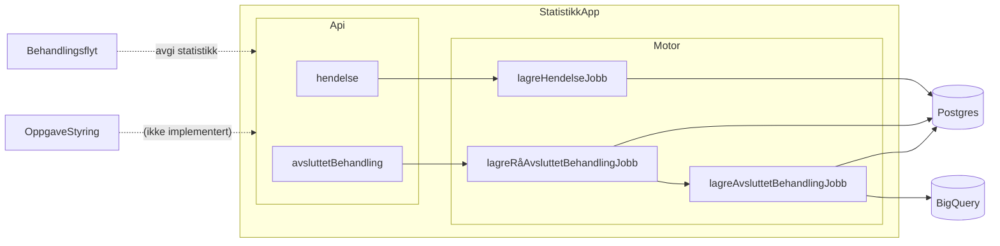
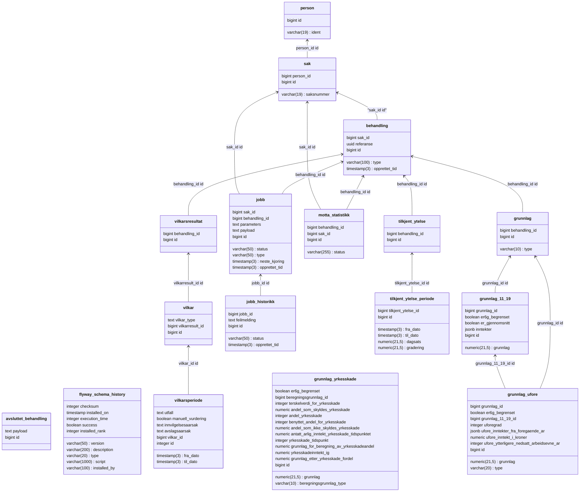

# Teknisk beskrivelse

Swagger-dokumentasjon: https://aap-statistikk.intern.dev.nav.no/swagger-ui/index.html


[Lenke til Nais Console](https://console.nav.cloud.nais.io/team/aap/dev-gcp/app/statistikk)

Logger: [Adeo](https://logs.adeo.no/app/r?l=DISCOVER_APP_LOCATOR&v=8.13.4&lz=N4IgjgrgpgTgniAXKANgQwHYHMJq1JEAa2nhABpxSFEQ0AHelASwGM0AXZgewwAJEfADogAzh07NxzIkREgAvpVHcYHJAG0NIAAJcAtlHFp99CiAAmR1iAC6tyq24oI%2BjKM0gUUAG5QU5oaiongElFAYPqzoweYMTGySvOb03BZ2lMwYVgAehACcAGxQhQAsABysAAwAtPnlVWg1AIzNUPk15QDMjTVQzQDsAEZDFmVDpRZD5lkcsD5oAbRoEBzc5gBmzChzMB6IGg6WnGgAasxQAO4Akum0RSUV1XUNTa3tnT1N%2FcOj45PTSgGKAAJUw%2BCQoA2MG4%2BkIGG4lxqACZSgALAD0aPMa3hiMUlBgUGhRjR1wwuwWS1AVOgSEKVUZVUo9BWogIiA4MGgCgUQA%3D%3D%3D)

Grafana-dashboard: https://grafana.nav.cloud.nais.io/d/edqu3y0nhmxhcb/statistikk?orgId=1

## Kjøre lokalt

Fra IntelliJ, kjør `TestApp`-klassen.

Swagger-UI kan da åpnes på: http://0.0.0.0:8080/swagger-ui/index.html

For å gjøre autentiserte kall trengs JWT-token fra "fake Azure AD" (startet i `Fakes`-klassen). "Fake AD" kjører på `localhost:8081`, og du kan få token ved å kjøre

```
curl -s -XPOST http://localhost:8081/token  | jq -r '.access_token' | pbcopy
```

Nå kan API-kall gjøres i Swagger UI ved å trykke på "Authorize"-knappen og lime inn token.

## API-kontrakt

Statistikk-appen publiserer et artifakt slik at konsumenter lett kan generere gyldige DTO-er.

Eksempel-bruk: (sjekk nyeste versjon [på Github](https://github.com/navikt/aap-statistikk/packages/2234133))

```gradle
    implementation("no.nav.aap.statistikk:api-kontrakt:0.0.3")
```

## App-arkitektur

Overordnet skisse av arkitektur:




Data fra hendelser (stopp i behandlingen) og avsluttet behandling brukes for å bygge opp en rikere modell i Postgres, slik at å lagre data i BigQuery ikke krever flere spørringer.

Ideen med å ha både en Postgres-database og et BigQuery-datasett, er at vi "eier" Postgres-databasen, og vi tenker på BigQuery-datasettet som "for eksterne", og i den forstand bør det være stabilt og ikke endre skjema veldig ofte. Det gir oss også mulighet til å implementere for eksempel produksjonsstyring uten å involvere BigQuery.


### Databaseskjema

Eksportert fra IntelliJ (koble til database, vis diagram, og eksporter til Mermaid)

Per 13/9-2024:



## Tester

Testdekningen er (per nå) høy, og det er brukt en blanding av mocking og TestContainers for å teste.
