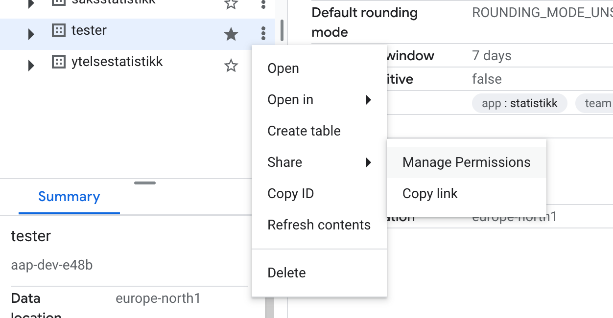
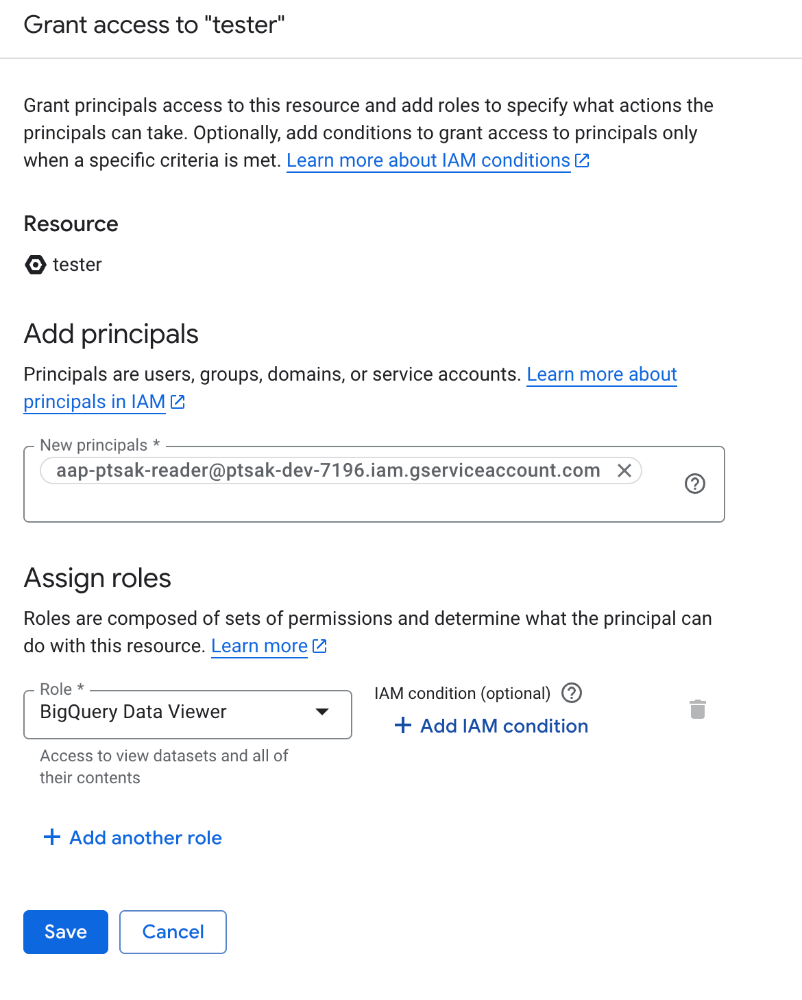
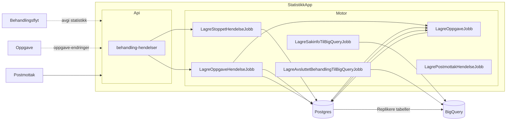
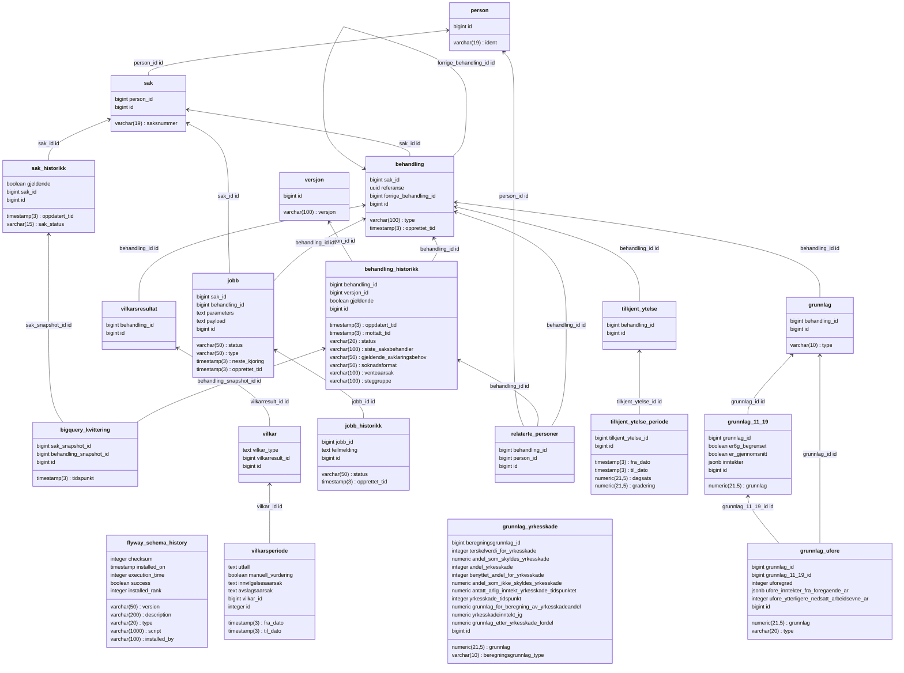

# Teknisk beskrivelse

[Github](https://github.com/navikt/aap-statistikk) | [Swagger](https://aap-statistikk.intern.dev.nav.no/swagger-ui/index.html) | [Grafana](https://grafana.nav.cloud.nais.io/d/edqu3y0nhmxhcb/statistikk?orgId=1) | [Nais Console](https://console.nav.cloud.nais.io/team/aap/dev-gcp/app/statistikk) | [Adeo](https://logs.adeo.no/app/r?l=DISCOVER_APP_LOCATOR&v=8.13.4&lz=N4IgjgrgpgTgniAXKANgQwHYHMJq1JEAa2nhABpxSFEQ0AHelASwGM0AXZgewwAJEfADogAzh07NxzIkREgAvpVHcYHJAG0NIAAJcAtlHFp99CiAAmR1iAC6tyq24oI%2BjKM0gUUAG5QU5oaiongElFAYPqzoweYMTGySvOb03BZ2lMwYVgAehACcAGxQhQAsABysAAwAtPnlVWg1AIzNUPk15QDMjTVQzQDsAEZDFmVDpRZD5lkcsD5oAbRoEBzc5gBmzChzMB6IGg6WnGgAasxQAO4Akum0RSUV1XUNTa3tnT1N%2FcOj45PTSgGKAAJUw%2BCQoA2MG4%2BkIGG4lxqACZSgALAD0aPMa3hiMUlBgUGhRjR1wwuwWS1AVOgSEKVUZVUo9BWogIiA4MGgCgUQA%3D%3D%3D) | [Google Cloud BigQuery-konsoll](https://console.cloud.google.com/bigquery?ws=!1m4!1m3!3m2!1saap-dev-e48b!2stester)

## Kjøre lokalt

Fra IntelliJ, kjør `TestApp`-klassen. Evt kjør `./gradlew runTestApp`.

Swagger-UI kan da åpnes på: http://0.0.0.0:8080/swagger-ui/index.html

For å gjøre autentiserte kall trengs JWT-token fra "fake Azure AD" (startet i `Fakes`-klassen). "Fake AD" kjører på `localhost:8081`, og du kan få token ved å kjøre

```
curl -s -XPOST http://localhost:8081/token  | jq -r '.access_token' | pbcopy
```

Nå kan API-kall gjøres i Swagger UI ved å trykke på "Authorize"-knappen og lime inn token.

## Hente test-token i dev

Se detaljer på [NAIS docs](https://docs.nais.io/auth/tokenx/how-to/generate/).

Besøk denne URL:

```
https://azure-token-generator.intern.dev.nav.no/api/m2m?aud=dev-gcp:aap:statistikk
```

Logg inn som en saksbehandler. Du vil få JSON som respons. Kopier `access_token`-verdien og lim den inn i [Swagger UI](https://aap-statistikk.intern.dev.nav.no/swagger-ui/index.html). Nå kan API testes i dev.

## Gjøre dump av testdatabasen for lokal utvikling

Sett opp proxy til databasen via NAIS-kommandolinjeverktøyet, se [her](https://doc.nais.io/persistence/postgres/how-to/personal-access/).

Deretter kjør en dump slik:

```
docker run  --rm -p 5432:5432 postgres:16 pg_dump -T public.jobb -T public.jobb_historikk --clean -h host.docker.internal -p 5432  -U ditt.navn@nav.no -d hendelser  > dump.sql
```

Erstatt `mitt.navn@nav.no` med din NAV-epost.

Kjør opp test-appen (se over), og finn begynnelsen på navnet på den kjørende Postgres-containeren, f.eks `0eb43`.

Deretter kjør:

```
docker exec -i  0eb43 psql -U test -d test < dump.sql
```

Nå er den lokale databasen overskrevet med dumpen fra dev.

## Roller til servicebruker

Gå til den aktuelle BigQuery-tabellen, og klikk på "Manage permissions". Se bildet:



Gi service-brukeren `BigQuery data viewer`-tilgang.



:::info

Etterhvert™ bør vi sette dette opp med Terraform (eller lignende), men per nå er det klikk i GUI.

:::

## Gjøre endringer på skjema i BigQuery

Å legge til nye kolonner i skjemaet støttes av SDK-et, men om datatype skal endres, må DDL brukes.

Siden dette er en engangsoperasjon, er det enkleste å gjøre i konsollet.

Her er eksempel på hvordan endre `tekniskTid` fra `DATETIME` til `TIMESTAMP`-type.

 1. Kopier sak-tabellen for å kunne teste endringer.
 2. I konsollet, legg til en ny kolonne:
    ```sql
     alter table `tester.sak_copy` add column tekniskTid2 timestamp;
    ```
 3. Denne er nå tom, så oppdater den med verdier fra den eksisterende kolonnnen:
    ```sql
    update `tester.sak_copy` set tekniskTid2 = timestamp(tekniskTid) where true;
    ```
 4. Til slutt drop den gamle, og rename den nye:
    ```sql
    alter table `tester.sak_copy` drop column tekniskTid;
    alter table `tester.sak_copy` rename column tekniskTid2 to tekniskTid;
    ```
    
For å bevare konsistens, gjør endring stegvis:
 1. Legg til ny kolonne i kode og deploy (slik at begge feltene blir skrevet til).
 2. Oppdater `tekniskTid2` for eldre innslag.
 3. Kjør steg 4. Dette vil føre til at innslag feiler, siden `tekniskTid2` ikke eksisterer mer, og jobben vil bli retryet.
 4. Deploy kodeendring hvor `tekniskTid2` ikke refereres til lenger.
 
 
:::warning

Jeg har ikke 100% tenkt gjennom alle samtidighetsproblemer som kan skje her. Men jeg tror at om rekkefølgen over overholdes, burde dette gi trygg migrering.

:::

## App-arkitektur

Overordnet skisse av arkitektur:




Data fra hendelser (stopp i behandlinger i postmottak og behandlingsflyt, og oppgave-hendelser) brukes for å bygge opp en rikere modell i Postgres, slik at å lagre data i BigQuery ikke krever flere spørringer.

Enkelte tabeller blir replikert til BigQuery via Datastream.

Ideen med å ha både en Postgres-database og et BigQuery-datasett, er at vi "eier" Postgres-databasen, og vi tenker på BigQuery-datasettet som "for eksterne", og i den forstand bør det være stabilt og ikke endre skjema veldig ofte. Det gir oss også mulighet til å implementere for eksempel produksjonsstyring uten å involvere BigQuery.


### Databaseskjema

Eksportert fra IntelliJ (koble til database, vis diagram, og eksporter til Mermaid, deretter fjerne syntaksfeil (`id:id` -> `id id`))

Per 13/9-2024:



## Tester

Testdekningen er (per nå) høy, og det er brukt en blanding av mocking og TestContainers for å teste.


## Tabeller i BigQuery

### `oppgave_hendelser`

Hver rad er en hendelse knyttet til en oppgave.

| Kolonne    | Beskrivelse |
| -------- | ------- |
| id | *INT64*: Primærnøkkel. Unike radteller. |
| oppgave_id | *INT64*: Fremmednøkkel. Radteller i `oppgave`-tabell. |
| identifikator | *INT64*: Identifikator for oppgavehendelse. |
| type | *STRING*: Unike verdier:  |
| mottatt_tidspunkt | *TIMESTAMP*: [Beskrivelse] |
| saksnummer | *STRING*: [Beskrivelse] |
| behandling_referanse | *STRING*: [Beskrivelse] |
| journalpost_id | *INT64*: [Beskrivelse] |
| enhet | *STRING*: [Beskrivelse] |
| avklaringsbehov_kode | *STRING*: [Beskrivelse] |
| status | *STRING*: [Beskrivelse] |
| reservert_av | *STRING*: [Beskrivelse] |
| reservert_tidspunkt | *TIMESTAMP*: [Beskrivelse] |
| opprettet_tidspunkt | *TIMESTAMP*: [Beskrivelse] |
| endret_av | *STRING*: [Beskrivelse] |
| endret_tidspunkt | *TIMESTAMP*: [Beskrivelse] |
| datastream_metadata | *STRUCT uuid STRING source_timestamp INT64>*: [Beskrivelse] |
