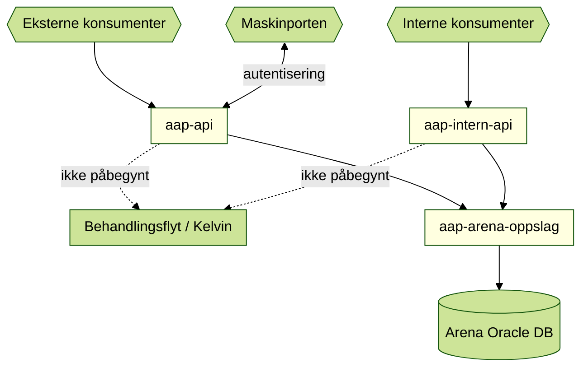
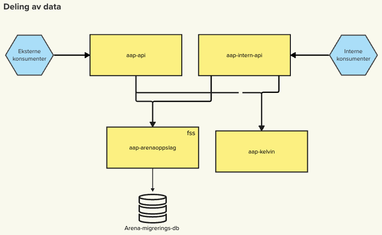

# Funksjonell beskrivelse

Datadeling inneholder to moduler for deling av data: Ekstern og Intern.

## Komponentdiagram

To versjoner, én i Mermaid og en fra Mural.

 
<!--- Komponentdiagram er hentet fra:https://app.mural.co/t/navdesign3580/m/navdesign3580/1686128879741/be8d640e3e037731badc3a78c09db5c1c14a8e7f?wid=0-1698213047002 -->

## Ekstern deling av data

AAP-data tilbys gjennom REST-grensesnitt til ulike konsumenter (den som henter data). Hver konsument har sitt eget dedikerte grensesnitt med autentisering og data.

### Autentisering av eksterne konsumenter

Det finnes to måter å autentisere eksterne konsumenter: Maskinporten og Samtykke. Maskinporten kan benyttes av de som har hjemmel til å hente data hos oss. De som ikke har hjemmel må benytte både Maskinporten og Samtykke.

#### Maskinporten

Maskinporten leveres av DigDir og tilbyr en portal der produsenter (den som tilbyr data) kan sette opp grensesnitt som konsumenter kan registrere seg mot. Konsumenten får da et gyldig token (kode), som produsenten godkjenner ved hvert kall til grensesnittet.

#### Samtykke

Samtykke er en tjeneste levert av DigDir og gir borgerne mulighet til å gi samtykke til at en konsument kan hente data for dem hos en produsent. Samtykke er ikke generelt, men tilbys per tjeneste

### Konsumenter, autentisering og data

I tabellen under ligger alle konsumenter som vi har i produksjon.

| Konsument       | Autentisering      | Data                                |
|-----------------|--------------------|-------------------------------------|
| Fellesordningen | Maskinporten       | Perioder med AAP                    | 

## Intern deling av data

For bruk innad i NAIS-klusteret.

Konsumenter (per 30/8-2024, se `app-prod.yml` for oppdatert data):

| Konsument       | Miljøer     |
|-----------------|-------------|
| Tilleggstønader | Prod og dev |
