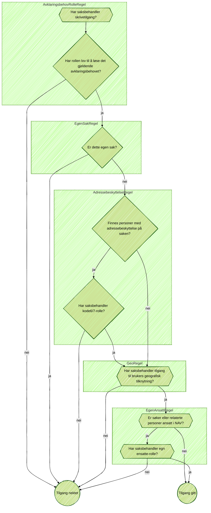

# Tilgang

Tilgang-appen er koblet til alle (snart) andre apper, og bruker saksbehandler-roller til å avgjøre om hen skal få lov til å utføre lese/skrive-operasjoner rundt omkring i Kelvin.

Den baserer seg på Entra ID (Azure AD)-roller, sammen med informasjon fra `behandlingsflyt` om alle personer som er knyttet til en sak. 

For skriveoperasjoner ("saksbehandle"), kreves det å oppgi et avklaringsbehov som skal løses (f.eks `AVKLAR_SYKDOM`).

Hele inputen til evalueringen er gitt ved klassen `RegelInput`:

```kotlin
class RegelInput (
    val callId: String,
    val ansattIdent: String, // saksbehandlerident
    // for å hente informasjon fra registre på vegne av saksbehandler
    val currentToken: OidcToken,
    // Hvilke roller saksbehandler har, hentet fra AZ
    val roller: List<Rolle>,
    // Alle identer knyttet til saken (barn og søker)
    val søkerIdenter: IdenterRespons,
    // Hvilket avklaringsbehov som skal løses
    val avklaringsbehovFraBehandlingsflyt: Definisjon?,
    val avklaringsbehovFraPostmottak: PostmottakDefinisjon?,
    // Hva slags operasjon er dette? For saksbehandling: SAKSBEHANDLE
    val operasjoner: List<Operasjon>,
)
```

Under et flytdiagram som viser hvilke spørsmål som besvares hver gang en saksbehandler prøver å gjøre en skriveoperasjon.


