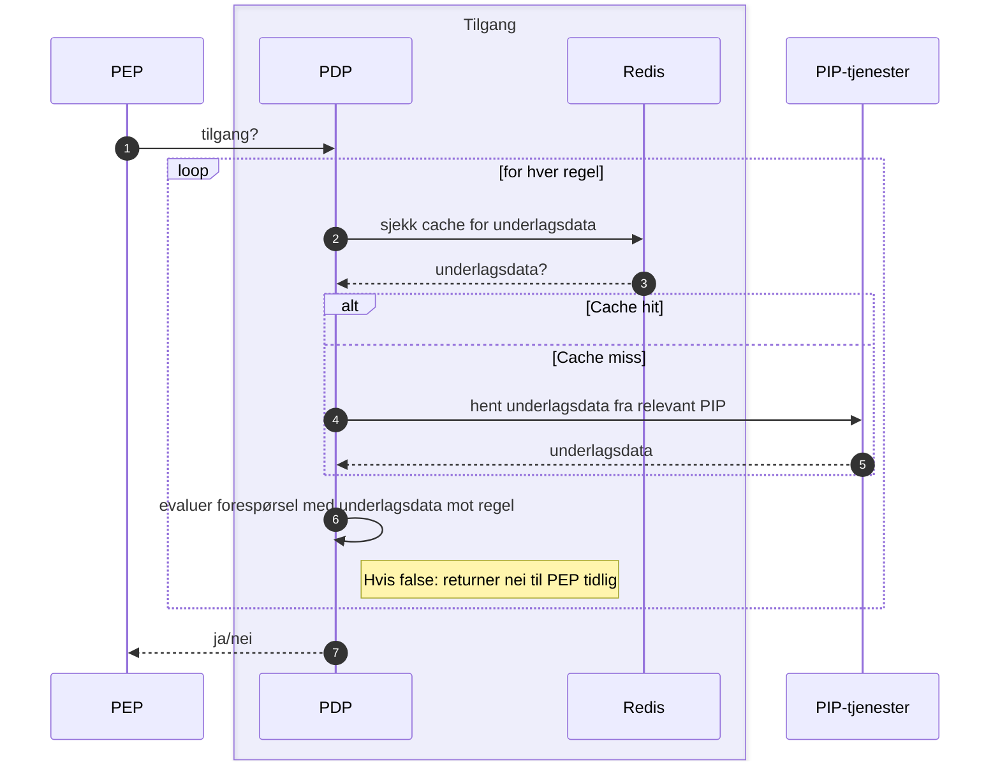

# Teknisk beskrivelse

[Github](https://github.com/navikt/aap-tilgang) | [Swagger](https://aap-tilgang.intern.dev.nav.no/swagger-ui/index.html) | [Grafana](https://grafana.nav.cloud.nais.io/d/ddtbde3obr5kwe/tilgang?orgId=1)

Tilgang er en tjeneste for tilgangskontroll i AAP. Den fungerer som et policy decision point (PDP) som evaluerer
tilgangsforespørsler fra andre tjenester (PEP) mot et sett med regler/policies. Tjenesten henter informasjon, som brukes
som underlagsdata i regelevalueringen, fra PIP-tjenester (policy information point). Per nå utføres regelevaluering med
relevante PIP-kall sekvensielt.

## PIP-tjenester

| Tjeneste                                                                    | Beskrivelse                                                                     | Slack                |
|-----------------------------------------------------------------------------|---------------------------------------------------------------------------------|----------------------|
| [Behandlingsflyt](../06_Behandlingsflyt/teknisk.md)                         | Henter identer for en gitt sak                                                  | #ytelse-aap-værsågod |
| [PDL](https://pdl-docs.ansatt.nav.no/ekstern/index.html)                    | Henter adressebeskyttelse og geografisk tilknytning                             | #pdl                 |
| [MS Graph DB](https://docs.microsoft.com/en-us/graph/overview)              | Hente AD-grupper som ikke er inkludert i token, deriblant ENHET- og GEO-roller. |                      |
| [Skjermingsløsningen](https://navikt.github.io/skjerming/index-intern.html) | Sjekker skjermede personer (egen ansatt)                                        | #skjermingsløsningen |
| [NOM](https://navikt.github.io/nom/#_ressurs)                               | Slår opp personnummer mot navident for å sjekke egen sak                        | #nom                 |
