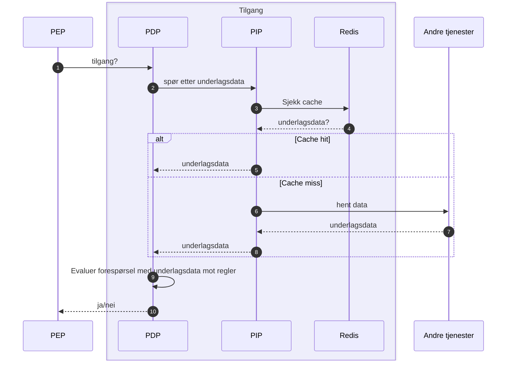

# Teknisk beskrivelse

[Github](https://github.com/navikt/aap-tilgang)
[Swagger](https://aap-tilgang.intern.dev.nav.no/swagger-ui/index.html)
[Grafana](https://grafana.nav.cloud.nais.io/d/ddtbde3obr5kwe/tilgang?orgId=1)

Tilgang er en tjeneste for tilgangsstyring i AAP. Den fungerer som et policy decision point (PDP) som evaluerer tilgangsforespørsler fra andre tjenester (PEP) mot et sett med regler. Tjenesten henter nødvendig informasjon fra andre tjenester.

## Interne integrasjoner

### Behandlingsflyt

For å be om identer for en gitt sak.

## Eksterne integrasjoner

### PDL
For å hente adressebeskyttelse og geografisk tilknytning.

Dokumentasjon: https://pdl-docs.ansatt.nav.no/ekstern/index.html

### MS Graph DB

For å be om info om AD-grupper og tilganger.

### Skjermingsløsningen
For å sjekke skjermede personer (egen ansatt).

Dokumentasjon: https://navikt.github.io/skjerming/index-intern.html
