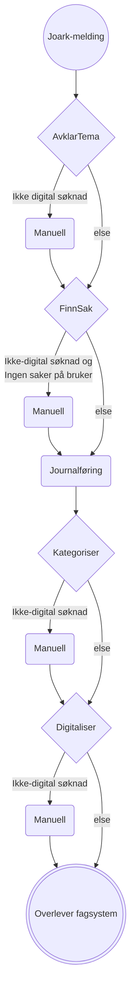

# Funksjonell beskrivelse

## Automatisk- / Delautomatisk- / Manuell-flyt

Per nå så går digitale søknader via søknadsveilederen automatisk igjennom for å ikke knekke eksisterende flyt fra AAP-Mottak. 
En søknad fra søknadsveilederen blir identifisert ved at journalposten har en AAP søknadsbrevkode (`NAV 11-13.05`) og har et tilhørende dokument i JSON format. Alle steg slipper nå kun igjennom manuell søknad, med unntak av Finn sak steget, som også automatisk behandler journalposter hvor bruker ikke har eksisterende saker i fagsystem.

