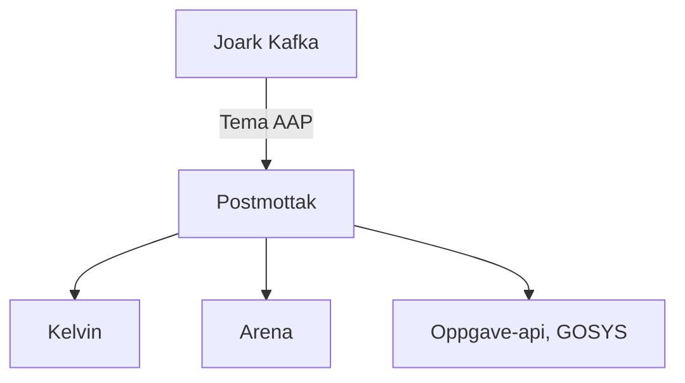
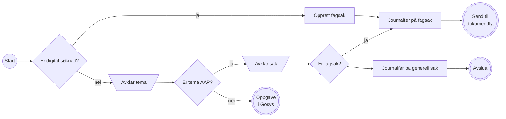
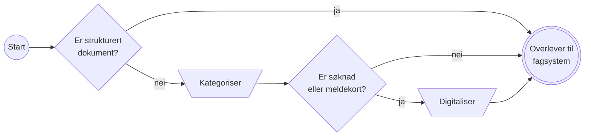

# Funksjonell beskrivelse

Når en bruker sender inn "noe" på MittNAV, må dette ende opp i
riktig system. Det er her postmottak kommer inn.

## Fordeling
Postmottak lytter på JOARK
sitt arkiveringstopic (`teamdokumenthandtering.aapen-dok-journalfoering`)
og sørger for at dokumentet kommer til riktig system. Frem til
Kelvin har tatt over all funksjonalitet i AAP, vil et dokument
ende opp 1 av 3 steder:
1. Kelvin - Nye saker som oppfyller [gitte kriterier](https://confluence.adeo.no/display/PAAP/Unntakstilfeller+ved+lansering)
2. Arena - Eksisterende saker, og nye saker som ikke oppfyller kriteriene for Kelvin
3. Gosys, via oppgave-api - Alt man ikke klarer å plassere andre steder

Punkt `2` og `3` er en erstatning av dagens ruting av søknader
(KRUT, som består av jfr-arena og jfr-generell), som nå ligger i postmottak.

## Journalføring
Dokumenter som kommer inn i postmottak skal endelig journalføres. Journalposter som har ligget urørt i over en uke, fanges opp av et sikkerhetsnett som oppretter en journalføringsoppgave i Gosys. 
> Dersom vi ønsker å holde igjen søknader for fordeling utover en uke, må vi ta en prat med Team Dokumentløsninger om å eventuelt skru av sikkerhetsnettet for tema AAP.

### Arena
Dokumenter som skal til Arena journalføres etter dagens praksis - automatisk i postmottak eller manuelt i Gosys avhengig av brevkode. Dersom man ikke klarer å bestemme journalførende enhet, vil en fordelingsoppgave opprettes i Gosys.
Legeerklæringer som skal til Arena journalføres på generell sak og tema Oppfølging. Disse håndteres videre av Pale-2.

### Kelvin
Alle dokumenter som skal til Kelvin journalføres i utgangspunktet automatisk av postmottak. Dersom dokumentet blir vurdert til å tilhøre et annet tema enn AAP, opprettes en manuell oppgave i Gosys.

## Kelvin dokumentflyt
Dokumenter som skal til Kelvin går gjennom en flyt bestående to delflyter med steg, der de i ulik grad må behandles manuelt før de kan sendes videre.
Per nå er det kun digital søknad via søknadsveilederen som går automatisk igjennom alle stegene.
En søknad fra søknadsveilederen blir identifisert ved at journalposten har en AAP søknadsbrevkode (`NAV 11-13.05`) og har et tilhørende dokument i JSON format. 

Trapesene under representerer avklaringsbehov som må løses av saksbehandler i postmottaks brukergrensesnitt. Oppgavene blir tildelt via Kelvins oppgaveløsning.

### Journalføringsflyt
Alle dokumenter som ikke skal til Arena går gjennom denne flyten.

### Dokumentflyt
Dokumenter som er journalført på Kelvin-fagsak i journalføringsflyten går videre gjennom denne flyten.

