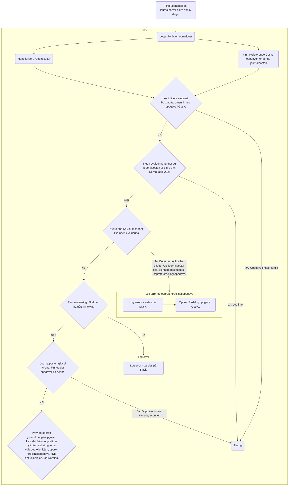

# Joarkavstemmer

Vi har en nattlig jobb som følger med på om journalføring skjer innen rimelig tid. Tidligere var det Team Dokumenthåndtering sitt "doksikkerhetsnett" som hadde ansvar for dette. Vi har prøvd å bevare samme logikk, se [Confluence](https://confluence.adeo.no/spaces/BOA/pages/366859456/doksikkerhetsnett).

