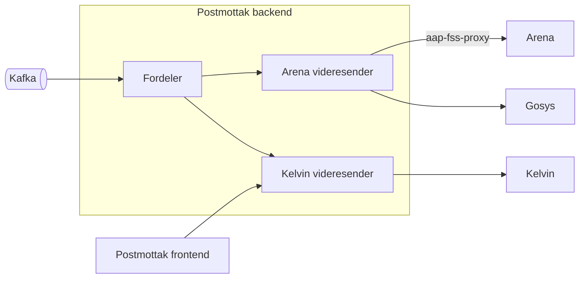
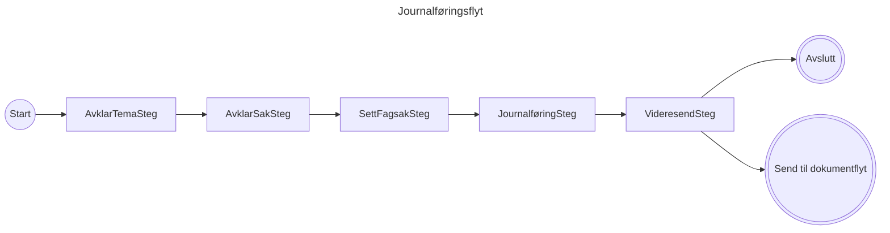
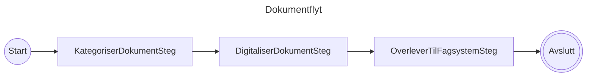
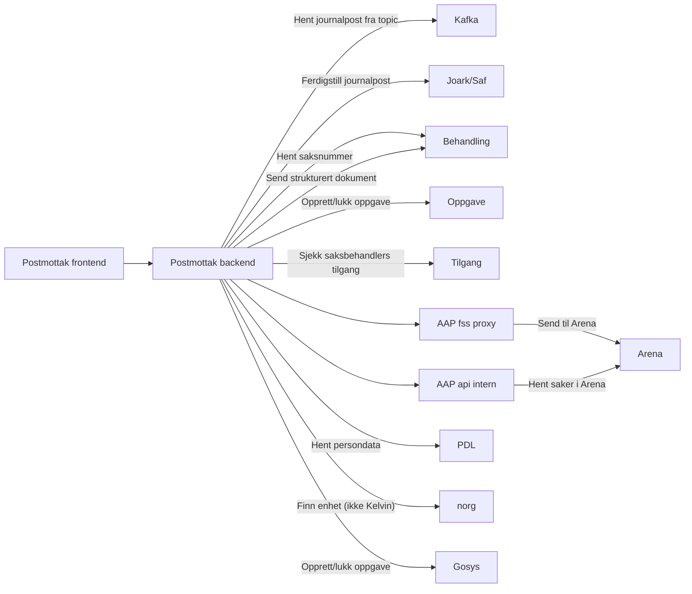
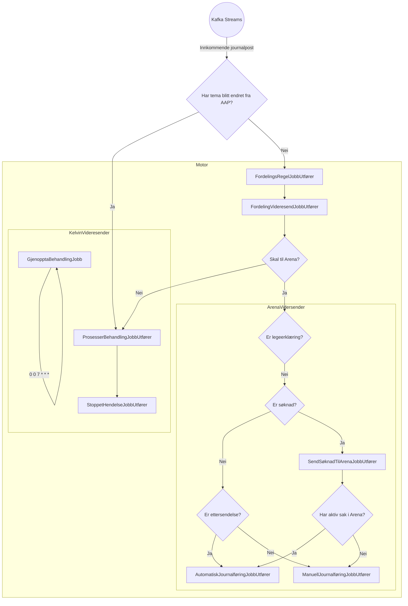
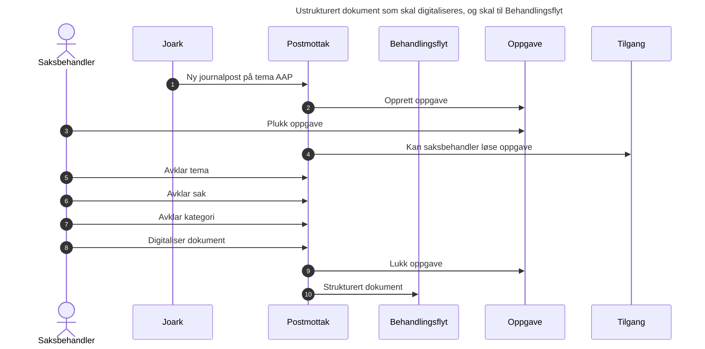

# Teknisk beskrivelse

Postmottak er inngangsportalen for alle dokumenter, digitale eller fysiske, som skal til AAP.

Følgende applikasjoner som Team AAP forvalter utgjør til sammen postmottak:

| App                    |                                                                                                                                                                                                                                                                                                                                                                                                                                                                |
|------------------------|----------------------------------------------------------------------------------------------------------------------------------------------------------------------------------------------------------------------------------------------------------------------------------------------------------------------------------------------------------------------------------------------------------------------------------------------------------------|
| aap-postmottak-backend | [Github](https://github.com/navikt/aap-postmottak-backend) \| [Swagger](https://aap-postmottak-backend.intern.dev.nav.no/swagger-ui/index.html) \| [Grafana - Postmottak](https://grafana.nav.cloud.nais.io/d/fdyxzbonzgidcc/postmottak?orgId=1&from=now-1h&to=now&timezone=browser) \| [Grafana - Kafka Streams](https://grafana.nav.cloud.nais.io/d/PRwEuOJ4k/aap-kafka-streams?orgId=1&from=now-6h&to=now&var-app=dokumentinnhenting&var-cluster=000000020) |
| aap-saksbehandling         | [Github](https://github.com/navikt/aap-saksbehandling) \| [Frontend](https://kelvin.ansatt.dev.nav.no/postmottak/)                                                                                                                                                                                                                                                                                                                                                    |
| aap-fss-proxy          | [Github](https://github.com/navikt/aap-fss-proxy) \| [Swagger](https://aap-fss-proxy.intern.dev.nav.no/swagger-ui/index.html)                                                                                                                                                                                                                                                                                                                                  |

## Overordnet arkitektur

Nedenfor vises en forenklet skisse over komponentene i Postmottak.

| Komponent           | Beskrivelse                                                                                                                                                                                             |
|---------------------|---------------------------------------------------------------------------------------------------------------------------------------------------------------------------------------------------------|
| Fordeler            | Postmottak har en egen komponent for fordeling av dokumenter. Denne komponenten tar imot dokumenter fra Kafka, og sender de videre til riktig system basert på regler i henhold til lanseringsstrategi. |
| Arena videresender  | Denne komponenten erstatter gamle KRUT, bestående av jfr-arena og jfr-manuell, for tema AAP. Den håndterer journalføring og oppgaveopprettelse for de dokumentene som skal til Arena.                   |
| Kelvin videresender | Dette er det nye postmottaket for Kelvin. Her håndteres journalføring, temaavklaring, kategorisering og digitalisering av dokumenter, samt videresending til Behandlingsflyt.                           

Fordeleren og Arena videresender skal fjernes når AAP er helt ute av Arena.

### Flyt og steg

Postmottak bruker mange av de samme konseptene som i [Behandlingsflyt](../06_Behandlingsflyt/teknisk.md) inkludert flyt-
og stegorkestrator.

Postmottaks flyt består av to delflyter. Disse er funksjonelt beskrevet [her](./funksjonell.md#kelvin-dokumentflyt).
Teknisk ser de slik ut:

### Integrasjoner

### Jobboversikt

Postmottak tar i motor for jobbhåndtering fra [felleskomponenter](../../teknisk/felles_komponenter.md#motor).
Flytdiagrammet viser hvilke jobber som trigger hverandre. Eksterne triggere (typisk api-kall) er ikke med i diagrammet.

### Andre diagrammer

Flyten her er lett forenklet i at oppgaver åpnes og lukkes for hvert avklaringsbehov med tilhørende kall til Tilgang,
men for saksbehandler vil dette oppleves sømløst.

