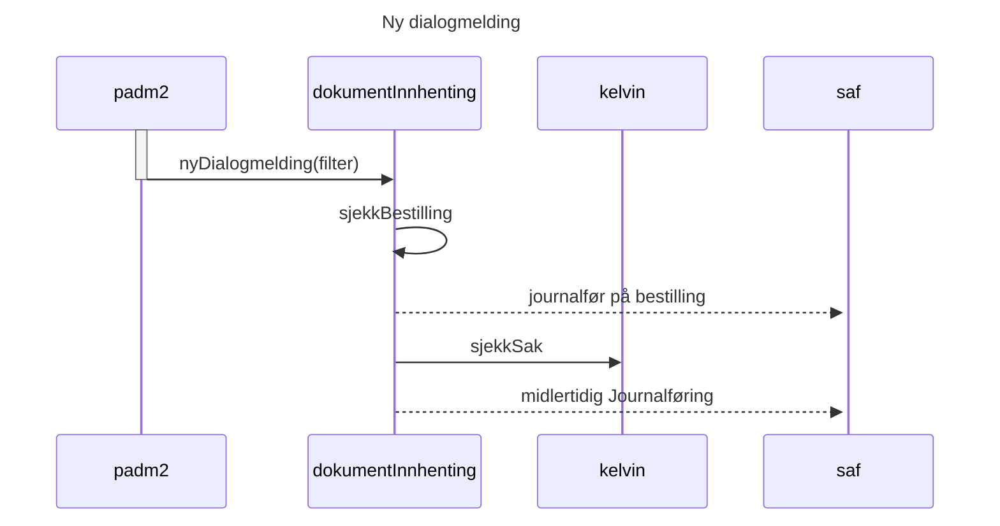
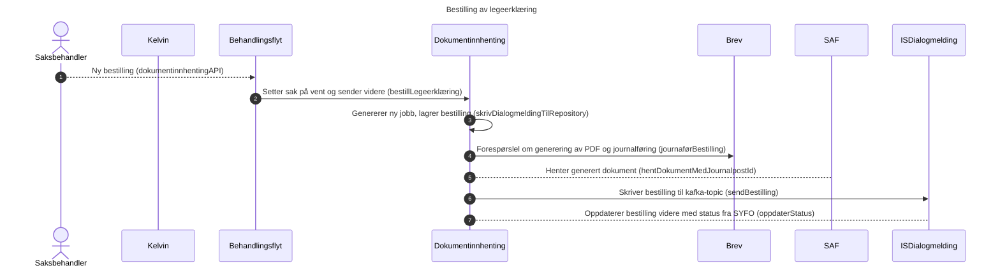

# Teknisk beskrivelse

Grafana Kommer™️

## flyter
Dokumentinnhenting står ansvarlig for 3 deler:
* Bestilling av legeerklæring
* mottak av legeerklæring
* DokumentSøk

Grunnet feilmarginer i eksterne systemer vil mottak av legeerlæring være nødt til å lytte på både inkommende legeerklæringer og dialogmeldinger.

### Dialogmelding
Da leger teknisk sett kan svare på en bestilling ved å sende inn legeerklæring som vedlegg til en ny dialogmelding er vi nødt til å lytte på padm2.
Det er ingen garanti at dialogmeldingen vil være relevant og vi blir nødt til å ta noen forhåndsregler.
1. Dersom det eksisterer en bestilling på en lege erklæring på bruker som dialogmelding gjelder, vil vi journaleføre dialogmeldingen på sakane.
2. Dersom det ikke eksisterer bestilling, men bruker har en åpen AAP sak, vil dialogmeldingen bli midlertidig journalført på AAP, for manuell sjekk i postmottak.
3. Dersom hverken bestilling eller sak eksisterer, vil vi se bort fra dialogmeldingen.

### Bestilling av legeerklæring
Bestilling av legeerklæring skjer i Kelvin under steget "Sykdom"
1. Saksbehandling slår opp behandler via dokumentinnhenting, som videre henter informasjon fra isdialogmelding (ISYFO)
2. Bestilling trigger en bestilling i behandlingslyt, som i tur setter sak på vent.
3. Bestilling går videre til dokumentinnhenting og lagrer bestillingen.
4. Dokumentinnhenting journalfører via Brev.
5. Dokumentinnhenting sending bestilling til isdialogmelding på en kafka-topic, som videre sender til NHN og deretter EPJ.
6. Dokumentinnhenting eksponerer et endepunkt `/status/{saksnummer}` som returnerer status på bestilte legeerklæringer. Denne
tar også sak av vent i behandlingsflyt om bestilt legeerklæring skulle bli avvist.

### DokumentSøk
Ved behandling av sak, 
