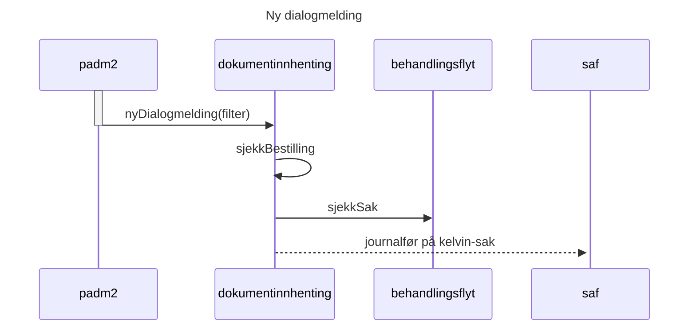
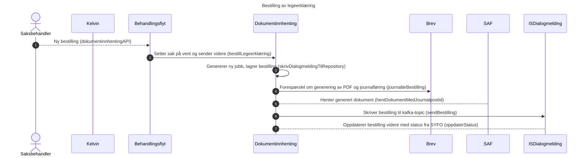

# Teknisk beskrivelse
[Github](https://github.com/navikt/aap-dokumentinnhenting) | [Swagger](https://aap-dokumentinnhenting.intern.dev.nav.no/swagger-ui/index.html) | [Grafana](https://grafana.nav.cloud.nais.io/goto/jcvl7ZwNg?orgId=1)

## Flyter
Dokumentinnhenting står ansvarlig for 3 deler:
* Bestilling av dialogmelding til behandler
* Mottak av dialogmeldinger
* Dokumentsøk

### Dialogmelding
Innkommende legeerklæringer blir journalført på tema AAP i pale-2-sak, og blir dermed automatisk videresendt til 
behandlingsflyt via postmottak. Men på grunn av at leger teknisk sett kan svare på en bestilling ved å sende inn
legeerklæring som vedlegg til en ny dialogmelding må vi lytte på Kafka-topic `teamsykefravr.dialogmelding` som padm2
produserer meldinger på.
Det er ingen garanti for at dialogmeldingen vil være relevant og vi blir nødt til å ta noen forhåndsregler.
Følgende kriterier må oppfylles for at vi vil journaleføre dialogmeldingen på AAP Kelvin-sak:
- Det må finnes en åpen sak for bruker
- Dialogmeldingen må være svar på en forespørsel fra saksbehandler

```mermaid
---
title: Ny dialogmelding
---
sequenceDiagram
  participant p as padm2
  participant d as dokumentinnhenting
  participant b as behandlingsflyt
  participant s as saf
  activate p
  p->>d: nyDialogmelding(filter)
  deactivate p
  d->>d: sjekkBestilling
  activate s
  d->>b: sjekkSak
  d-->>s: journalfør på kelvin-sak
```

### Bestilling av legeerklæring
Bestilling av legeerklæring skjer i Kelvin, fra høyremeny i en behandling.
1. Saksbehandling slår opp behandler via dokumentinnhenting, som videre henter informasjon fra isdialogmelding (ISYFO), fastlege eller søk.
2. Ved bestilling settes saken på vent i behandlingsflyt.
3. Bestilling går videre til dokumentinnhenting og lagrer bestillingen.
4. Dokumentinnhenting journalfører via Brev.
5. Dokumentinnhenting sending bestilling til isdialogmelding ved å produsere melding på Kafka-topic `teamsykefravr.isdialogmelding-behandler-dialogmelding-bestilling`, som videre sender til NHN og deretter EPJ.
6. Dokumentinnhenting konsumerer Kafka-topic `teamsykefravr.behandler-dialogmelding-status` (produsent er isdialogmelding) og oppdaterer status på bestilt dialogmelding (BESTILT, SENDT, OK, AVVIST)
6. Dokumentinnhenting eksponerer et endepunkt `/status/{saksnummer}` som returnerer status på bestilte legeerklæringer.

```mermaid
---
 title: Bestilling av legeerklæring
---
    sequenceDiagram
        autonumber
        actor Saksbehandler
        participant Kelvin
        participant Behandlingsflyt
        participant Dokumentinnhenting
        participant Brev
        participant SAF
        participant ISDialogmelding
        Saksbehandler-->>Behandlingsflyt: Ny bestilling (dokumentinnhentingAPI)
        Behandlingsflyt->>Dokumentinnhenting: Setter sak på vent og sender videre (bestillLegeerklæring)
        Dokumentinnhenting->>Dokumentinnhenting: Genererer ny jobb, lagrer bestilling (skrivDialogmeldingTilRepository)
        Dokumentinnhenting->>Brev: Forespørslel om generering av PDF og journalføring (journaførBestilling)
        Dokumentinnhenting-->SAF: Henter generert dokument (hentDokumentMedJournalpostId)
        Dokumentinnhenting->>ISDialogmelding: Skriver bestilling til kafka-topic (sendBestilling)
        Dokumentinnhenting-->ISDialogmelding: Oppdaterer bestilling videre med status fra SYFO (oppdaterStatus)
```
### DokumentSøk
Ved behandling av sak, 
