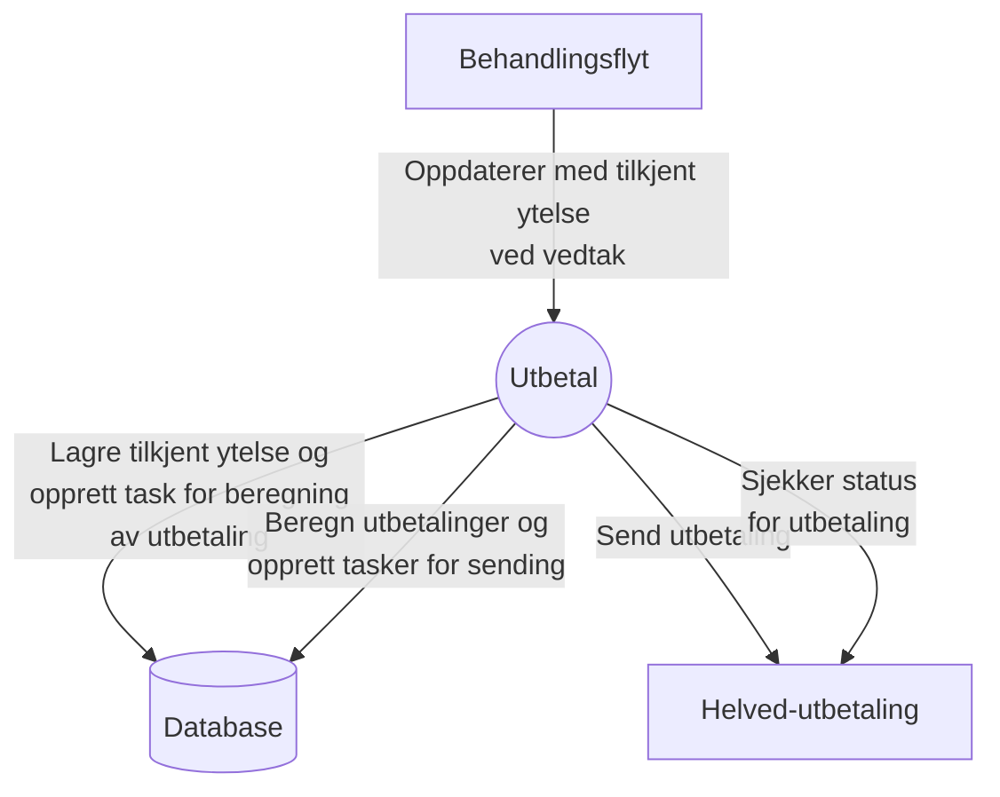

# Funksjonell beskrivelse

Applikasjon som sørger for at tilkjent ytelse fra behandlingsflyt blir omgjort til utbetalinger som sendes til oppdrag via helved-utbetaling. Innkommende tilkjent ytelse lagre i applikasjonens database. Deretter beregnes utbetalingene som enten er nye eller endringer. Så sendes de til Helved utbetaling sitt grensesnitt. Det kjører også en egen jobb som henter på kvittering på utbetalingene og oppdaterer status for utbetalingen i applikasjons database.

## Kontekstdiagram
