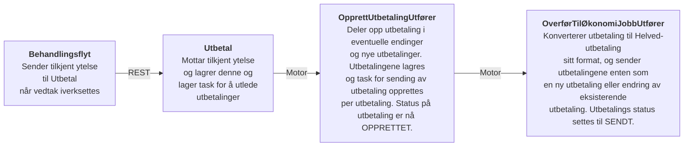
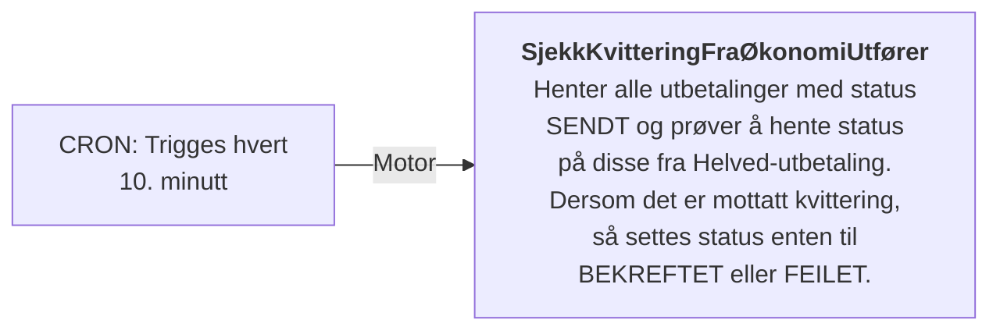
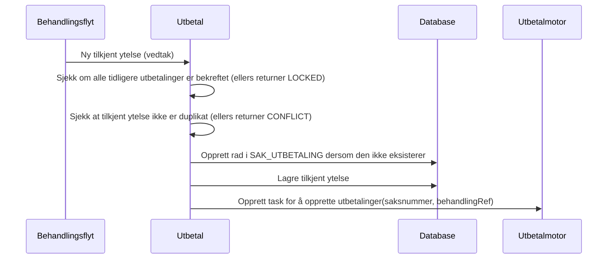
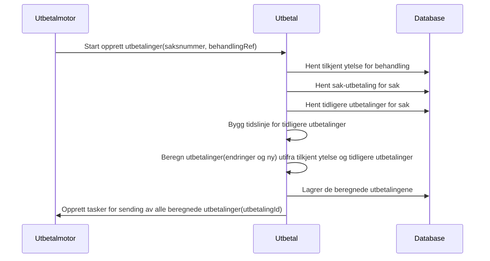
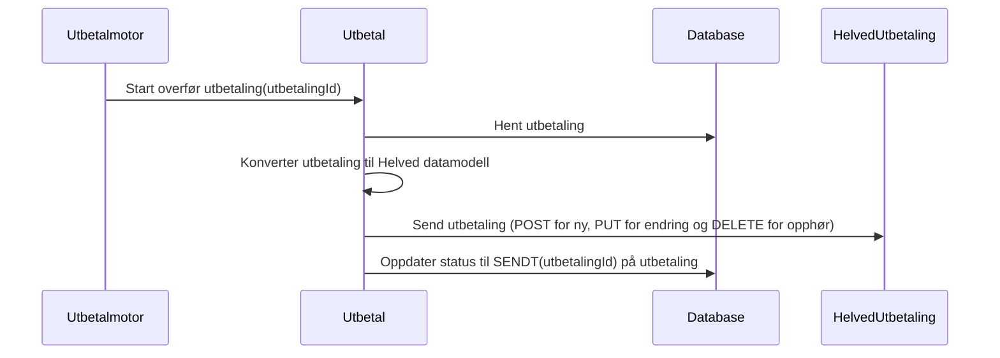
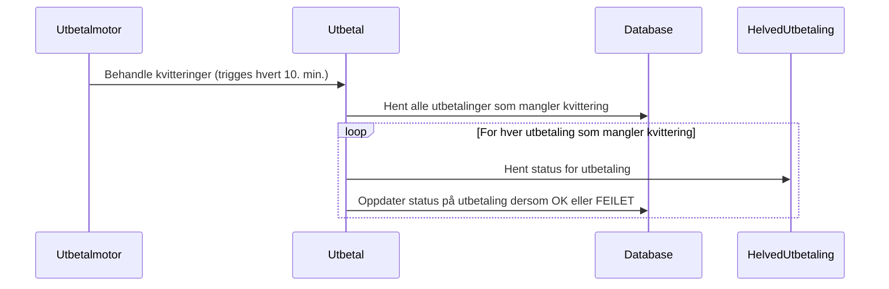

# Teknisk beskrivelse

## Nyttige lenker

* API dokumentasjon for aap-utbetal: https://aap-utbetal.intern.dev.nav.no/swagger-ui/index.html
* API dokumentasjon for Helved utbetaling: https://helved-docs.intern.dev.nav.no/v3/doc/kom_i_gang

## Flyter
### #1: Tilkjent ytelse fra Behandlingsflyt til Helved Utbetaling

### #2: Hent kvitteringer for utbetalinger

## Hovedfunksjoner

### #1: Mottar tilkjent ytelse fra behandlingsflyt ved veedtak

### #2: Opprett utbetalinger for gitt behandling/tilkjent ytelse

### #3: Overfør utbetaling til Helved-utbetaling

### #4: Behandle kvittering

