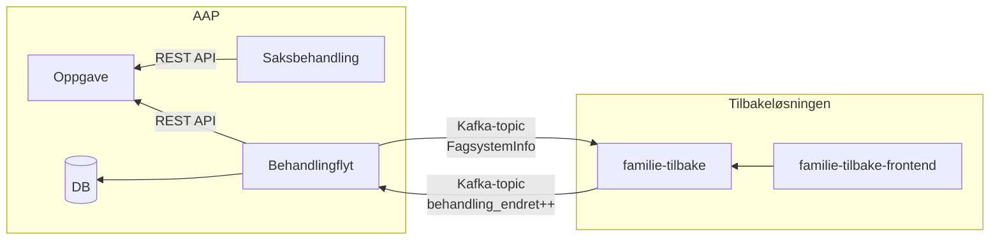

# Tilbakekreving

Løsningen for tilbakekreving i AAP muliggjør visning og behandling i Kelvin mot NAV-intern tilbakeløsning.

## Komponentdiagram

```mermaid
flowchart RL

    subgraph Tilbakeløsningen
        TilbakeUI[familie-tilbake-frontend] --> Tilbake[familie-tilbake]
    end

    subgraph AAP
        Behandlingflyt -->|REST API| Oppgave
        Saksbehandling -->|REST API| Oppgave
        Behandlingflyt --> DB[(DB)]
    end

    Tilbake --> |Kafka-topic<br>behandling_endret++| Behandlingflyt
    Behandlingflyt -->  |Kafka-topic<br>FagsystemInfo| Tilbake
```
