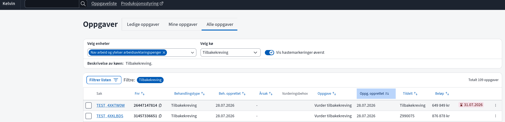
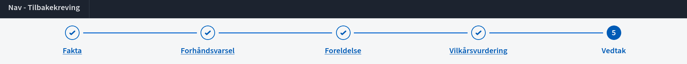
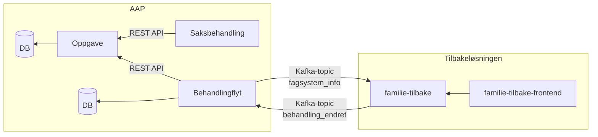
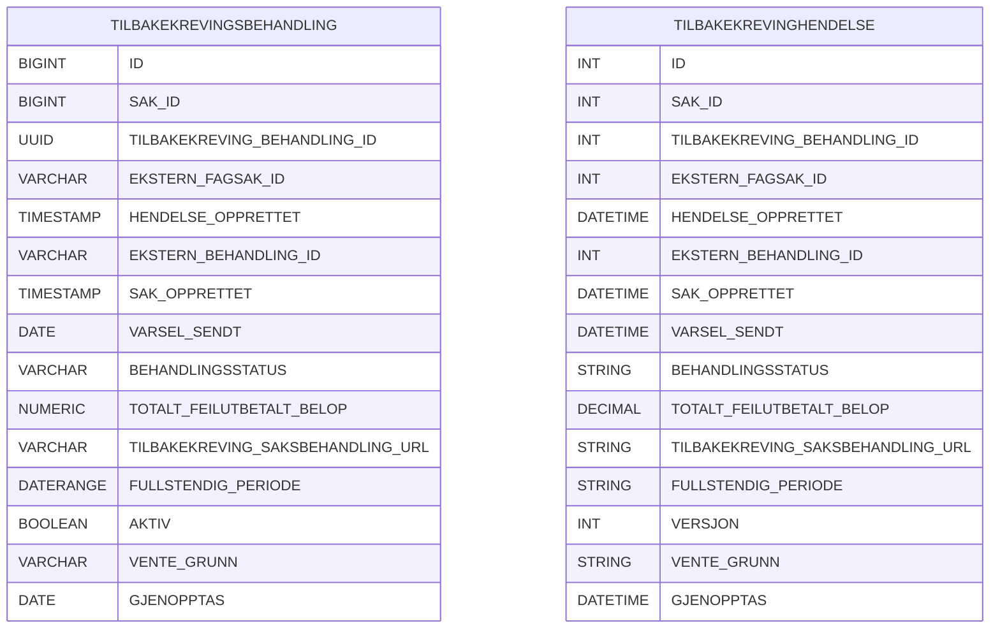
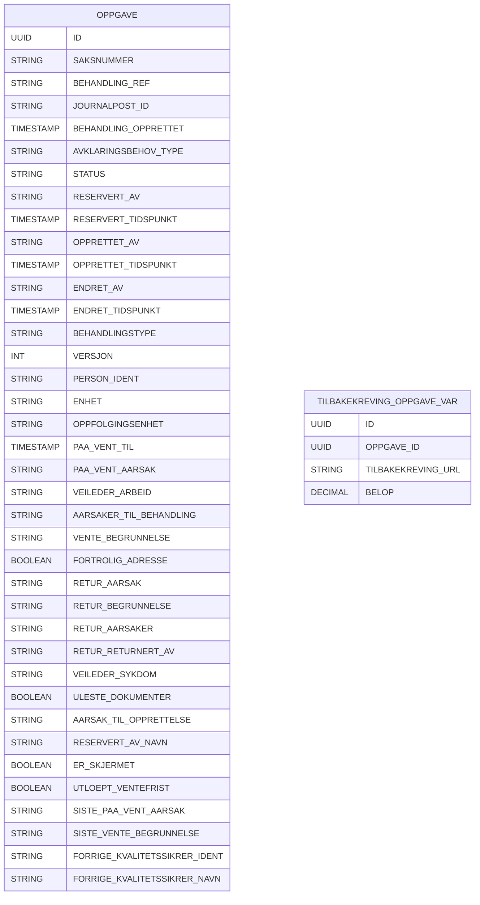

# Tilbakekreving

Løsningen for tilbakekreving i AAP muliggjør visning og behandling i Kelvin mot NAV-intern tilbakeløsning.

## Saksbehandler-representasjon
AAP saksbehandler får se tilbakekrevingsoppgaver i Kelvin og kan åpne behandlingen i Tilbake via Åpne lenke fra oppgavelista i Kelvin.

### Kelvin UI


### Tilbake UI


## System-representasjon

### Komponentdiagram



### Data-representasjon

#### Datautveksling i integrasjon mellom Tilbake og Kelvin

##### kafka melding fra Tilbake til Kelvin: behandling_endret
```json
{
    "hendelsestype": "behandling_endret",
    "versjon": 1,
    "eksternFagsakId": "000000",
    "hendelseOpprettet": "2025-10-24T10:21:49.076434",
    "eksternBehandlingId": null,
    "sakOpprettet": "2025-10-24T10:21:49.064877",
    "varselSendt": null,
    "behandlingsstatus": "OPPRETTET", # TIL_FORHÅNDSVARSEL | TIL_BEHANDLING | AVSLUTTET
    "totaltFeilutbetaltBeløp": "2000.00",
    "saksbehandlingURL": "https://tilbakekreving.intern.nav.no/fagsystem/TS/fagsak/000000/behandling/99c195f6-716e-4dc0-a7ce-baddf5475e7a",
    "fullstendigPeriode": {
      "fom": "2021-01-01",
      "tom": "2021-01-01"
    }
}
```
##### kafka melding fra Tilbake til Kelvin: fagsysteminfo_behov
```json
{
  "hendelsestype": "fagsysteminfo_behov",
  "versjon": 1,
  "eksternFagsakId": "4UA79Qo",
  "kravgrunnlagReferanse": "EEio2tWRTS6BwG9FRfl6Zg==",
  "hendelseOpprettet": "2026-01-13T12:15:27.087202255"
  }
```
##### kafka melding fra Kelvin til Tilbake: fagsysteminfo_svar
```json
{
  "hendelsestype": "fagsysteminfo_svar",
  "versjon": 1,
  "eksternFagsakId": "123456",
  "hendelseOpprettet": "2025-01-13T12:30:45.00000",
  "mottaker": {
    "type": "PERSON",
    "ident": "32132132111"
  },
  "revurdering": {
    "behandlingId": "654321",
    "årsak": "NYE_OPPLYSNINGER",
    "årsakTilFeilutbetaling": "Bruker sluttet på tiltaket",
    "vedtaksdato": "2025-01-12",
    "utvidPerioder": [
      {
        "kravgrunnlagPeriode": {
          "fom": "2023-01-01",
          "tom": "2023-01-01"
        },
        "vedtaksperiode": {
          "fom": "2023-01-01",
          "tom": "2023-01-31"
        }
      }
    ]
  }
}
```

#### Behandlingsflyt-Database


#### Oppgave-Database

