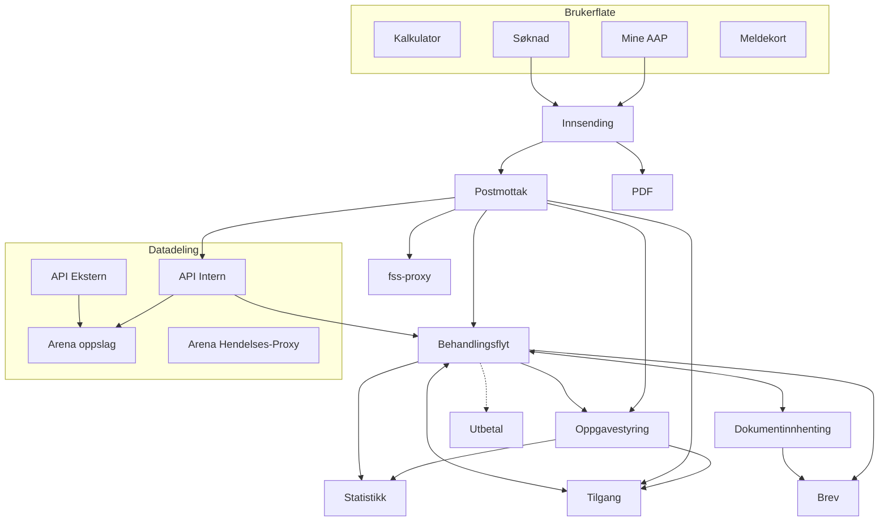

# Applikasjoner

Hensikten med de ulike løsningene Team AAP leverer, er å sikre kritisk funksjonalitet i dialog mellom Nav og innbyggere på ytelsen Arbeidsavklaringspenger (AAP), samt effektiv og lik behandling. Noen kontaktpunkter er til for å muliggjøre saksbehandling, andre er til for å gi god veiledning og informasjon til innbyggere.

## Komponent-diagram
Detaljer om de ulike komponentene i Team AAP sin løsning finner du i menyen til venstre.

