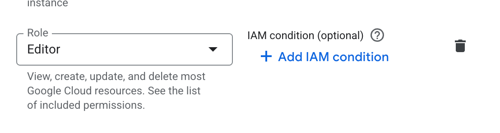

# Replikering til Bigquery

Det er satt opp replikering fra Postgres til Bigquery via Datastream. Vi har fulgt oppskriften her: https://github.com/navikt/nada-datastream Vi gjengir dagens oppsett her i tilfelle den endrer seg.

Per dags dato (25/6-25) er det satt opp replikering fra `postmottak-backend` til BigQuery.

## Opprette replikering

### 1 Oppdatere nais-manifestet

Dette er eksakt som oppskriften over sier. Man må sette flagget `cloudsql.logical_decoding` til `on` i manifestet, og opprette en bruker for Datastream. I tillegg ble `autoResize` satt til `true`. Husk også å legge til ny bruker med navn `datastream` (som under).

```yaml title="Fra app.yaml i postmottak-backend"
...
  gcp:
    sqlInstances:
      - type: POSTGRES_16
        flags:
          - name: cloudsql.logical_decoding
            value: "on"
        tier: {{sql.tier}}
        diskAutoresize: true
        highAvailability: {{sql.highAvailability}}
        pointInTimeRecovery: {{sql.pointInTimeRecovery}}
        databases:
          - name: postmottak
            envVarPrefix: DB_POSTMOTTAK
            users:
              - name: datastream
... 
```

### 2 Gi brukeren tilganger til tabellene

Her fikk vi feil om vi brukte oppskriften til `nada-datastream`. Det fungerte om vi kjørte disse to skriptene som separate migreringer:
```sql title="resources/flyway/V1.51__datastream_oppsett.sql"
DO
$$
    BEGIN
        IF EXISTS(SELECT * FROM pg_roles WHERE rolname = 'datastream') THEN
            ALTER USER "appnavn" WITH REPLICATION;
            CREATE PUBLICATION "ds_publication" FOR ALL TABLES;

            ALTER DEFAULT PRIVILEGES IN SCHEMA PUBLIC GRANT SELECT ON TABLES TO "datastream";
            GRANT SELECT ON ALL TABLES IN SCHEMA PUBLIC TO "datastream";
            ALTER USER "datastream" WITH REPLICATION;
        END IF;
    END
$$ LANGUAGE 'plpgsql';
```

```sql title="resources/flyway/V1.52__del_2_datastream.sql"
DO
$$
    BEGIN
        IF EXISTS(SELECT * FROM pg_roles WHERE rolname = 'datastream') THEN
            PERFORM PG_CREATE_LOGICAL_REPLICATION_SLOT('ds_replication', 'pgoutput');
        END IF;
    END
$$ LANGUAGE 'plpgsql';
```

## 3 Sette opp Datastream-kobling

Det første man må gjøre her er å gi seg selv `Editor`-rollen i GCP. Dette gjøres ved å navigere til IAM, og redigere sin egen bruker.



:::warning
Dette er helst midlertidig. Ideelt sett skal folk ha så få tilganger som mulig over tid.
:::

`nada-datastream`-repoet publiserer en binærfil, men jeg (Fredrik) fikk ikke til å kjøre den på Mac. Så jeg sjekket ut repoet, og kjørte `go build`.

Deretter gjør man `nais login`.

Kommandoen for å opprette datastream er denne:

```
./nada-datastream create postmottak-backend datastream --include-tables regel_evaluering,regelsett_resultat
```

Dette oppretter en strøm fra to tabeller. Kommandoer tar en del tid (5-10 minutter).

Done.

### Endre datastream

Søk opp "Datastream" i GCP-konsollet, og finn streamen du vil endre. Trykk "Edit", og deretter "Edit source configuration". Her er det mulig å velge nøyaktig hvilke tabeller og rader som skal replikeres.

:::danger
Ikke repliker sensitiv data med mindre dette er gått opp godt på forhånd.
:::
