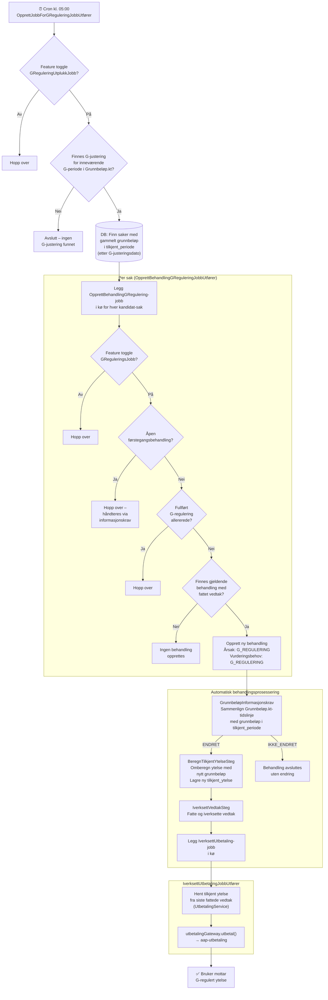
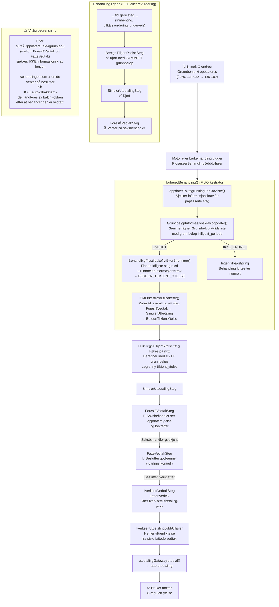

# G-regulering

Løsningen for G-regulering etablert i 2026 har i hovedsak 2 startpunkter for å identifisere og igangsette G-regulering.
 - Uttrekksjobb for iverksatte saker
 - Tilbakeflyt for pågående saker

I tillegg vil dagens meldekort løsning trigge G-regulering når nye meldekort kommer inn til behandlingsflyt da dette medfører tilbakeflyt grunnet meldekort-informasjonskrav. 
Da vil en omberegning av ytelse utføres og dagsats blir automatisk basert på en evtuelt ny G-justering i Grunnbeløp.kt for relevant del av AAP-perioden.

## Uttrekksjobb

G-regulering skjer i fire faser:

1. Finn kandidater (daglig kl. 05:00)

OpprettJobbForGReguleringJobbUtfører kjøres daglig. Den sjekker om det finnes en ny G-justering i Grunnbeløp.kt for gjeldende G-periode (1. mai – 30. april). Finner den en, spør den
databasen om hvilke saker som fortsatt har gammelt grunnbeløp i tilkjent ytelse for perioder som burde brukt nytt – disse er kandidatene. For hver kandidat legges en 
OpprettBehandlingGRegulering-jobb i køen.

2. Opprett behandling (per sak)

OpprettBehandlingGReguleringJobbUtfører kjøres for hver kandidat-sak. Den hopper over saker med åpen førstegangsbehandling eller som allerede har en fullført G-regulering. For resten
opprettes en ny behandling med vurderingsbehov = G_REGULERING.

3. Omberegning via GrunnbeløpInformasjonskrav

Behandlingen prosesseres automatisk. GrunnbeløpInformasjonskrav er relevant for G_REGULERING-behandlinger. Den sammenligner grunnbeløp-tidslinja fra Grunnbeløp.kt med det som faktisk
ligger i tilkjent ytelse. Finner den avvik → ENDRET → BeregnTilkjentYtelseSteg kjøres på nytt med riktig (nytt) grunnbeløp. Ny tilkjent ytelse lagres.

4. Send til aap-utbetaling

IverksettVedtakSteg legger en IverksettUtbetaling-jobb i køen. Den henter tilkjent ytelse fra siste fattede vedtak og sender det til aap-utbetaling via utbetalingGateway.utbetal(...).

### Komponentdiagram for Uttrekksjobb

## Tilbakeflyt

Behandlingen "oppdager" G-endringen selv neste gang den prosesseres, ruller automatisk tilbake til beregningssteget, omberegner med nytt G, og venter deretter på normal
manuell godkjenning (saksbehandler + beslutter) før ny ytelse sendes til aap-utbetaling.

Scenario

En behandling (FGB eller revurdering) er allerede i gang — behandlingen har allerede kjørt BeregnTilkjentYtelseSteg med gammelt grunnbeløp — og venter nå på saksbehandler eller
beslutter. G endres 1. mai.

 Merk: OpprettBehandlingGReguleringJobbUtfører hopper over saker med åpen førstegangsbehandling. I stedet håndteres disse via GrunnbeløpInformasjonskrav automatisk.

Hva skjer når behandlingen prosesseres på nytt

Hver gang behandlingen drives fremover (motor eller brukerhandling trigger ProsesserBehandlingJobbUtfører), kjøres forberedBehandling() i FlytOrkestrator.

1. Detect: Informasjonskrav sjekkes
oppdaterFaktagrunnlagForKravliste() sjekker alle informasjonskrav for steg som er passert og før aktivt steg. GrunnbeløpInformasjonskrav sitter i BeregnTilkjentYtelseStegs kravliste. Den
sammenligner grunnbeløp-tidslinja fra Grunnbeløp.kt med det som faktisk er lagret i tilkjent_periode → finner avvik → returnerer ENDRET.

 Viktig begrensning: Etter sluttÅOppdatereFaktagrunnlag() (mellom ForeslåVedtakSteg og FatteVedtakSteg) sjekkes ikke faktagrunnlag lenger. Behandlinger som allerede venter på beslutter
 vil altså ikke bli auto-tilbakeført.

2. Back-step: Behandlingen tilbakeføres
BehandlingFlyt.tilbakeflytEtterEndringer() finner det tidligste steget i flyten der GrunnbeløpInformasjonskrav er knyttet → BEREGN_TILKJENT_YTELSE. FlytOrkestrator.tilbakefør() ruller
steg for steg bakover (via stegOrkestrator.utførTilbakefør()) fra aktivt steg ned til BEREGN_TILKJENT_YTELSE.

3. Recalculate: Ny beregning
BeregnTilkjentYtelseSteg kjøres på nytt med riktig (nytt) grunnbeløp. Ny tilkjent ytelse lagres.

4. Manuell behandling
Behandlingen fortsetter gjennom SimulerUtbetalingSteg → ForeslåVedtakSteg (saksbehandler ser oppdatert ytelse og bekrefter) → FatteVedtakSteg (beslutter godkjenner — to-trinns).

5. Iverksettelse → aap-utbetaling
IverksettVedtakSteg legger en IverksettUtbetaling-jobb i køen. Den sender oppdatert tilkjent ytelse til aap-utbetaling via utbetalingGateway.utbetal(...).

### Komponentdiagram for Tilbakeflyt

