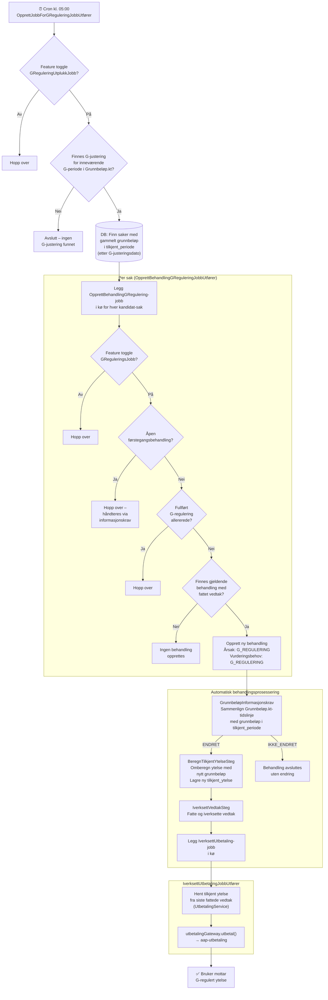

# G-regulering

Løsningen for G-regulering etablert i 2026 har i hovedsak 2 startpunkter for å identifisere og igangsette G-regulering.
 - Uttrekksjobb for iverksatte saker
 - Tilbakeløsning for pågående saker

I tillegg vil dagens meldekort løsning trigge G-regulering når nye meldekort kommer inn til behandlingsflyt da dette medfører informasjonskrav og omberegning av ytelse som da blir basert på aktiv G-justering i Grunnbeløp.kt.

## Komponentdiagram for Uttrekksjobb

