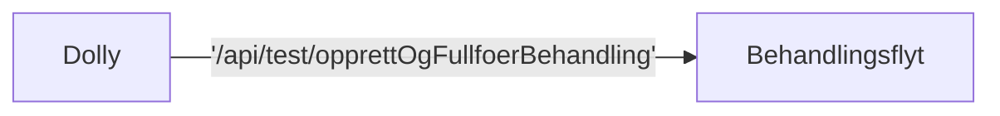

# Dolly-integrasjon

Kelvin har en integrasjon med Dolly.

De integrerer mot to endepunkter i `behandlingsflyt`, dokumentert på Swagger: https://aap-behandlingsflyt.intern.dev.nav.no/swagger-ui/index.html#/Dolly




Kallet gjør omtrent det samme som `TestApp` i det man oppretter en søknad og ber den fullføre behandlingen.

Eksempel-payload:

```json
{
  "andreUtbetalinger": {
    "afp": {
      "hvemBetaler": "string"
    },
    "loenn": "JA",
    "stoenad": [
      "AFP"
    ]
  },
  "erStudent": true,
  "harMedlemskap": true,
  "harYrkesskade": true,
  "ident": "string"
}
```

Dette er felter som havner i søknaden, deretter blir behandlingen fullført automatisk.

Deretter poller Dolly på endepunktet `/api/test/behandlingStatus` inntil de får status om at behandlingen er fullført.

Implementert i filen `FullførBehandlingApi.kt` i `aap-behandlingsflyt`.

## Kontaktpunkter

Kanalen `#dolly` på Slack og den (dessverre) private kanalen `#dolly-kelvin-integrasjon`. Be noen andre på teamet invitere deg inn.

## Krav til endepunktet

Dolly foretrekker at vi ikke bruker norske tegn (æøå) i endepunkt eller i payload.

Post-endepunktet bør være idempotent, det skal ikke krasje om det kalles to ganger. Aller helst skal man kunne endre svar ved å kalle det to ganger med forskjellig payload.

## Gjenstående

Ingen mulighet i dag til å gi forskjellige typer AAP, samordning, osv.

Ikke mulig å sette sluttdato.

:::info
Ideen var å skrive integrasjonen ganske lik flyt-testene. Da kan f.eks sluttdato legges til ved å gjøre en ekstra sykdom-vurdering.
:::
