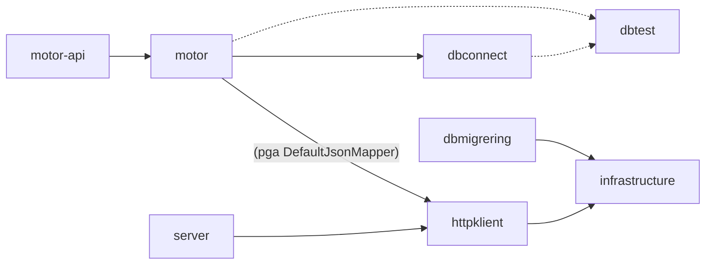
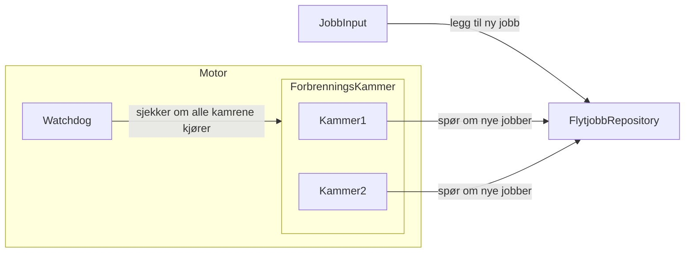
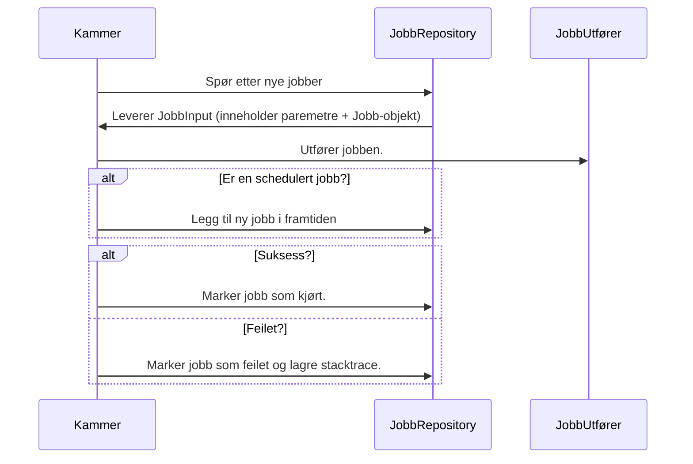
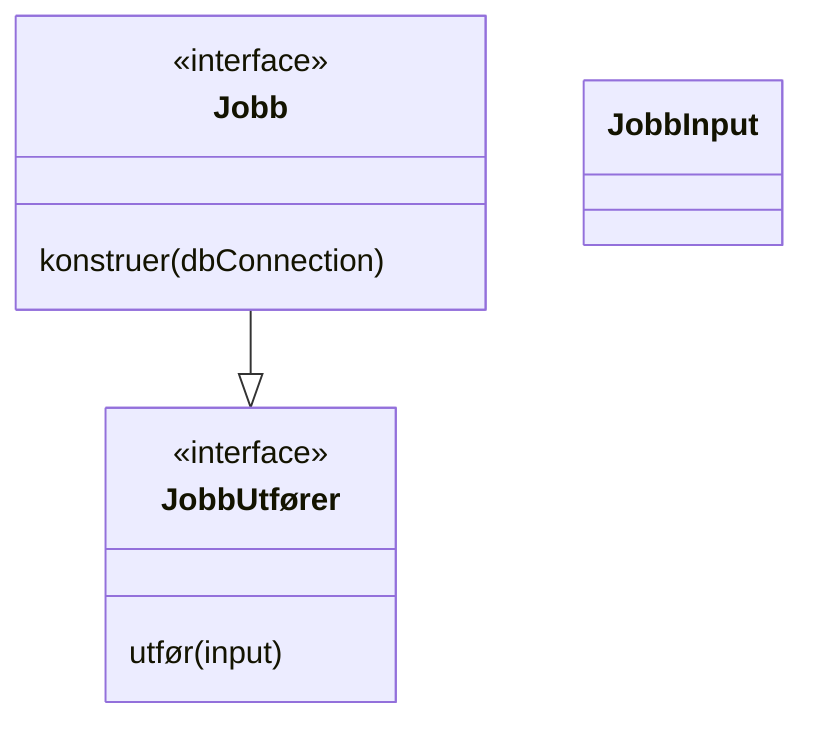

# Felleskomponenter

Vi har dratt ut noe felles funksjonalitet til biblioteker, som vi har i repoet https://github.com/navikt/aap-kelvin-komponenter .

API-dokumentasjon kan leses på https://navikt.github.io/aap-kelvin-komponenter/

## Avhengigheter mellom pakker

For øyeblikket lastes ikke transitive avhengigheter ned pakker ned (f.eks om man er interessert i `motor`).

## Motor

Funksjonalitet for å kjøre asynkrone jobber basert på implementasjoner av `JobbUtfører`-interfacet.

Krever at tabellene `JOBB` og `JOBB_HISTORIKK` er opprettet, se [her](https://github.com/navikt/aap-kelvin-komponenter/blob/main/motor/src/test/resources/flyway/V0.1__modell.sql).

Her er en oversikt over de relevante klassene.

### Flytdiagram i et forbrenningskammer

I et forbrenningskammer er det følgende flyt:

### Klassediagram for jobber

Skisse på forhold mellom `Jobb`, `JobbUtfører` og `JobbInput`. Jobb-objektene brukes for å konstruere `JobbUtfører`. `JobbInput` er det som lagres i databasen.

## dbconnect

Wrapper rundt `javax.sql`, med funksjonalitet for å sikre transaksjonshåndtering, og bedre null-håndtering.

TODO: presenter public API
