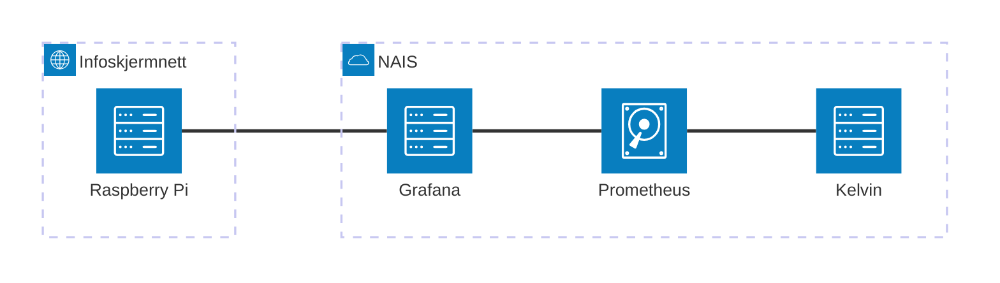

# Overvåking

Vi legger Grafana-dashboard i `aap`-mappen: https://grafana.nav.cloud.nais.io/dashboards/f/z2F1_Ap7k/aap

:::note["Teknisk gjeld" vedrørende overvåking]
  * Bør få én måte å få alerts på (nå har vi 3)
  * Få ned støy i loggene
  * Finpusse dashboards slik at de  blir nyttige
  * Lage "run book" / guide for hvordan håndtere feil.
:::

## Landskapet

### Slack-alerts

De to Slack-kanalene [#team-aap-dev-alerts](https://nav-it.slack.com/archives/C07NZJBEXU6) og [#team-aap-prod-alerts](https://nav-it.slack.com/archives/C079K243D0V). Ideelt sett burde disse inneholde kun varsler som er kritiske og som tyder på alvorlige bugs.

### Grafana

Logger, metrikker, dashboards, alerts.

### Kibana / Adeo

Logger, men mye raskere + secureLog.

**TODO**: skriv om secure logs, og hvordan bruke

### Paw Patrol

Hjemmesnekret overvåking av motoren. Her kan man se stacktrace til jobber som har feilet, avbryte og rekjøre dem.

### Brukerstøtte-kanalen på Slack

På Slack: [#aap-kelvin-brukerstøtte](https://nav-it.slack.com/archives/C08RRLQBXC6)

Her postet Porten-saker som vi får inn. Aller helst vil vi oppdage ting før det kommer her. Her bør det følges nøye med, da enkelte henvendelser kan være kritiske.

## Hvordan overvåke

Her følger en teknisk guide til hvordan overvåke systemet. Funksjonell instruksjon finnes på [Confluence](https://confluence.adeo.no/spaces/PAAP/pages/641020103/Rutiner+for+drift+og+vedlikehold+i+team+AAP).

### "Førstelinje"

"Førstelinje" er alerts-kanalene på Slack: [#team-aap-dev-alerts](https://nav-it.slack.com/archives/C07NZJBEXU6) og [#team-aap-prod-alerts](https://nav-it.slack.com/archives/C079K243D0V). Det er en kontinuerlig jobb å filtrere vekk støy.

Per i dag (16/9-25), er det noen typer meldinger som postes i alerts-kanalen:
 - Lenke til Kibana (Adeo) med _error_-logs siste 30 min. Dette inkluderer et par ting som overvåkes ved hjelp av error-logging:
     - Om oppgave-appen finner oppgaver på enheter utenfor pilot
     - Om vårt "doksikkerhetsnett" (`JoarkAvstemmer` i `postmottak-backend`) finner journalposter som burde vært journalført.
 - Alert ved høy error-rate i loggene (per dags dato definert i [aap-alerts](https://github.com/navikt/aap-alerts))
 - Alerts definert i Grafana. I dag har vi alert på feilende jobber i prod og treg responstid.

### "Andrelinje"

Manuell sjekk av Paw Patrol:

 - Prod: https://aap-paw-patrol.ansatt.nav.no/
 - Dev: https://aap-paw-patrol.intern.dev.nav.no/
 
 Dev er dessverre veldig støyete, men i prod skal det ikke være feilende jobber. Konsekvensen varierer avhengig av jobben.
 
**Eksempel**: om journalføring feiler i postmottak, bryter vi raskt regler på hvor raskt dokumenter skal journalføres (2 dager**.
 
**Eksempel**: om `prosesserBehandling` feiler i `behandlingsflyt`, stopper saksbehandling på denne behandlingen opp.

### Tredjelinje

To dashboards kan være interessante her: _AAP Globalt_ og _Forretningsmetrikker_. Førstnevnte viser prosent feillogger (warn+error) over tid og metrikk på antall feilende jobber per app, i tillegg til responstid i frontend. Sistnevnte vil over tid vise metrikker interessant for forretning også. Nå er det mest interessante tallet innsendinger, fordelingsresultat, og unike brukere over tid.


## Loggnivå

| Nivå  | Bruksområde                                                                                              |
|-------|----------------------------------------------------------------------------------------------------------|
| Info  | For kontekstuell logging. Viktig ved debugging. Bør gjøres når løsningen tar valg.                       |
| Warn  | Feil eller uheldig tilstand. Ingen varsling (men bør kanskje få varsling om warn+error-prosent går opp?) |
| Error | Feil som krever rask oppmerksomhet. Logges stil `stderr`, og varsles på Slack.                           |

## Alerts

Alerts definerer i Grafana (click-ops): https://grafana.nav.cloud.nais.io/alerting/list 

Alerts defineres i et felles repo: https://github.com/navikt/aap-alerts , og blir farslet på Slack-kanalen `#team-aap-prod-alerts`.

**TODO**: oppskrift for hvordan lage alerts i Grafana basert på metrikker

## Hvordan søke i logger

**TODO**: oppskrift for hvordan finne fram på Grafana


## Oversikt

| App             | Grafana-dashboard                                                                                 | Adeo-logger                                        | Alerts? |
|-----------------|---------------------------------------------------------------------------------------------------|----------------------------------------------------|---------|
| Behandlingsflyt | [Lenke](https://grafana.nav.cloud.nais.io/d/fdti727n7u6m8c/behandlingsflyt?orgId=1)               | [Lenke](https://logs.adeo.no/app/r/s/niCDc "	") |         |
| Innsending      | [Lenke](https://grafana.nav.cloud.nais.io/d/TSvq-GvIk/innsending?orgId=1 "	")                  | [Lenke](https://logs.adeo.no/app/r/s/tczwn "	") | ✅      |
| Statistikk      | [Lenke](https://grafana.nav.cloud.nais.io/d/edqu3y0nhmxhcb/statistikk?orgId=1)                    | [Lenke](https://logs.adeo.no/app/r/s/XL6Dp)        |         |
| Ekstern API     | [Lenke](https://grafana.nav.cloud.nais.io/d/bcb27950-0648-4940-9cfb-3137d9b0405c/aap-api?orgId=1) | [Lenke](https://logs.adeo.no/app/r/s/JiOr7)        |         |
| Oppgave         | [Lenke](https://grafana.nav.cloud.nais.io/d/fdy5hjhfbo3r4c/oppgave?orgId=1 "	")                |                                                    |         |

(Adeo-lenker lages ved å klikke "Share" og så "Short URL")

## Infoskjerm på kontoret

Vi har satt opp en Raspberry Pi som viser Grafana-dashboards på en infoskjerm på kontoret.



### Oppsett

Vi fulgte instruksjoner [herfra](https://utvikling.intern.nav.no/teknisk/infoskjerm.html) og [her](https://doc.nais.io/observability/metrics/how-to/grafana-from-infoscreen/?h=).

OS er Ubuntu Desktop. MAC-adressen til Pi-en måtte sendes på Slack-kanalen `#tech-nettverk`. Da fikk vi tilsendt et WiFi-passord slik at vi kunne koble oss til det skjulte nettverket `infoskjerm`. Velg WPA2 som auth-metode.

For Raspberry OS måtte følgende info legges i `wpa_supplicant.conf`-filen, men på Ubuntu kunne dette gjøres i GUI.

```conf
country=NO
update_config=1
ctrl_interface=/var/run/wpa_supplicant
network={
 scan_ssid=1
 ssid="infoskjerm"
 psk="***"
}
```

Her er SSID-verdien navnet på WiFi-nettverket.

Deretter måtte Pi-en restartes. Etterpå kan Grafana nåes på `https://grafana-infoskjerm.nav.cloud.nais.io/`.

Vi har en egen "playlist" i Grafana som autospiller predefinerte dashboard. Trykk [her](https://grafana.nav.cloud.nais.io/playlists/edit/ce34vgscjtqtca) for å redigere.

Om infoskjermen ikke er skrudd på, kan den skrus på med bryteren på Raspberry Pi-en. Den er satt til å starte Firefox automatisk ved oppstart.

Brukernavn/passord: `aap`/`pengerpenger`.

