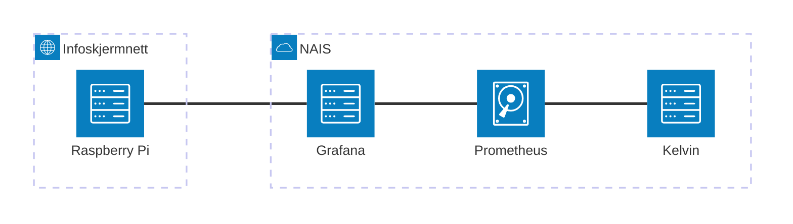

# Overvåking

Vi legger Grafana-dashboard i `aap`-mappen: https://grafana.nav.cloud.nais.io/dashboards/f/z2F1_Ap7k/aap


## Oversikt

| App             | Grafana-dashboard                                                                                 | Adeo-logger                                        | Alerts? |
|-----------------|---------------------------------------------------------------------------------------------------|----------------------------------------------------|---------|
| Behandlingsflyt | [Lenke](https://grafana.nav.cloud.nais.io/d/fdti727n7u6m8c/behandlingsflyt?orgId=1)               | [Lenke](https://logs.adeo.no/app/r/s/niCDc "	") |         |
| Innsending      | [Lenke](https://grafana.nav.cloud.nais.io/d/TSvq-GvIk/innsending?orgId=1 "	")                  | [Lenke](https://logs.adeo.no/app/r/s/tczwn "	") | ✅      |
| Statistikk      | [Lenke](https://grafana.nav.cloud.nais.io/d/edqu3y0nhmxhcb/statistikk?orgId=1)                    | [Lenke](https://logs.adeo.no/app/r/s/XL6Dp)        |         |
| Ekstern API     | [Lenke](https://grafana.nav.cloud.nais.io/d/bcb27950-0648-4940-9cfb-3137d9b0405c/aap-api?orgId=1) | [Lenke](https://logs.adeo.no/app/r/s/JiOr7)        |         |
| Oppgave         | [Lenke](https://grafana.nav.cloud.nais.io/d/fdy5hjhfbo3r4c/oppgave?orgId=1 "	")                |                                                    |         |

(Adeo-lenker lages ved å klikke "Share" og så "Short URL")

## Alerts

Alerts defineres i et felles repo: https://github.com/navikt/aap-alerts , og blir farslet på Slack-kanalen `#team-aap-prod-alerts`.

## Infoskjerm på kontoret

Vi har satt opp en Raspberry Pi som viser Grafana-dashboards på en infoskjerm på kontoret.



### Oppsett

Vi fulgte instruksjoner [herfra](https://utvikling.intern.nav.no/teknisk/infoskjerm.html) og [her](https://doc.nais.io/observability/metrics/how-to/grafana-from-infoscreen/?h=).

MAC-adressen til Pi-en måtte sendes på Slack-kanalen `#tech-nettverk`. Da fikk vi tilsendt et WiFi-passord, som måtte legges i `/etc/wpa_supplicant/wpa_supplicant.conf` slik:

```conf
country=NO
update_config=1
ctrl_interface=/var/run/wpa_supplicant
network={
 scan_ssid=1
 ssid="infoskjerm"
 psk="***"
}
```

Her er SSID-verdien navnet på WiFi-nettverket.

Deretter måtte Pi-en restartes. Etterpå kan Grafana nåes på `https://grafana-infoskjerm.nav.cloud.nais.io/*`.

For å vise flere dashboards brukes Firefox-pluginen [Tab Rotator](https://addons.mozilla.org/en-US/firefox/addon/tab-rotator/). Man kan sette hvor mange sekunder hver tab skal vises.
