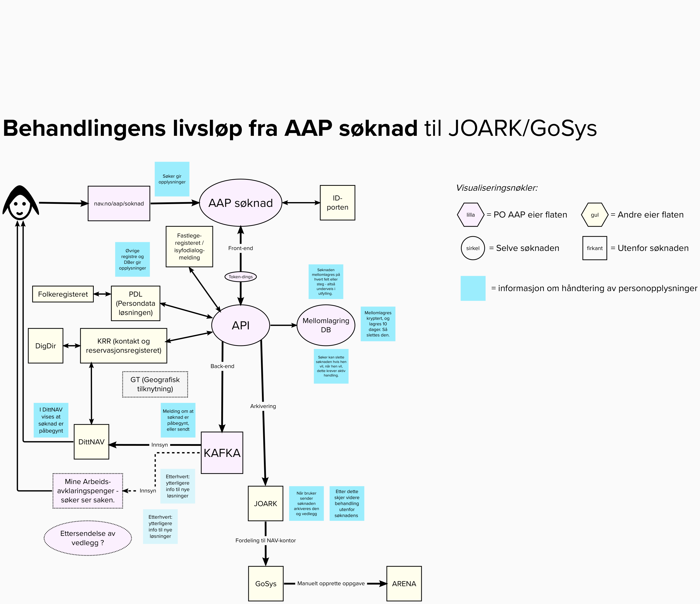
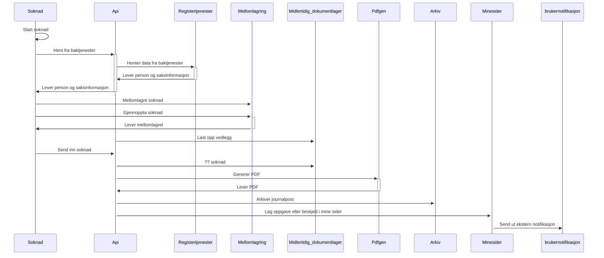

# Systemdokumentasjon av Arbeidsavklaringspenger for innbygger

Hensikt med denne tjenesten er å tilby innsending av søknad og vise status på denne for innbygger.
Her trenger vi mer..

## Prosesser og funksjoner 
- Søknader for AAP og AAP utland
- Vise innsendt dokumentasjon.
- Kvitteringsside som bekrefter hva som har blitt sendt inn.
- Mulighet for å gjennopta en påbegynt, men ikke innsendt søknad.
- Ettersende dokumentasjon som er påkrevd basert på svar gitt i søknaden.
- Ettersende generell dokumentasjon tilknyttet sak.
- [Brukernotifikasjoner](https://navikt.github.io/dittnav-brukernotifikasjoner-intro/) som varsler bruker om påbegynt søknad og manglende dokumentasjon.

### Eksempler
* En bruker kan velge å fortsette senere under utfylling av selve søknaden eller under oppsummeringen.
* En bruker kan velge å etterende påkrevd dokumentasjon under oppsummeringen.
* En bruker kan velge å avbryte søknad når som helst.
* En bruker får en beskjed på dittnav når den velger å fortsette senere.
* En bruker får en oppgave på dittnav når den velger å ettersende påkrevd dokumentasjon.

## informasjonsmodell

## Tekniskbeskrivelse
Løsningen bygger på [NAIS](https://nais.io) som er kjøreplattform for Google cloud.

| Del av løsning | Teknologi                                                                |
|----------------|--------------------------------------------------------------------------|
| Klient         | NEXT.js                                                                  |
| Baksystem      | Java med Spring boot , kotlin                                            |
| Infrastruktur  | Postgress database for forretningslogikk og GC Buckets for mellomlagring |

### Tegning av teknisk landskap

#### Tekniske tjenester
Tjenester som konsumeres

- Innlogging via [Id-porten](https://eid.difi.no/en/id-porten)
- PDL - Persondatatjeneste for NAV og Skatt
- KRR - Kontakt og reservasjonsregisteret
- Arkivtjeneste for oppslag i NAVS dokumentarkiv
- Brukernotifikasjoner for [pålogget bruker på nav.no](https://nav.no)

Systemene tilbyr ingen eksterne tjenster, kun interne i dialog med hverandre

#### Databasemodell
Som figuren viser er modellen delt i 2:
- Håndtering av søknadslogikk og påkrevcde vedlegg som er sendt inn eller mangler.
- Håndtering av brukernotifikasjoner tilknyttet søknader.

