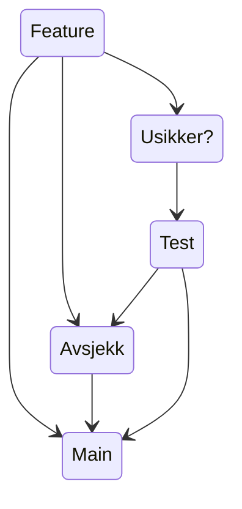

# Hvordan vi jobber med kode
Vi jobber [trunkbased](https://trunkbaseddevelopment.com/), men dersom du er usikker eller har lyst at noen andre skal se på koden, benytter vi brancher. 
Vi er 1 team, vi skriver kode sammen, vi har de samme målene. Det finnes ikke `du` og `jeg` bare `vi`.

- Når en er sikker på featuren en har laget, commiter en direkte i `Main`.
- Når en er usikker kan en be om en kodegjennomgang enten ved parprogramering eller pullrequest.
- Når en er usikker kan det være lurt å teste først.

Denne figurer prøver å illustrere flytvalg en har ved innsjekk av kode.

## Hyppige og små kodeendringer

Vi ønsker å rulle koden fremover ikke rulle tilbake. 
Har vi ødelagt noe, så fikser vi det.
Dette muliggjøres av å ha små og hyppige kodeendringer.

## Mange kokker mye søl

- Når det er mange om 🦴, må vi prate sammen og bli enige.
- Varsle om din kode kommer med `Breaking changes`
- ..annet?

## Arkitektur i teamet

`Litt om hvordan vi ønsker å jobbe med arkitektur i teamet`
- en skal kunne ta valg selv
- en bør være enige 
- Tør å feile, det er lov å angre eller endre mening.
- .. litt mer

## Kvalitet i koden vår
- testing
- felles linting og formatering av kode
- patterns
- annet?