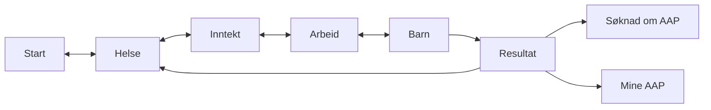
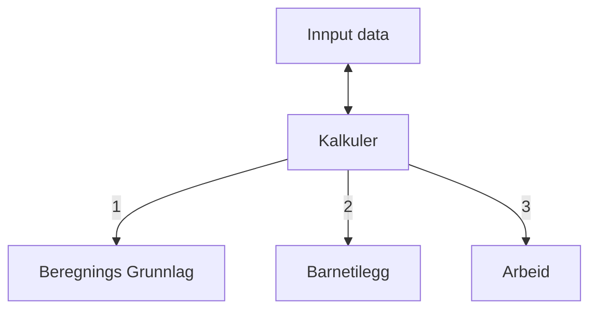

# Teknisk beskrivelse
# Komme i gang

Hvordan bygge, teste og kjøre koden viss aktuelt.

Install:
```bash
yarn
```
Run:
```bash
yarn dev
```

Åpne [http://localhost:3000](http://localhost:3000) i nettleser for å gå gjennom kalkulatoren

---


Kalkulatoren er strukturert rundt 5 sider.


[Start](https://github.com/navikt/aap-kalkulator-frontend/blob/main/pages/index.tsx)
--> [Spørsmål](https://github.com/navikt/aap-kalkulator-frontend/tree/main/components/questions)
--> [Resultat](https://github.com/navikt/aap-kalkulator-frontend/blob/main/pages/resultat.tsx)

## Logikk

Kalkuler wrapper state (brukers input) i en type, som inneholder tekst log og resultat per år i kroner.
wrappet state blir da sendt inn i 3 funksjoner som regner Beregningsgrunnlag, evt. Baretilegg og Reduksjon pga. arbeid

## Universell utforming

Kalkulatoren er tested for WCAG 2.0 A og AA. Dette ble testet med en rekke verktøy, blant annet [W3C Validator](https://validator.w3.org/) og [Lighthouse](https://developers.google.com/web/tools/lighthouse).

---
# Henvendelser

Spørsmål knyttet til koden eller prosjektet kan stilles som issues her på GitHub

## For NAV-ansatte

Interne henvendelser kan sendes via Slack i kanalen #po-aap-innbygger.
