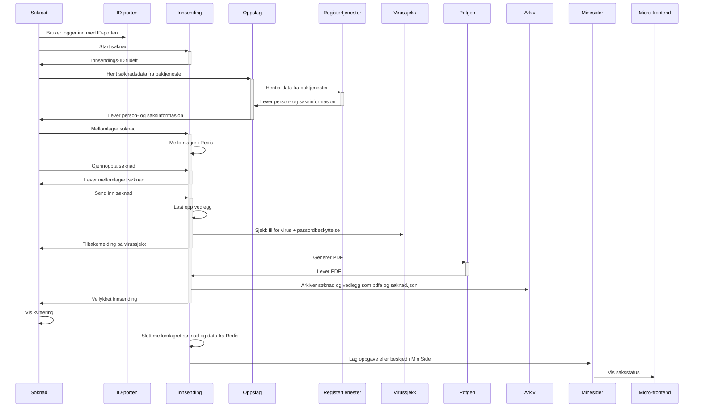

# Flyt fra søknad til arkiv, Mine AAP og Min side

```mermaid
sequenceDiagram
    Soknad->>+ID-porten: Bruker logger inn med ID-porten
    Soknad->>+Innsending: Start søknad
    Innsending->>-Soknad: Innsendings-ID tildelt
    Soknad->>+Oppslag: Hent søknadsdata fra baktjenester
    Oppslag->>+Registertjenester: Henter data fra baktjenester
    Registertjenester->>-Oppslag: Lever person- og saksinformasjon
    Oppslag->>-Soknad: Lever person- og saksinformasjon
    Soknad->>+Innsending: Mellomlagre soknad
    Innsending->>Innsending: Mellomlagre i Redis
    Soknad->>+Innsending: Gjennoppta søknad
    Innsending->>-Soknad: Lever mellomlagret søknad
    Soknad->>+Innsending: Send inn søknad
    Innsending->>Innsending: Last opp vedlegg
    Innsending->>+Virussjekk: Sjekk fil for virus + passordbeskyttelse
    Innsending->>-Soknad: Tilbakemelding på virussjekk
    Innsending->>+Pdfgen: Generer PDF
    Pdfgen->>-Innsending: Lever PDF
    Innsending->>+Arkiv: Arkiver søknad og vedlegg som pdfa og søknad.json
    Innsending->>-Soknad: Vellykket innsending
    Soknad->>Soknad : Vis kvittering
    Innsending->>Innsending: Slett mellomlagret søknad og data fra Redis
    Innsending->>+Minesider: Lag oppgave eller beskjed i Min Side
    Minesider->>Micro-frontend: Vis saksstatus
```
