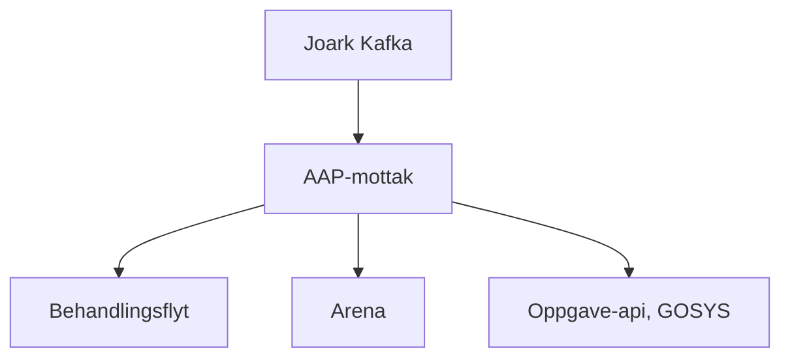

# Funksjonell beskrivelse

Når en bruker sender inn "noe" på MittNAV, må dette ende opp i 
riktig system.

Det er her aap-mottak kommer inn. Aap-mottak lytter på JOARK 
sitt arkiveringstopic (`teamdokumenthandtering.aapen-dok-journalfoering`)
og sørger for at meldingen kommer til riktig system. Frem til
Kelvin har tatt over all funksjonalitet i AAP, vil en melding
ende opp 1 av 3 steder:
1. Behandlingsflyt - Nye saker som oppfyller et gitt kriterie
2. Arena - Eksisterende saker
3. Gosys, via oppgave-api - Alt man ikke klarer å plassere andre steder

Punkt `2` og `3` vil være en erstatning av dagens ruting av søknader
(KRUT). Det er viktig at vi tar over KRUT før vi begynner å rute 
data til Kelvin for å sørge for at vi kan ha en gradvis overgang
