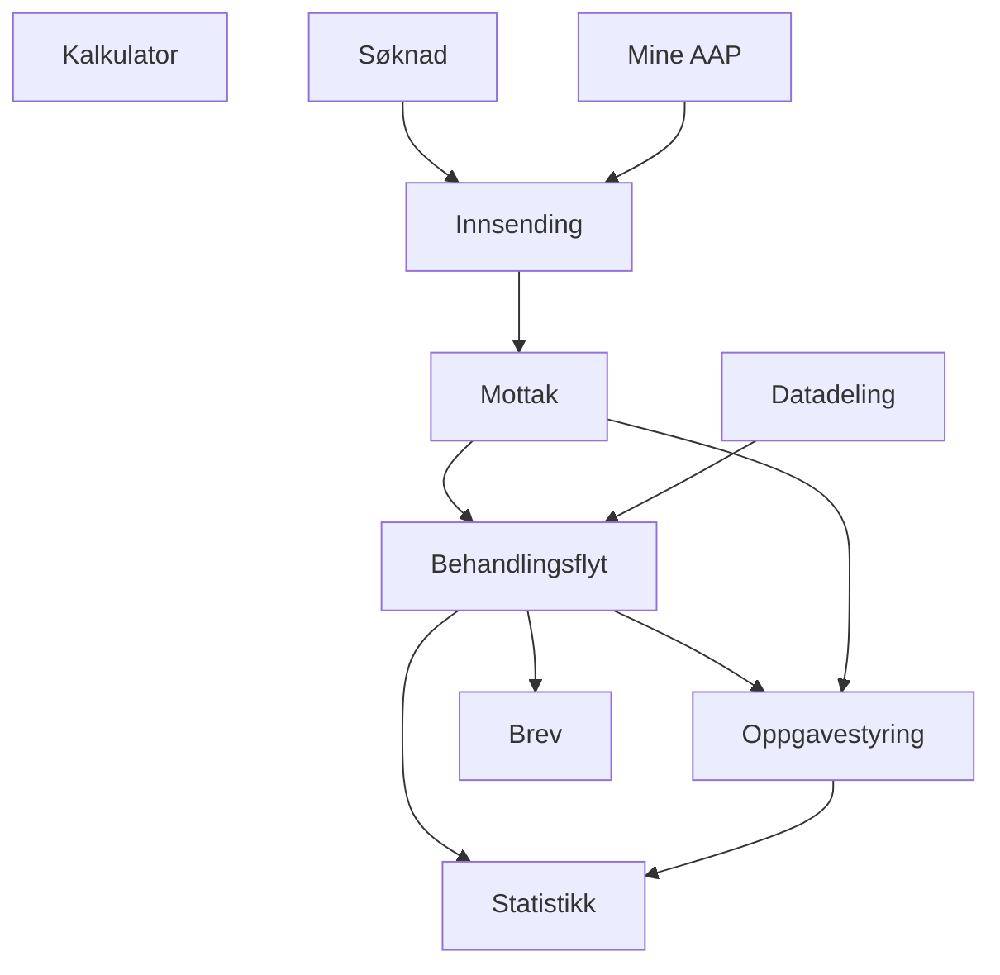

# Funksjonell beskrivelse

Hensikten med de ulike løsningene Team AAP leverer, er å sikre kritisk funksjonalitet i dialog mellom NAV og innbyggere på ytelsen Arbeidsavklaringspenger (AAP), samt effektiv og lik behandling.

Vårt fokus er å skape brukergevinster, og å gjøre brukerreisen helhetlig god.

Noen kontaktpunkter er til for å muliggjøre saksbehandling, andre er til for å gi god veiledning og informasjon til innbyggere.

## Prosesser og funksjoner
Under følger en beskrivelse av de ulike komponentene som til sammen blir AAP-systemet.

### Kalkulator
Kalkulatoren er en nettside som hjelper potensielle søkere med å avklare hvor mye de vil få utbetalt i stønad dersom de sender inn en søknad og om de er kvalifisert for å søke.

### Søknad

- Innsending av hovedsøknad for AAP
- Mulighet for å gjennopta en påbegynt, men ikke innsendt søknad
- Legge ved dokumentasjon til søknad
- Kvitteringsside som bekrefter hva som har blitt sendt inn

Søknaden arkiveres pt både som pdf og JSON i JOARK.

Flere søknader på tema AAP vil bli lagt til etterhvert.

### Mine AAP

- Vise innsendte søknader og manglende vedlegg
- Vise innsendt dokumentasjon
- Inngang til Ettersendelse
- Informasjon om veien videre etter innsendt søknad
- Inngang til "Skriv til Oss"

### Innsending

- Felleskomponent for Søknad og Mine AAP
- Håndterer mellomlagding, pdf-generering, virussjekk og arkivering

### Mottak (Under arbeid)

- Plukker opp alle journalføringshendelser på tema AAP
- Oppretter oppgaver i Gosys for manuell journalføring
- Oppretter oppgaver i Arena for saksbehandling
- Opprette manuell journalførings- eller fordelings-oppgave i Gosys på riktig saksbehandlende enhet. En fordelingsoppgave opprettes kun dersom en ikke klarer å avklare hvilken enhet som skal behandle innsendingen.
- Oppdattere arkivet med riktig sakstilknytning og behandlende enhet.

### Behandlingsflyt (Under arbeid)

- Vedtaksløsning

### Oppgavestyring (Under arbeid)

- Oppgaver for saksbehandler

### Brev (Under arbeid)

- Skrive brev

### Statistikk (Under arbeid)

- Ulike dataprodukter

### Datadeling

- Deling av data med eksterne aktører
  - Offentlig AFP
  - Privat AFP
  - Tjenestepensjon
  - Forsikringsselskaper
- Deling med interne ytelser
  - Dagpenger
  - Tilleggsstønader
  - Sykepenger
  - Foreldrepenger
  - Uføre

## Komponent-diagram

