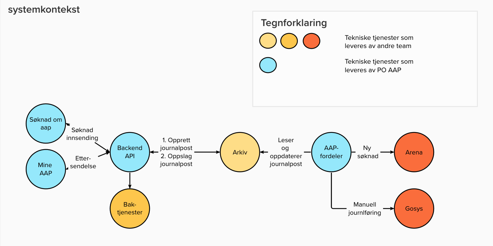
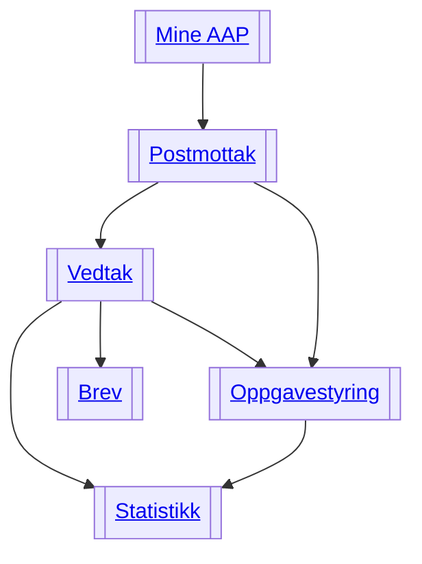

# Funksjonell beskrivelse

Hensikten med de ulike løsningene Team AAP leverer, er å sikre kritisk funksjonalitet i dialog mellom NAV og innbyggere på ytelsen Arbeidsavklaringspenger (AAP), samt effektiv og lik behandling.

Vårt fokus er å skape brukergevinster, og å gjøre brukerreisen helhetlig god.

Noen kontaktpunkter er til for å muliggjøre saksbehandling, andre er til for å gi god veiledning og informasjon til innbyggere.

## Prosesser og funksjoner
Under følger en beskrivelse av de ulike komponentene som tilsammen blir AAP-systemet.

### Kalkulator
Kalkulatoren er en nettside som hjelper potensielle søkere med å avklare hvor mye de vil få utbetalt i stønad dersom de sender inn en søknad og om de er kvalifisert for å søke.

### Søknad

- Innsending av hovedsøknad for AAP
- Mulighet for å gjennopta en påbegynt, men ikke innsendt søknad
- Legge ved dokumentasjon til søknad
- Kvitteringsside som bekrefter hva som har blitt sendt inn

Søknaden arkiveres pt både som pdf og JSON i JOARK.

Flere søknader på tema AAP vil bli lagt til etterhvert.

### Mine AAP

- Vise innsendte søknader og manglende vedlegg
- Vise innsendt dokumentasjon
- Inngang til Ettersendelse
- Informasjon om veien videre etter innsendt søknad
- Inngang til "Skriv til Oss"

### Mottak

- Plukker opp alle journalføringshendelser på tema AAP
- Oppretter oppgaver i Gosys for manuell journalføring
- Oppretter oppgaver i Arena for saksbehandling

#### Fremtidig mottak

- Opprette alle førsteganssøknader i Kelvin / behandlingsflyt
- 

### Behandlingsflyt

### Oppgavestyring

### Baksystemer for innbyggerflaten
Som støtte for brukerflatene /kontaktpunktene, så benyttes baksystemer for å hente inn data og sende data videre. Løsningen består av  to baksystemer.

#### Søknad-Api
Applikasjonen tar seg av å hente data fra baksystemer som leverer data som trengs for behandling av søknader og innsending av søknader og ettersendelser. Den håndterer:
- Varseler og oppgaver på nav.no tilknyttet en søknad.
- Hente data fra baktjenester tilknyttet en søknad: personinformasjon, barn mm.
- Lagre og hente dokumenter som skal til arkivet eller hentes ut for mine arbeidsavklaringspenger.

#### AAP-Mottak
Applikasjonen tar seg av opprettelse av oppgaver i fagsystemene for nye dokumenter som sendes inn for en bruker. Den håndterer både dokumenter via post og digitale innsendinger. Den er hendelsebasert og følger med på endringer i arkivet.
Det er i basis 3 forskjellige operasjoner
- Opprette sak i Arena for saksbehandling av nye søknader.
- Opprette manuell journalførings- eller fordelings-oppgave i Gosys på riktig saksbehandlende enhet. En fordelingsoppgave opprettes kun dersom en ikke klarer å avklare hvilken enhet som skal behandle innsendingen.
- Oppdattere arkivet med riktig sakstilknytning og behandlende enhet.

## Informasjonsmodell

Denne tegningen viser en oversikt over hvilke informasjonstyper vi har i datamodellen. Den viser hvilken informasjon som samles inn og tas vare på og til hvilke formål.

TODO: Oppdatere informasjonsmodell i mural, legge til tegnforklaring / farger, legge ved eksempler på de ulike informasjonstypene.

Eksempel: Informasjon om innsendte vedlegg i søknaden tas vare på slik at vi vet hvilke vedlegg som mangler, og kan vise dette i Mine AAP.

<!---
Tegningen er hentet herfra
https://app.mural.co/invitation/mural/navdesign3580/1663231311908?sender=sturlehelland7470&key=9cf412d2-8755-499a-8a37-e32922515281
--->

## Tekniskbeskrivelse

Løsningen bygger på [NAIS](https://nais.io) som er kjøreplattform for Google cloud.

| Del av løsning | Teknologi beskrivelse                                                    |
| -------------- |--------------------------------------------------------------------------|
| Klient         | NEXT.js, Typescript                                                      |
| Baksystem      | Kator og kotlin                                                          |
| Infrastruktur  | Postgress database for forretningslogikk og GC Buckets for mellomlagring |
| KAFKA          | Hendelsebasert kommuninkasjon mellom systemer i NAV og feilhåndtering    |
| BUCKETS        | Del av tjenestene i GCP, benyttes for mellomlagring ved innsending       |

### Tekniske tjenester
Tekniske tjenester er integrasjoner mellom systemer/tjenester. Denne oversikten er over

#### Tjenester som konsumeres av (soknad-api)[https://github.com/navikt/aap-soknad-api]

- **Innlogging** via [Id-porten](https://eid.difi.no/en/id-porten)
- **PDL** - Persondatatjeneste for NAV og Skatt
- **KRR** - Kontakt og reservasjonsregisteret
- **Arkivtjeneste** for oppslag i NAVS dokumentarkiv
- **Brukernotifikasjoner** for [pålogget bruker på nav.no](https://nav.no)

Systemene tilbyr ingen eksterne tjenster, kun interne i dialog med hverandre.

#### Tjenestster som konsumeres av (aap-fordeler)[https://github.com/navikt/aap-routing]

- **PDL** - Persondatatjeneste for NAV og Skatt: brukes for fordeling til riktig behandlende enhet.
- **NORG** - NAV Organsiasjonsmaster: brukes for å fordele oppgaven til riktig enhet. Diskresjonskoder fortrolig og strengt fortrolig blir for eksempel behandlet av egen enhet.
- **SAK** - Generell sakssystem fra Arkiv: brukes for å knytte journalpost og oppgave til en journalpost.
- **Arkivtjeneste** - For oppslag i NAVS dokumentarkiv: brukes for å oppdattere informasjon tilknyttet saksbehandling og fordeling.
- **Egenansatt** - Tjeneste som avklarer om innsender er ansatt i NAV og skal behandles av egen ansatt.
- **Arena** - Tjeneste for å opprette AAP-sak og oppgave for behandling av søknad.

### Databasemodell i søknad-api

Som figuren viser er modellen delt i 3:

- Håndtering av søknadslogikk og påkrevde vedlegg som er sendt inn eller mangler
- Håndtering av brukernotifikasjoner tilknyttet søknader, både oppgaver og beskjeder

